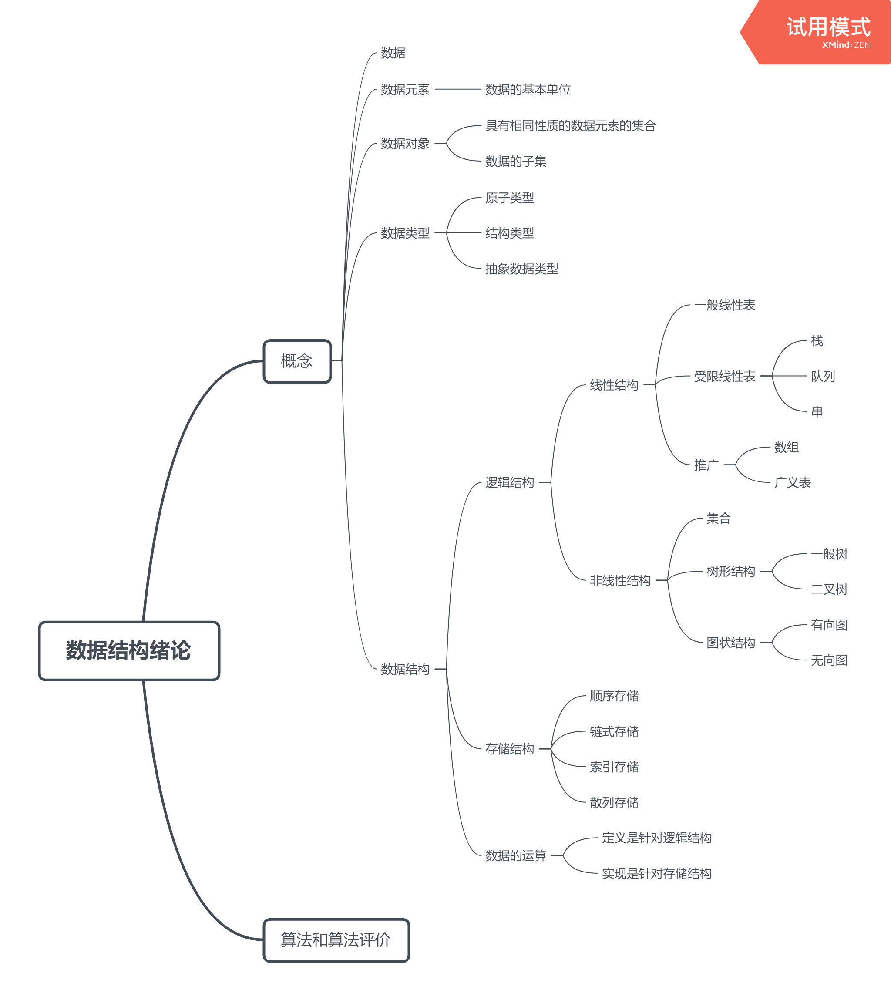

# 数据结构

## 一.绪论



### 1.1 基本概念

> 【2021 p3 1】
>
> 可以用（）定义一个完整的数据结构
>
> A.数据元素 B.数据对象 C.数据关系 D.抽象数据类型

抽象数据类型描述了**数据的逻辑结构**和**抽象运算**，通常使用（数据对象，数据关系，基本操作集）这样的三元组来表示

D

---

>【2021 p3 2】
>
>以下数据结构中，（）是非线性数据结构
>
>A.树 B.字符串 C.队列 D.栈

树是树形结构，选A

---

> 【2021 p3 3】
>
> 以下属于逻辑结构的是（）
>
> A.顺序表 B.哈希表 C.有序表 D.单链表

顺序表和哈希表以及单链表，既描述**逻辑结构**，又描述**存储结构和数据运算**

有序表是指关键字有序的线性表，仅描述元素之间的逻辑关系，既可以链式存储，也可以顺序存储

选C

---

> 【2021 p3 4】
>
> 以下与存储结构无关的术语是（）
>
> A.循环队列 B.链表 C.哈希表 D.栈

栈是一种逻辑结构，无法表示如何存储

---

> 【2021 p4 5】
>
> 以下关于数据结构的说法中，正确的是（）
>
> A. 数据的逻辑结构独立于其存储结构
>
> B. 数据的存储结构独立于其逻辑结构
>
> C. 数据的逻辑结构唯一决定了其存储结构
>
> D. 数据结构仅由其逻辑结构和存储结构决定

数据的逻辑结构是从面向实际问题的角度出发，只采用抽象表达方式，独立于存储结构；

数据的存储结构是逻辑结构在计算机上的映射，不能独立于逻辑结构而存在；

数据结构的三个要素：**逻辑结构、存储结构、数据运算**缺一不可

---

> 【2021 p4 6】
>
> 在存储数据时，通常不仅要存储各数据元素的值，还要存储（**数据元素之间的关系**）

---

> 【2021 p4 7】
>
> 链式存储设计时，**结点内**的存储单元地址（一定连续）

**不同结点**可以不连续，但是**同一结点内**一定连续的。

---

两种不同的数据结构，他们的逻辑结构和物理结构可能完全相同。比如`二叉树`和二`叉排序树`，

二叉树排序树可以采用二叉树的逻辑表示方式和存储方式，前者通常表示层次关系，后者通常用于排序和查找。

以查找为例，二叉树的时间复杂度为$O(n)$，二叉排序树的时间复杂度为$O(log_2n)$


### 1.2 算法评价

```c
for(int i = 1; i <=n; i++) 
    for(int j = 1; j <= i; j++) 
        for(int k = 1; k <= j; k++) 
            x++;
```

该程序段的时间复杂度为？

将该程序段的时间复杂度计算公式写出来，即$\sum_{i=1}^{n}\sum_{j=1}^i\sum_{k=1}^{j}1$​

$\sum_{j=1}^i\sum_{k=1}^{j}1=\frac{i(i+1)}{2}$​​，即原式为$\sum_{i=1}^{n}\frac{i(i+1)}{2}=\frac{1}{2}+\frac{2}{2}+\cdots+\frac{n}{2}+\frac{1^2}{2}+\frac{2^2}{2}+\cdots+\frac{n^2}{2}=\frac{n(n+1)}{4}+\frac{n(n+1)(2n+1)}{12}$​​

>解：利用恒等式(n+1)³=n³+3n²+3n+1,可以得到：
>(n+1)³-n³=3n²+3n+1,
>n³-(n-1)³=3(n-1)²+3(n-1)+1
>......
>3³-2³=3×(2²)+3×2+1
>2³-1³=3×(1²)+3×1+1.
>把这n个等式两端分别相加，得：
>(n+1)³-1=3(1²+2²+3²+....+n²)+3(1+2+3+...+n)+n,
>由于1+2+3+...+n=(n+1)n/2,
>代入上式得：
>n³+3n²+3n=3(1²+2²+3²+....+n²)+3(n+1)n/2+n
>整理后得：
>1²+2²+3²+....+n²=n(n+1)(2n+1)/6

抓大头，找到最高次幂应该为$\frac{2n^3}{12}=\frac{n^3}{6}$

所以最后的时间复杂度应该为$O(n^3)$

