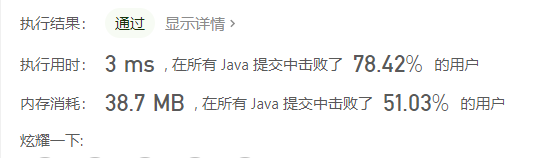
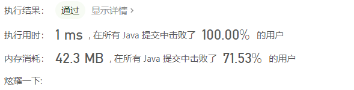

# 剑指OfferII 百家争鸣

## [剑指 Offer II 001. 整数除法](https://leetcode-cn.com/problems/xoh6Oh/)

难度简单6

给定两个整数 `a` 和 `b` ，求它们的除法的商 `a/b` ，要求不得使用乘号 `'*'`、除号 `'/'` 以及求余符号 `'%'` 。

 

**注意：**

- 整数除法的结果应当截去（`truncate`）其小数部分，例如：`truncate(8.345) = 8` 以及 `truncate(-2.7335) = -2`
- 假设我们的环境只能存储 32 位有符号整数，其数值范围是 `[−231, 231−1]`。本题中，如果除法结果溢出，则返回 `231 − 1`

 

**示例 1：**

```
输入：a = 15, b = 2
输出：7
解释：15/2 = truncate(7.5) = 7
```

**示例 2：**

```
输入：a = 7, b = -3
输出：-2
解释：7/-3 = truncate(-2.33333..) = -2
```

**示例 3：**

```
输入：a = 0, b = 1
输出：0
```

**示例 4：**

```
输入：a = 1, b = 1
输出：1
```

 

**提示:**

- `-231 <= a, b <= 231 - 1`
- `b != 0`

 

注意：本题与主站 29 题相同：https://leetcode-cn.com/problems/divide-two-integers/

解析来源：[刷穿剑指offer-Day01-整数I 001. 整数除法 - 整数除法 - 力扣（LeetCode） (leetcode-cn.com)](https://leetcode-cn.com/problems/xoh6Oh/solution/shua-chuan-jian-zhi-offer-day01-zheng-sh-8u0s/)


```java
/**
 * 剑指 Offer II 001. 整数除法
 * 给定两个整数 a 和 b ，求它们的除法的商 a/b ，要求不得使用乘号 '*'、除号 '/' 以及求余符号 '%' 。
 *
 *
 *
 * 注意：
 *
 * 整数除法的结果应当截去（truncate）其小数部分，例如：truncate(8.345) = 8 以及 truncate(-2.7335) = -2
 * 假设我们的环境只能存储 32 位有符号整数，其数值范围是 [−231, 231−1]。本题中，如果除法结果溢出，则返回 231 − 1
 *
 *
 * 示例 1：
 *
 * 输入：a = 15, b = 2
 * 输出：7
 * 解释：15/2 = truncate(7.5) = 7
 * 示例 2：
 *
 * 输入：a = 7, b = -3
 * 输出：-2
 * 解释：7/-3 = truncate(-2.33333..) = -2
 * 示例 3：
 *
 * 输入：a = 0, b = 1
 * 输出：0
 * 示例 4：
 *
 * 输入：a = 1, b = 1
 * 输出：1
 *
 *
 * 提示:
 *
 * -231 <= a, b <= 231 - 1
 * b != 0
 */
public class _1_Divide {

    public int divide(int a, int b) {
        int flag = 0;
        if (a > 0) {
            a = -a;
            flag++;
        }
        if (b > 0) {
            b = -b;
            flag++;
        }
        int res = calculate(a, b);
//        输入：
//        -2147483648
//                -1
//        输出：
//        -2147483648
//        预期结果：
//        2147483647
        if (flag != 1 && res == Integer.MIN_VALUE) {
            res = Integer.MAX_VALUE;
        }
        return flag == 1 ? res : -res;
    }

    public int calculate(int a, int b) {
        int ret = 0;
        while(a <= b) {
            int cnt = 1;
            int val = b;
            while(val >= Integer.MIN_VALUE >> 1 && (val << 1) >= a) {
                val += val;
                cnt += cnt;
            }
            ret -= cnt;
            a -= val;
        }
        return ret;
    }

    public static void main(String[] args) {
        int a = -2147483648;
        System.out.println(-a);
    }

}
```

```
执行结果：
通过

执行用时：
1 ms, 在所有 Java 提交中击败了100.00%的用户
内存消耗：35.6 MB, 在所有 Java 提交中击败了46.18%的用户
```

---

## [剑指 Offer II 081. 允许重复选择元素的组合](https://leetcode-cn.com/problems/Ygoe9J/)

难度中等1收藏分享切换为英文接收动态反馈

给定一个**无重复元素**的正整数数组 `candidates` 和一个正整数 `target` ，找出 `candidates` 中所有可以使数字和为目标数 `target` 的唯一组合。

`candidates` 中的数字可以无限制重复被选取。如果至少一个所选数字数量不同，则两种组合是唯一的。 

对于给定的输入，保证和为 `target` 的唯一组合数少于 `150` 个。

 

**示例 1：**

```
输入: candidates = [2,3,6,7], target = 7
输出: [[7],[2,2,3]]
```

**示例 2：**

```
输入: candidates = [2,3,5], target = 8
输出: [[2,2,2,2],[2,3,3],[3,5]]
```

**示例 3：**

```
输入: candidates = [2], target = 1
输出: []
```

**示例 4：**

```
输入: candidates = [1], target = 1
输出: [[1]]
```

**示例 5：**

```
输入: candidates = [1], target = 2
输出: [[1,1]]
```

 

**提示：**

- `1 <= candidates.length <= 30`
- `1 <= candidates[i] <= 200`
- `candidate` 中的每个元素都是独一无二的。
- `1 <= target <= 500`

 

注意：本题与主站 39 题相同： https://leetcode-cn.com/problems/combination-sum/

通过次数770

提交次数972

```java
//我自己写的
class Solution {
    List<List<Integer>> resList = new ArrayList<>();
    public List<List<Integer>> combinationSum(int[] candidates, int target) {
        com(0, new ArrayList<>(), 0, candidates, target);
        return resList;
    }

    public void com(int sum, List<Integer> tempList, int index, int[] candidates, int target) {
        if (index >= candidates.length || sum > target) return;
        if (sum == target) {
           List<Integer> list = new ArrayList<>(tempList);
            resList.add(list);
            return;
        }
        for (int i = index; i < candidates.length; i++) {
            tempList.add(candidates[i]);
            com(sum + candidates[i], tempList, i, candidates, target);
            tempList.remove(tempList.size() - 1);
        }
    }
}
```




## [剑指 Offer II 003. 前 n 个数字二进制中 1 的个数](https://leetcode-cn.com/problems/w3tCBm/)

难度简单6收藏分享切换为英文接收动态反馈

给定一个非负整数 `n` ，请计算 `0` 到 `n` 之间的每个数字的二进制表示中 1 的个数，并输出一个数组。

 

**示例 1:**

```
输入: n = 2
输出: [0,1,1]
解释: 
0 --> 0
1 --> 1
2 --> 10
```

**示例 2:**

```
输入: n = 5
输出: [0,1,1,2,1,2]
解释:
0 --> 0
1 --> 1
2 --> 10
3 --> 11
4 --> 100
5 --> 101
```

 

**说明 :**

- `0 <= n <= 105`

 

**进阶:**

- 给出时间复杂度为 `O(n*sizeof(integer))` 的解答非常容易。但你可以在线性时间 `O(n)` 内用一趟扫描做到吗？
- 要求算法的空间复杂度为 `O(n)` 。
- 你能进一步完善解法吗？要求在C++或任何其他语言中不使用任何内置函数（如 C++ 中的 `__builtin_popcount` ）来执行此操作。

 

注意：本题与主站 338 题相同：https://leetcode-cn.com/problems/counting-bits/


```java
//我写的
class Solution {
   public int[] countBits(int n) {
        int[] res = new int[n + 1];
        res[0] = 0;
        if(n == 0) return res;
        res[1] = 1;
        int cl = 2;
        int flag = 1;
        while(cl <= n) {
            if ((cl & (cl - 1)) == 0) {//判断是否为二的幂
                flag = 1;
                res[cl] = 1;
            } else {
                res[cl] += res[flag++] + 1;
            }
            cl++;
        }
        return res;
    }
}
```




# Android

https://www.thedroidsonroids.com/blog/how-to-learn-android-development-programming#title_how_to_start

