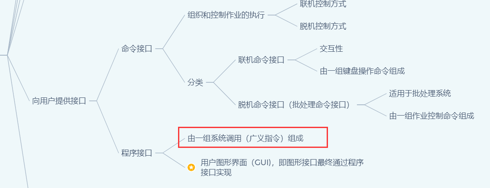

# 操作系统

## 第一章

### 操作系统概述

> 【2021 王道 p5 8】
>
> 单处理机系统中，可并行的是（）
>
> I.进程与进程 II.处理机与设备 III.处理机与通道 IV.设备与设备
>
> A.I II III 
>
> B.I II IV
>
> C.I III IV
>
> D.II III IV

> 通道是一种**专用处理器**
>
> CPU对通道的请求形式是：**通道命令**
>
> 通道对 CPU的请求形式是：**中断**
>
> ——https://blog.csdn.net/u012110719/article/details/41707611

单处理机系统同一时刻只能有一个进程占用处理机；

**通道独立于CPU、控制输入/输出设备**，所以可以与处理机并行

> 【2021 王道 p6 16】
>
> 操作系统与用户接口通常不包括
>
> A.shell B.命令解释器 C.广义指令 D.缓存管理指令

Shell 是一个应用程序，它连接了用户和 Linux 内核，让用户能够更加高效、安全、低成本地使用 Linux 内核，这就是 Shell 的本质。

——http://c.biancheng.net/view/706.html

广义指令指的就是**系统调用命令**，命令解释器属于**命令接口**

操作系统中的**缓存全部由操作系统管理**，对用户透明，不可能存在缓存相关指令

> 【2021 王道 p6 17】
>
> 下列选项中不属于多道程序设计的基本特征是（）
>
> A.制约性 B.间断性 C.顺序性 D.共享性

引入多道程序设计，程序的执行失去了封闭性和顺序性。

程序执行因为资源共享及相互协同的原因产生竞争，相互制约

为了竞争的公平性，程序的执行是断续的

**顺序性**是**单道程序设计**的**基本特征**

　　

---

库函数与系统调用的区别和联系：

**库函数**是语言或者应用程序的一部分，可以运行**在用户空间**中。而**系统调用**是操作系统的一部分，运行在**内核空间**中，是内核为用户提供的程序接口。

许多库函数会使用系统调用来实现功能。

未使用系统调用的库函数执行效率更高，因为使用系统调用的时候需要**上下文的切换**以及**用户态到核心态的转变**

### 操作系统分类

> 多道操作系统的基本特征有：**制约性、间断性、共享性**

---

>【2016 408真题】
>
>下列关于批处理系统的叙述中，正确的是（）
>
>I.批处理系统允许多个用户与计算机直接交互
>
>II.批处理系统分为单道批处理系统和多道批处理系统
>
>III.中断技术使得多道批处理系统和I/O设备可与CPU并行工作

应该是II和III，重点是III，**中断技术**使得多道批处理系统和I/O设备可与CPU并行工作

---

> 【2017 408真题】
>
> 与单道程序系统相比，多道程序系统的优点是
>
> I.CPU利用率高；II.系统开销小；III.系统吞吐量大；IV.I/O设备利用率高

I、III、IV是优点，但是**系统要付出额外的开销来组织和切换作业**，系统开销是增大的

---

> 实时系统的进程调度，通常采用（）算法

实时系统强调实时性，如果优先级高，抢占，所以是**抢占式的优先级高者优先算法**

> 分时系统的一个重要性能是系统的响应时间，对操作系统（）因素进行改进有利于改善系统的响应时间
>
> A.加大时间片 B.采用静态页式管理 C.优先级+非抢占式调度算法 D.代码可重入

