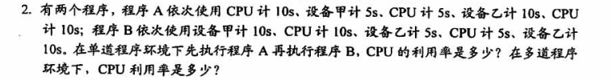
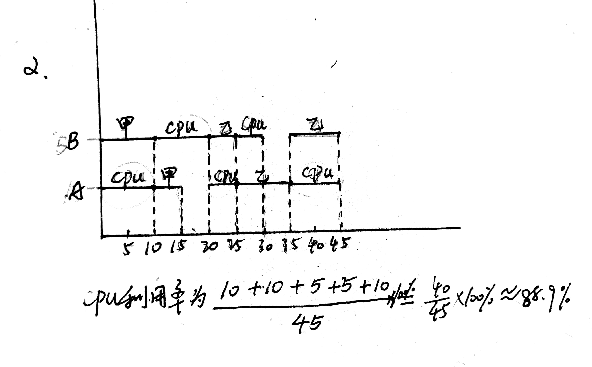
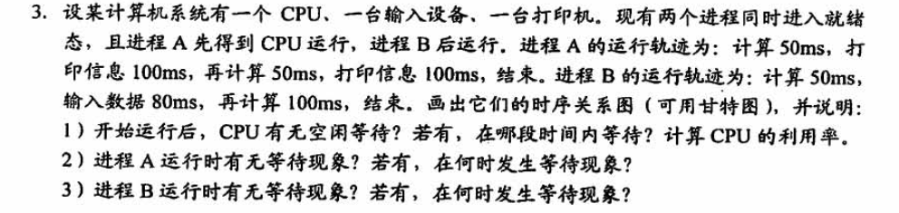
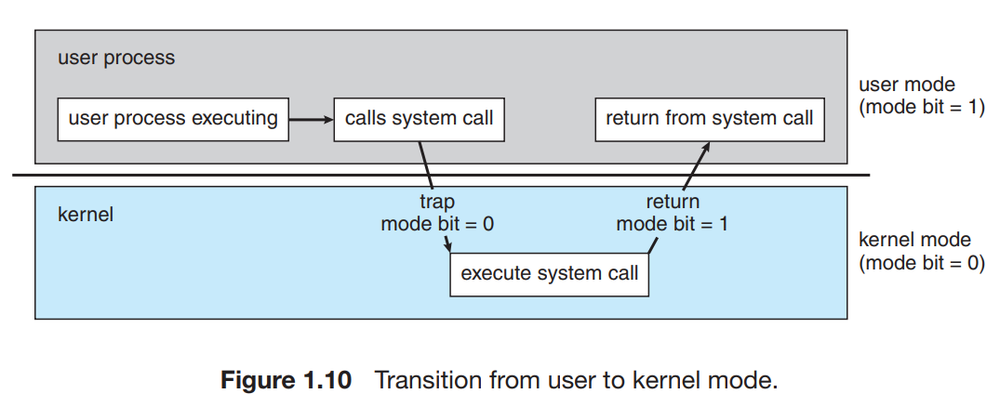
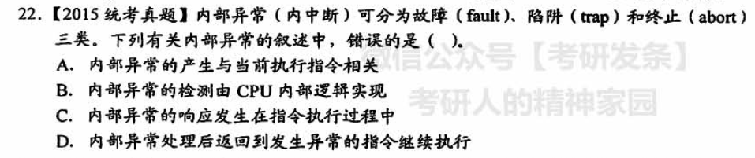

# 操作系统

## 第一章

### 操作系统概述

> 【2021 王道 p5 8】
>
> 单处理机系统中，可并行的是（）
>
> I.进程与进程 II.处理机与设备 III.处理机与通道 IV.设备与设备
>
> A.I II III 
>
> B.I II IV
>
> C.I III IV
>
> D.II III IV

> 通道是一种**专用处理器**
>
> CPU对通道的请求形式是：**通道命令**
>
> 通道对 CPU的请求形式是：**中断**
>
> ——https://blog.csdn.net/u012110719/article/details/41707611

单处理机系统同一时刻只能有一个进程占用处理机；

**通道独立于CPU、控制输入/输出设备**，所以可以与处理机并行

> 【2021 王道 p6 16】
>
> 操作系统与用户接口通常不包括
>
> A.shell B.命令解释器 C.广义指令 D.缓存管理指令

Shell 是一个应用程序，它连接了用户和 Linux 内核，让用户能够更加高效、安全、低成本地使用 Linux 内核，这就是 Shell 的本质。

——http://c.biancheng.net/view/706.html

广义指令指的就是**系统调用命令**，命令解释器属于**命令接口**

操作系统中的**缓存全部由操作系统管理**，对用户透明，不可能存在缓存相关指令

> 【2021 王道 p6 17】
>
> 下列选项中不属于多道程序设计的基本特征是（）
>
> A.制约性 B.间断性 C.顺序性 D.共享性

引入多道程序设计，程序的执行失去了封闭性和顺序性。

程序执行因为资源共享及相互协同的原因产生竞争，相互制约

为了竞争的公平性，程序的执行是断续的

**顺序性**是**单道程序设计**的**基本特征**

　　

---

库函数与系统调用的区别和联系：

**库函数**是语言或者应用程序的一部分，可以运行**在用户空间**中。而**系统调用**是操作系统的一部分，运行在**内核空间**中，是内核为用户提供的程序接口。

许多库函数会使用系统调用来实现功能。

未使用系统调用的库函数执行效率更高，因为使用系统调用的时候需要**上下文的切换**以及**用户态到核心态的转变**

### 操作系统分类

> 多道操作系统的基本特征有：**制约性、间断性、共享性**

---

>【2016 408真题】
>
>下列关于批处理系统的叙述中，正确的是（）
>
>I.批处理系统允许多个用户与计算机直接交互
>
>II.批处理系统分为单道批处理系统和多道批处理系统
>
>III.中断技术使得多道批处理系统和I/O设备可与CPU并行工作

应该是II和III，重点是III，**中断技术**使得多道批处理系统和I/O设备可与CPU并行工作

---

> 【2017 408真题】
>
> 与单道程序系统相比，多道程序系统的优点是
>
> I.CPU利用率高；II.系统开销小；III.系统吞吐量大；IV.I/O设备利用率高
>
> I、III、IV是优点，但是**系统要付出额外的开销来组织和切换作业**，系统开销是增大的

---

> 实时系统的进程调度，通常采用（）算法
>
> 实时系统强调实时性，如果优先级高，抢占，所以是**抢占式的优先级高者优先算法**

---

> 【王道2021 p12 11】
>
> 分时系统的一个重要性能是系统的响应时间，对操作系统（）因素进行改进有利于改善系统的响应时间
>
> A.加大时间片 B.采用静态页式管理 C.优先级+非抢占式调度算法 D.代码可重入
>
> 选C，
>
> > 简单的说，时间片小，每个进程运行的时间就短，进程切换花费的时间相对就多；但是等待的进程等待时间也短；时间片大，每个进程一旦得到运行，就可以运行不少的时间，进度快；进程切换少，浪费也少；但是，等待 的进程等待时间比较长。

---

> 【王道2021 p12 13】
>
> 在分时系统中，时间片一定的时候，（），响应时间越长
>
> A.内存越多 B.内存越少 C.用户数量越多 D.用户数量越少
>
> C 时间片固定的时候，用户越多，每个用户分到的时间片越少，响应的时间增长，分时系统中，响应时间T的比例关系为
> $$
> T\approx QN
> $$
> 
> 其中，Q是时间片，N是用户数量

---

> 
>
> 

> 
>
> 

### 操作系统运行环境

> 【王道2021 p20 2】
>
> 下列说法中，正确的是（）
>
> I.批处理系统的主要缺点是需要大量内存
>
> II.当计算机提供了核心态和用户态时，输入输出指令必须在核心态下执行
>
> III.操作系统中采用多道程序设计技术的主要原因是为了提高CPU和外部设备的可靠性
>
> IV.操作系统中，通道技术是一种硬件技术
>
> **批处理系统的主要缺点是缺乏交互性, 多道程序设计是为了提高系统利用率和吞吐量**

> 【王道2021 p20 3】
>
> 下列关于系统调用的说法中，正确的是（）
>
> **I.用户程序设计时，使用系统调用命令，该命令经过编译后，形成若干参数和陷入指令**
>
> II.用户程序设计时，使用系统调用命令，该命令经过编译后，形成若干参数和屏蔽中断指令
>
> **III.系统调用功能是操作系统向用户程序提供的接口**
>
> **IV.用户及其应用程序和应用系统是通过系统调用提供的支持和服务来使用系统资源完成其操作的**
>
> I、III、IV
>
> **用户的系统调用需要触发trap指令。**
>
> > A trap (or an exception) is a software-generated interrupt caused
> > either by an error (for example, division by zero or invalid memory access)
> > or by a specific request from a user program that an operating-system service
> > be performed.   
> >
> > 
>
> **程序设计无法形成屏蔽中断指令**

---

> **用户程序在用户状态下要使用特权指令引起的中断称为“访管中断”**

---

> 中断发生后，进入中断处理的程序属于**“操作系统程序”**

---

> 中断系统需要硬件支持

---

> 从用户态到核心态的转换是由**硬件**完成的

---

> 【2011 统考真题】
>
> 下列选项中，在用户态**执行**的是（）
>
> A.命令解释程序，B.缺页处理程序 C.进程调度程序 D.时钟中断处理程序
>
> 选A
>
> 【2012统考真题】
>
> 下列选项中，不可能在用户态**发生**的事件是（）
>
> A.系统调用，B.外部中断 C.进程切换 D.缺页
>
> 选C
>
> ---
>
> 
>
> > 命令解释程序（shell）是一个**用来对命令进行解释的进程**。 命令解释程序工作流程：命令解释程序从标准输入读入命令行，并创建一个子进程来之行命令，然后父进程要在读入另一条命令之前，等待这个子进程执行完毕。 实际的命令解释程序要负责处理进程流水线和重定向，以及前台进程组、后台进程组和信号。 我们可以给出一个设计命令解释程序的简单框架。
>
> 进程调度程序是操作系统内核进程，无需用户干预，在核心态执行
>
> [中断和异常的再总结]([(1条消息) 中断和异常的再总结_Bing's Blog-CSDN博客_访存时缺页属于中断吗](https://blog.csdn.net/u011240016/article/details/53117093))
>
> > **内部异常(内中断)**
> >
> > 故障（fault）
> > 自陷（trap）
> > 终止（abort）
> > 是源自CPU执行指令内部的事件。如：非法操作码，地址越界，算术溢出，虚存系统的缺页，陷入指令等引起的事件。内部异常不可被屏蔽，一旦出现立马处理。
> >
> > 外中断：来自CPU执行指令以外的事件。如：I/O中断，时钟中断等。
> >
> > 在操作系统层次上，我们多听到“异常”（Exception）而少见“中断”（Interrupt），且往往笼统地称其为异常，但处理器微体系结构规范通常会区分中断和异常。
> >
> > 一般而言，<u>**中断是异步的**，**异常是同步的**</u>，所谓同步和异步的概念，又与我们网络通信或函数调用中的同步异步有所不同。中断是来自处理器外部的I/O设备的信号的结果，它不是由指令流中某条指令执行引起的，从这个意义上讲，它是异步的，是来自指令流之外的。
> >
> > 异常又分为三类：陷阱（Trap）、故障（Fault）和终止（Abort），它们都是执行当前指令流中的某条指令的结果，是来自指令流内部的，从这个意义上讲它们都是同步的。
> >
> > 陷阱是有意而为之的异常，是明知有套还往里钻——人家要的就是这个结果，其最常见的用途就是操作系统的系统调用。
> >
> > 故障是由错误条件引起的，可能被故障处理例程修复。如果可以修复，则啥事儿没有，继续干活；如果不能修复则会转化为终止，并进入下一步。常见的故障如缺页。
> >
> > 终止是不可恢复的致命的错误造成结果。终止处理程序不再将控制返回给引发终止的应用程序，而是交给了系统——其结果往往是系统终止应用程序。
> > ————————————————
> > 版权声明：本文为CSDN博主「DrCrypto」的原创文章，遵循CC 4.0 BY-SA版权协议，转载请附上原文出处链接及本声明。
> > 原文链接：https://blog.csdn.net/u011240016/article/details/53117093
>
> > **中断或异常返回点的问题**
> >
> > 良性的如**中断和陷阱**，只是在正常的工作流之外执行额外的操作，然后继续干没干完的活。因此处理程序完了后返回到**原指令流的下一条指令**，继续执行。恶性的如故障和终止，对于可修复故障，由于是在上一条指令执行过程中发生（是由正在执行的指令引发的）的，在修复故障之后，会重新执行该指令；至于不可修复故障或终止，则不会再返回。
> > ————————————————
> > 版权声明：本文为CSDN博主「DrCrypto」的原创文章，遵循CC 4.0 BY-SA版权协议，转载请附上原文出处链接及本声明。
> > 原文链接：https://blog.csdn.net/u011240016/article/details/53117093
>
> > 缺页中断实际上是内中断，也就是异常，来自指令流的。
> > 存储异常也是来自指令流的，因此也是异常，不是中断。

---

> (2016.22) 异常是指令执行过程中在处理器内部发生的特殊事件，中断是来自处理器外部的请求事件。下列关于中断或异常情况的叙述中，错误的是：A
> A. **“访存时缺页”属于中断**
> B. “整数除以0”属于异常
> C. “DMA传送结束”属于中断
> D. “存储保护错”属于异常
>
> > 分析：这种概念的识记题如果没有真的理解，就很麻烦。这里，需要特别强调的是**CPU指令流相关一定是内中断，也即所谓的异常**。而**非CPU指令流导致的才是外中断**，比如**时钟中断，DMA中断等才是真正的外中断**。访存时缺页，我们听过太多的缺页中断，缺页异常，后来根本分不清谁是谁了，只需要抓住：**缺页是CPU访存指令时才有的。是CPU相关**。于是A项错误。
> > 整数除0，当然是CPU干的。存储保护错，也是内存访问相关，属于异常，也叫内中断。
> > ————————————————
> > 版权声明：本文为CSDN博主「DrCrypto」的原创文章，遵循CC 4.0 BY-SA版权协议，转载请附上原文出处链接及本声明。
> > 原文链接：https://blog.csdn.net/u011240016/article/details/53117093

> 
>
> 外中断和陷阱都是返回到下一条指令继续执行
>
> 除数为0和自行中断INT都会自动跳过中断指令

> CPU处于核心态的时候可以执行**除“访管”指令外**的所有指令

> 关中断是特权指令

> 【2012统考真题】
>
> 
>
> 子程序调用只保存程序断点，即该指令的下一条指令；
>
> 中断调用子程序要保存断点和程序状态寄存器（PSW）的内容
>
> > PSW
> >
> > PSW是Program Status Word的缩写，即程序状态字（也叫程序状态寄存器），可用于OS在管态（系统态）和目态（用户态）之间的转换。
> >
> > - **中文名：** 程序状态字
> > - **外文名：** PSW
> > - **别称：** 状态寄存器
>
> 中断处理的最重要的两个寄存器是PC和PSWR

