# 操作系统

## 第一章

### 操作系统概述

> 【2021 王道 p5 8】
>
> 单处理机系统中，可并行的是（）
>
> I.进程与进程 II.处理机与设备 III.处理机与通道 IV.设备与设备
>
> A.I II III 
>
> B.I II IV
>
> C.I III IV
>
> D.II III IV

> 通道是一种**专用处理器**
>
> CPU对通道的请求形式是：**通道命令**
>
> 通道对 CPU的请求形式是：**中断**
>
> ——https://blog.csdn.net/u012110719/article/details/41707611

单处理机系统同一时刻只能有一个进程占用处理机；

**通道独立于CPU、控制输入/输出设备**，所以可以与处理机并行


> 【2021 王道 p6 16】
>
> 操作系统与用户接口通常不包括
>
> A.shell B.命令解释器 C.广义指令 D.缓存管理指令

Shell 是一个应用程序，它连接了用户和 Linux 内核，让用户能够更加高效、安全、低成本地使用 Linux 内核，这就是 Shell 的本质。

——http://c.biancheng.net/view/706.html


广义指令指的就是**系统调用命令**，命令解释器属于**命令接口**

操作系统中的**缓存全部由操作系统管理**，对用户透明，不可能存在缓存相关指令


> 【2021 王道 p6 17】
>
> 下列选项中不属于多道程序设计的基本特征是（）
>
> A.制约性 B.间断性 C.顺序性 D.共享性

引入多道程序设计，程序的执行失去了封闭性和顺序性。

程序执行因为资源共享及相互协同的原因产生竞争，相互制约

为了竞争的公平性，程序的执行是断续的

**顺序性**是**单道程序设计**的**基本特征**

　　

---

库函数与系统调用的区别和联系：

**库函数**是语言或者应用程序的一部分，可以运行**在用户空间**中。而**系统调用**是操作系统的一部分，运行在**内核空间**中，是内核为用户提供的程序接口。

许多库函数会使用系统调用来实现功能。

未使用系统调用的库函数执行效率更高，因为使用系统调用的时候需要**上下文的切换**以及**用户态到核心态的转变**

### 操作系统分类

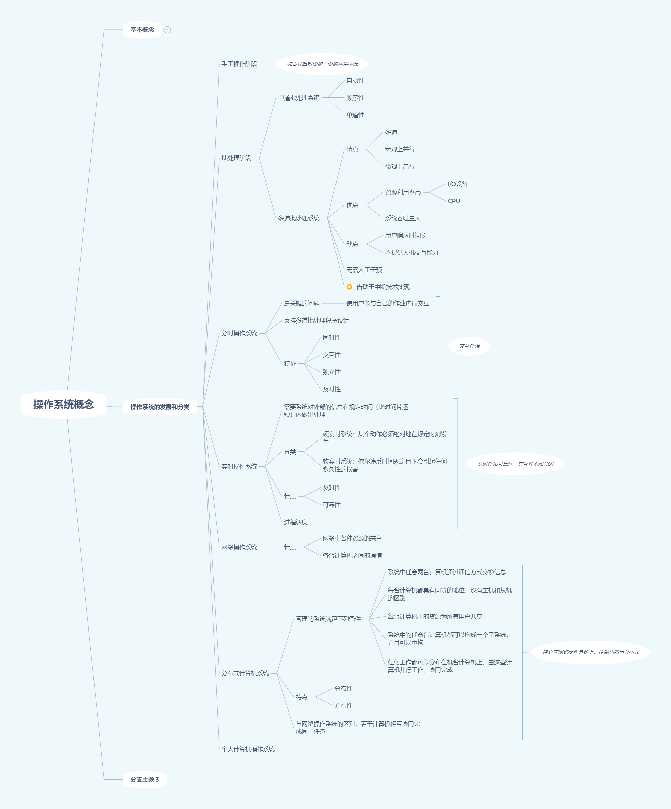

> 多道操作系统的基本特征有：**制约性、间断性、共享性**

---

>【2016 408真题】
>
>下列关于批处理系统的叙述中，正确的是（）
>
>I.批处理系统允许多个用户与计算机直接交互
>
>II.批处理系统分为单道批处理系统和多道批处理系统
>
>III.中断技术使得多道批处理系统和I/O设备可与CPU并行工作

应该是II和III，重点是III，**中断技术**使得多道批处理系统和I/O设备可与CPU并行工作

---

> 【2017 408真题】
>
> 与单道程序系统相比，多道程序系统的优点是
>
> I.CPU利用率高；II.系统开销小；III.系统吞吐量大；IV.I/O设备利用率高
>
> I、III、IV是优点，但是**系统要付出额外的开销来组织和切换作业**，系统开销是增大的


---

> 实时系统的进程调度，通常采用（）算法
>
> 实时系统强调实时性，如果优先级高，抢占，所以是**抢占式的优先级高者优先算法**

---

> 【王道2021 p12 11】
>
> 分时系统的一个重要性能是系统的响应时间，对操作系统（）因素进行改进有利于改善系统的响应时间
>
> A.加大时间片 B.采用静态页式管理 C.优先级+非抢占式调度算法 D.代码可重入
>
> 选C，
>
> > 简单的说，时间片小，每个进程运行的时间就短，进程切换花费的时间相对就多；但是等待的进程等待时间也短；时间片大，每个进程一旦得到运行，就可以运行不少的时间，进度快；进程切换少，浪费也少；但是，等待 的进程等待时间比较长。

---


> 【王道2021 p12 13】
>
> 在分时系统中，时间片一定的时候，（），响应时间越长
>
> A.内存越多 B.内存越少 C.用户数量越多 D.用户数量越少
>
> C 时间片固定的时候，用户越多，每个用户分到的时间片越少，响应的时间增长，分时系统中，响应时间T的比例关系为
> $$
> T\approx QN
> $$
> 
> 其中，Q是时间片，N是用户数量

---

> 
>
> 


> 
>
> 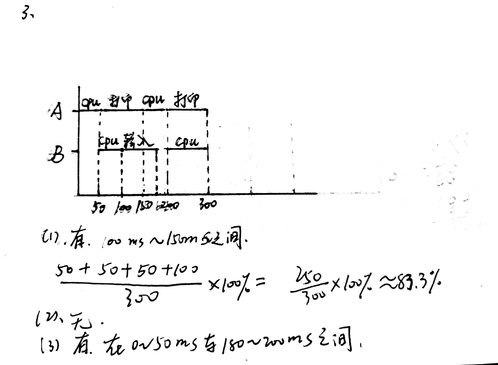

### 操作系统运行环境

> 【王道2021 p20 2】
>
> 下列说法中，正确的是（）
>
> I.批处理系统的主要缺点是需要大量内存
>
> II.当计算机提供了核心态和用户态时，输入输出指令必须在核心态下执行
>
> III.操作系统中采用多道程序设计技术的主要原因是为了提高CPU和外部设备的可靠性
>
> IV.操作系统中，通道技术是一种硬件技术
>
> <font color = red>**批处理系统的主要缺点是缺乏交互性, 多道程序设计是为了提高系统利用率和吞吐量**</font>


> 【王道2021 p20 3】
>
> 下列关于系统调用的说法中，正确的是（）
>
> **I.用户程序设计时，使用系统调用命令，该命令经过编译后，形成若干参数和陷入指令**
>
> II.用户程序设计时，使用系统调用命令，该命令经过编译后，形成若干参数和屏蔽中断指令
>
> **III.系统调用功能是操作系统向用户程序提供的接口**
>
> **IV.用户及其应用程序和应用系统是通过系统调用提供的支持和服务来使用系统资源完成其操作的**
>
> I、III、IV
>
> <font color = red>**用户的系统调用需要触发trap指令。**</font>
>
> > A trap (or an exception) is a software-generated interrupt caused
> > either by an error (for example, division by zero or invalid memory access)
> > or by a specific request from a user program that an operating-system service
> > be performed.   
> >
> > 
>
> **程序设计无法形成屏蔽中断指令**

---

> **用户程序在用户状态下要使用特权指令引起的中断称为“访管中断”**

---

> 中断发生后，进入中断处理的程序属于**“操作系统程序”**

---

> 中断系统需要硬件支持

---

> 从用户态到核心态的转换是由**硬件**完成的

---

> 【2011 统考真题】
>
> 下列选项中，在用户态**执行**的是（）
>
> A.命令解释程序，B.缺页处理程序 C.进程调度程序 D.时钟中断处理程序
>
> 选A
>
> 【2012统考真题】
>
> 下列选项中，不可能在用户态**发生**的事件是（）
>
> A.系统调用，B.外部中断 C.进程切换 D.缺页
>
> 选C
>
> ---
>
> 
>
> > 命令解释程序（shell）是一个**用来对命令进行解释的进程**。 命令解释程序工作流程：命令解释程序从标准输入读入命令行，并创建一个子进程来之行命令，然后父进程要在读入另一条命令之前，等待这个子进程执行完毕。 实际的命令解释程序要负责处理进程流水线和重定向，以及前台进程组、后台进程组和信号。 我们可以给出一个设计命令解释程序的简单框架。
>
> 进程调度程序是操作系统内核进程，无需用户干预，在核心态执行
>
> [中断和异常的再总结]([(1条消息) 中断和异常的再总结_Bing's Blog-CSDN博客_访存时缺页属于中断吗](https://blog.csdn.net/u011240016/article/details/53117093))
>
> > **内部异常(内中断)**
> >
> > 故障（fault）
> > 自陷（trap）
> > 终止（abort）
> > 是源自CPU执行指令内部的事件。如：非法操作码，地址越界，算术溢出，虚存系统的缺页，陷入指令等引起的事件。内部异常不可被屏蔽，一旦出现立马处理。
> >
> > 外中断：来自CPU执行指令以外的事件。如：I/O中断，时钟中断等。
> >
> > 在操作系统层次上，我们多听到“异常”（Exception）而少见“中断”（Interrupt），且往往笼统地称其为异常，但处理器微体系结构规范通常会区分中断和异常。
> >
> > 一般而言，<u>**中断是异步的**，**异常是同步的**</u>，所谓同步和异步的概念，又与我们网络通信或函数调用中的同步异步有所不同。中断是来自处理器外部的I/O设备的信号的结果，它不是由指令流中某条指令执行引起的，从这个意义上讲，它是异步的，是来自指令流之外的。
> >
> > 异常又分为三类：陷阱（Trap）、故障（Fault）和终止（Abort），它们都是执行当前指令流中的某条指令的结果，是来自指令流内部的，从这个意义上讲它们都是同步的。
> >
> > 陷阱是有意而为之的异常，是明知有套还往里钻——人家要的就是这个结果，其最常见的用途就是**操作系统的系统调用。**
> >
> > 故障是由错误条件引起的，可能被故障处理例程修复。如果可以修复，则啥事儿没有，继续干活；如果不能修复则会转化为终止，并进入下一步。常见的故障如缺页。
> >
> > 终止是不可恢复的致命的错误造成结果。终止处理程序不再将控制返回给引发终止的应用程序，而是交给了系统——其结果往往是系统终止应用程序。
> > ————————————————
> > 版权声明：本文为CSDN博主「DrCrypto」的原创文章，遵循CC 4.0 BY-SA版权协议，转载请附上原文出处链接及本声明。
> > 原文链接：https://blog.csdn.net/u011240016/article/details/53117093
>
> > <span id="return_point">**中断或异常返回点的问题**</span>
> >
> > 良性的如**中断和陷阱**，只是在正常的工作流之外执行额外的操作，然后继续干没干完的活。因此处理程序完了后返回到**原指令流的下一条指令**，继续执行。恶性的如故障和终止，对于可修复故障，由于是在上一条指令执行过程中发生（是由正在执行的指令引发的）的，在修复故障之后，会重新执行该指令；至于不可修复故障或终止，则不会再返回。
> > ————————————————
> > 版权声明：本文为CSDN博主「DrCrypto」的原创文章，遵循CC 4.0 BY-SA版权协议，转载请附上原文出处链接及本声明。
> > 原文链接：https://blog.csdn.net/u011240016/article/details/53117093
>
> > 缺页中断实际上是内中断，也就是异常，来自指令流的。
> > 存储异常也是来自指令流的，因此也是异常，不是中断。

---

> (2016.22) 异常是指令执行过程中在处理器内部发生的特殊事件，中断是来自处理器外部的请求事件。下列关于中断或异常情况的叙述中，错误的是：A
> A. **“访存时缺页”属于中断**
> B. “整数除以0”属于异常
> C. “DMA传送结束”属于中断
> D. “存储保护错”属于异常
>
> > 分析：这种概念的识记题如果没有真的理解，就很麻烦。这里，需要特别强调的是**CPU指令流相关一定是内中断，也即所谓的异常**。而**非CPU指令流导致的才是外中断**，比如**时钟中断，DMA中断等才是真正的外中断**。访存时缺页，我们听过太多的缺页中断，缺页异常，后来根本分不清谁是谁了，只需要抓住：**缺页是CPU访存指令时才有的。是CPU相关**。于是A项错误。
> > 整数除0，当然是CPU干的。存储保护错，也是内存访问相关，属于异常，也叫内中断。
> > ————————————————
> > 版权声明：本文为CSDN博主「DrCrypto」的原创文章，遵循CC 4.0 BY-SA版权协议，转载请附上原文出处链接及本声明。
> > 原文链接：https://blog.csdn.net/u011240016/article/details/53117093

> 
>
> 外中断和陷阱都是返回到下一条指令继续执行
>
> 除数为0和自行中断INT都会自动跳过中断指令
>
> 选D


> CPU处于核心态的时候可以执行**除“访管”指令外**的所有指令


> 关中断是特权指令


> 【2012统考真题】
>
> 
>
> **子程序**调用只保存**程序断点**，即该指令的下一条指令；
>
> **中断调用子程序**要保存**断点**和**程序状态寄存器**（PSW）的内容
>
> > PSW
> >
> > PSW是Program Status Word的缩写，即程序状态字（也叫程序状态寄存器），可用于OS在管态（系统态）和目态（用户态）之间的转换。
> >
> > - **中文名：** 程序状态字
> > - **外文名：** PSW
> > - **别称：** 状态寄存器
>
> 中断处理的最重要的两个寄存器是PC和PSWR


> 【王道2021 p22 22】
>
> 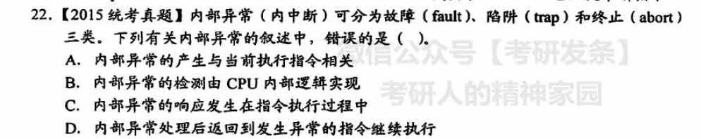
>
> [异常或者中断返回点的问题](#return_point)
>
> > 良性的如**中断和陷阱**，只是在正常的工作流之外执行额外的操作，然后继续干没干完的活。因此处理程序完了后返回到**原指令流的下一条指令**，继续执行。恶性的如故障和终止，对于可修复故障，由于是在上一条指令执行过程中发生（是由正在执行的指令引发的）的，在修复故障之后，会重新执行该指令；至于不可修复故障或终止，则不会再返回。
>
> 内中断不可以被屏蔽，一旦出现立即执行。
>
> 内中断举例：地址非法、校验错、页面失效、非法指令、用户程序执行特权指令自行中断（INT）、除数为零
>
> 如除数为0，自行中断（INT）都会自动跳过中断指令，不会返回到发生异常的指令继续执行
>
> > 链接：https://www.nowcoder.com/questionTerminal/12780ff7885a41358259776e06933f65
> > 来源：牛客网
> >
> > 这题D选项是说法过于绝对. 如果产生**缺页异常**, 属于fa.ult, 错误可恢复, 中断处理完成后仍回到被中断的指令继续执行; 如果除数为0, 属于abort, 严重错误不可恢复, 则不会返回到被中断的指令继续执行. 


> 【王道2021 p22 23】
>
> 
>
> 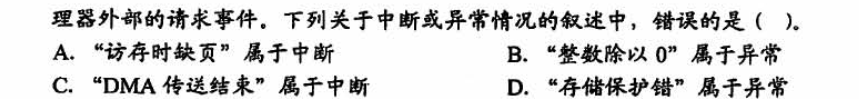
>
> > 把中断分为外中断和内中断。
> >
> > **外中断**——就是我们指的**中断**——是指由于外部设备事件所引起的中断，如通常的磁盘中断、打印机中断等；
> > **内中断**——就是**异常**——是指由于 CPU 内部事件所引起的中断，如程序出错(非法指令、地址越界)。内中断(trap)也被译为“捕获”或“陷入”。
> > 异常是由于执行了现行指令所引起的。由于系统调用引起的中断属于异常。
> > 中断则是由于系统中某事件引起的，该事件与现行指令无关。
> > ————————————————
> > 版权声明：本文为CSDN博主「王小闹儿」的原创文章，遵循CC 4.0 BY-SA版权协议，转载请附上原文出处链接及本声明。
> > 原文链接：https://blog.csdn.net/qq_29996285/article/details/88078939
>
> **访存时缺页，内部中断，也就是异常**
>
> 选A


> 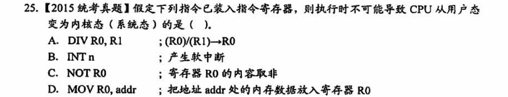
>
> 从用户态到内核的转换
>
> > **a.系统调用**
> > 这是用户进程主动要求切换到内核态的一种方式，用户进程通过系统调用申请操作系统提供的服务程序完成工作。
> >
> > 而系统调用的机制其核心还是使用了操作系统为用户特别开放的一个中断来实现，例如Linux的ine 80h中断。
> >
> > **b.异常**
> > 当CPU在执行运行在用户态的程序时，发现了某些事件不可知的异常，这是会触发由当前运行进程切换到处理此
> > 异常的内核相关程序中，也就到了内核态，比如缺页异常。
> >
> > **c.外围设备的中断**
> > 当外围设备完成用户请求的操作之后，会向CPU发出相应的中断信号，这时CPU会暂停执行下一条将要执行的指令
> > 转而去执行中断信号的处理程序，如果先执行的指令是用户态下的程序，那么这个转换的过程自然也就发生了有
> > 用户态到内核态的切换。比如硬盘读写操作完成，系统会切换到硬盘读写的中断处理程序中执行后续操作等。
> >
> > ————————————————
> > 版权声明：本文为CSDN博主「liuke0002」的原创文章，遵循CC 4.0 BY-SA版权协议，转载请附上原文出处链接及本声明。
> > 原文链接：https://blog.csdn.net/u014142287/article/details/51934940
>
> D选项可能产生**缺页异常**
>
> C选项不可能导致缺页异常

## 第二章 进程管理

### 进程与线程

#### 内容理解

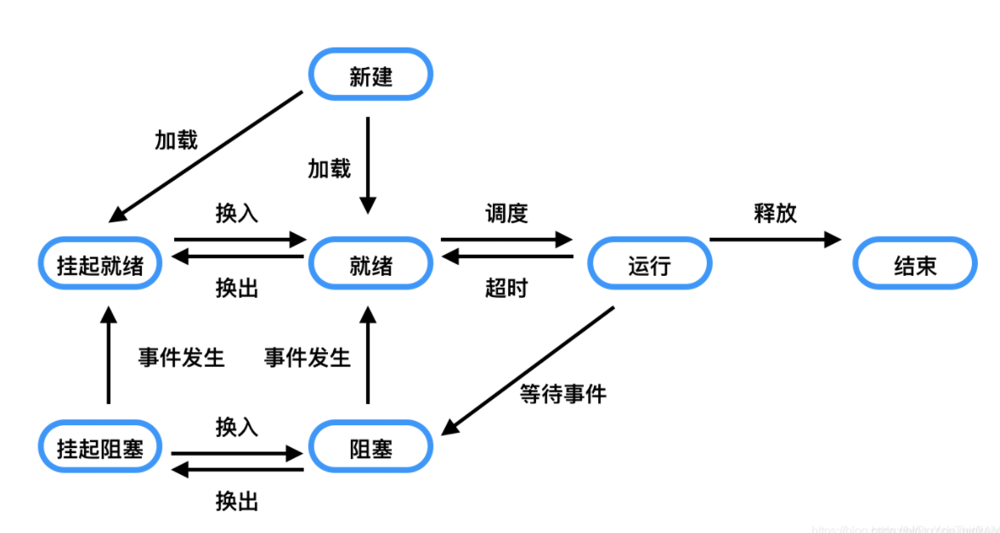

> 
>
> B，不用说
>
> C，死锁情况下，可能都是阻塞态
>
> D，申请不到处理器的时候，状态为就绪态
>
> 
>
> [Lime丶](https://www.nowcoder.com/profile/274664)
>
> 选A。
>
> D选项，进程若已获得除CPU以外的所有运行所需资源，此时申请CPU得不到满足，应该依然处于就绪状态。正在运行的进程，因为**某种原因而暂停**，此时处于阻塞状态(也称等待状态、挂起状态)


> 
>
> 运行——>就绪 引起变化
>
> 阻塞——>就绪 不引起变化
>
> C


> 
>
> C
>
> 但是阻塞队列最多有10个


> 
>
> 选D


> 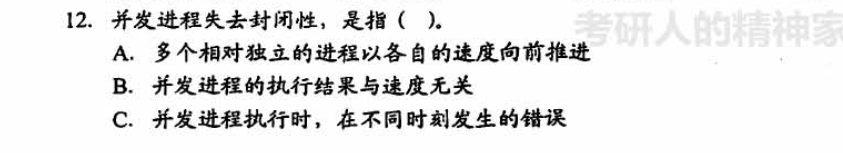


> 
>
> 进程：资源分配单位
>
> 线程：处理器调度和分配单位


> 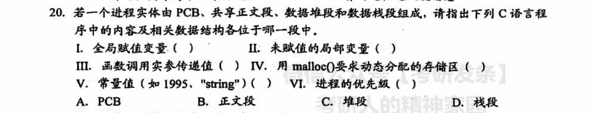
>
> 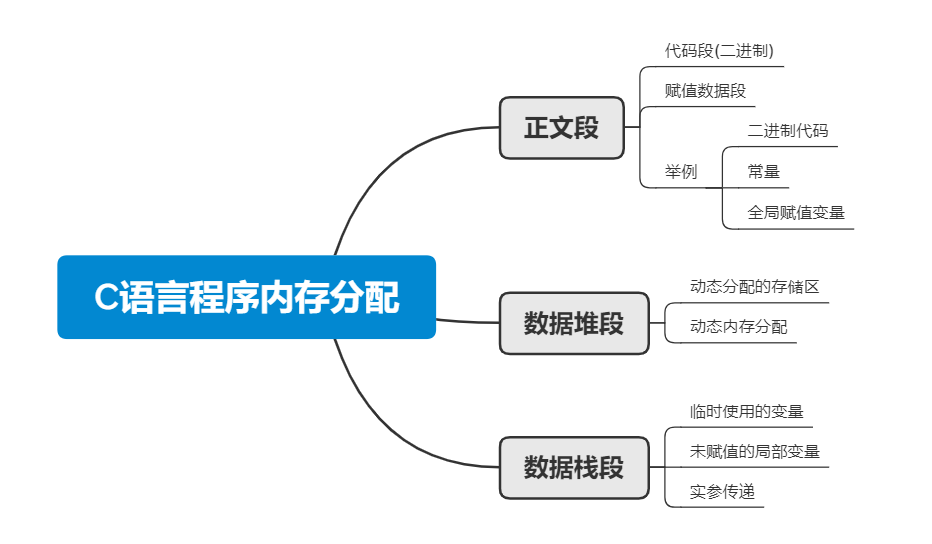
>
> 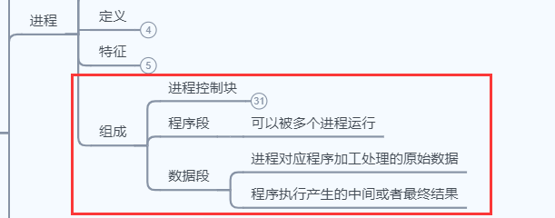
>
> 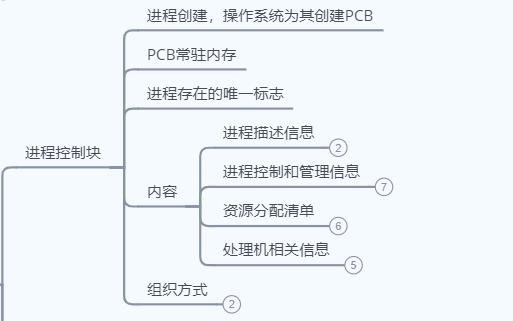


> 
>
> 进程是程序在一个数据集合上的运行过程
>
> 数据集不同，形成的是不同的进程


> 
>
> 
>
> 相同的


> 
>
> 只有当就绪队列为空的时候，CPU陷入等待状态，处理器效率才会变低


> 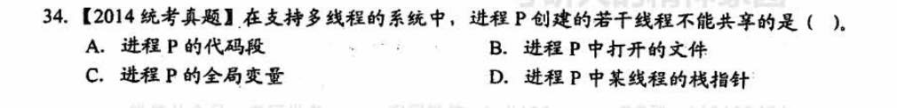


> 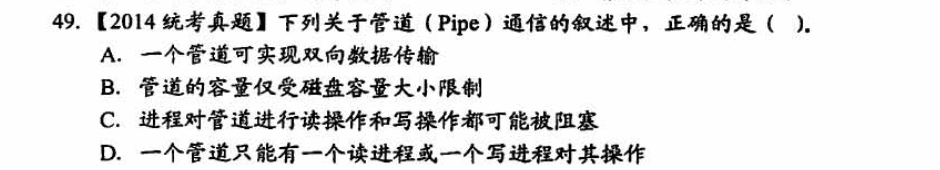


> 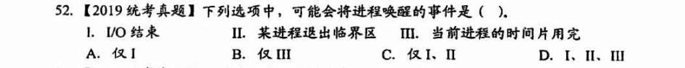
>
> I/O结束，之前等待I/O的进程被唤醒；
>
> 某进程退出临界区，之前需要进入临界区的进程被唤醒
>
> 时间片用完会从就绪队列调度进程，不会唤醒阻塞进程，阻塞的进程本身是运行着的时候，某时刻需要停下来等待资源；


### 处理机调度

> 
>
> A无需解释
>
> B 创建新的进程后，如果新的进程的优先级最高并且调度是剥夺式的调度，则可能发生处理机调度
>
> C 执行用户程序的临界区是允许调度的，
>
> 不适合进行处理机调度的情况，
>
> ①在处理中断的过程中
>
> ②操作系统内核程序的临界区中
>
> ③其他需要完全屏蔽中断的原子操作
>
> 某进程访问临界区或说处于临界区时，因某事件而阻塞，OS理应允许调度其他进程运行，但不能进入被阻塞进程的临界区
>
> 
>
> 引发新的调度的几个时刻：
>
> 1、新进程到来；
>
> 2、当前进程时间片用完；
>
> 3、进程结束阻塞状态；比如退出系统调用并返回；
>
> 而对于临界区中是否可以进行进程调度，一般而言是可以的；比如当进程访问外部设备时，进程由运行态转为阻塞态，此时进程重新调度。
>
> 链接：https://www.nowcoder.com/questionTerminal/1328fea60a494dfe897f0b8ca4ea3c98
> 来源：牛客网
>
> 
>
> 注意：
>
> - 进程在操作系统内核程序临界区中不能进行调度与切换。（√）
> - 进程处于临界区时不能进行处理机调度。（×）
>
> 
>
> 


> 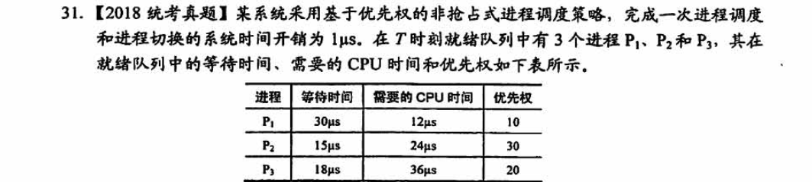


> 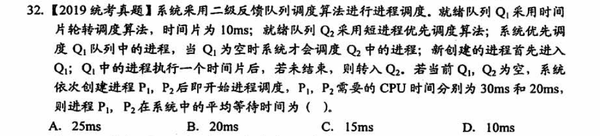


### 进程同步

> 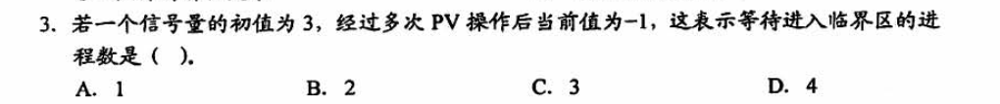


## 第三章 内存管理

### 内容理解

#### 分页、分段、段页式

如果是分页的话，我们需要将内存分成一个个大小一致的页框，我的一段程序可以分成一页一页地，离散地装入内存中。


我们需要做的是，将这段进程的数据按页送入内存


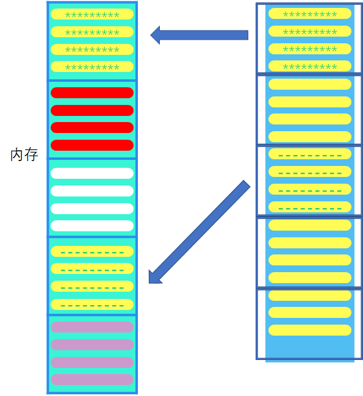


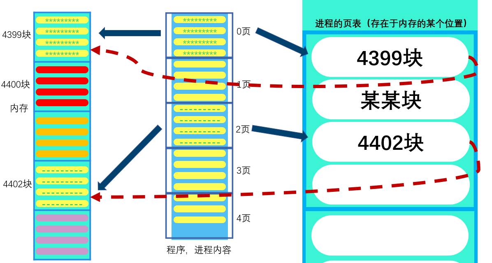

比如我现在给你一个32位的地址，你应该怎么找到某页内容在内存中的地址？

现在我们回想一下程序的运行机制：

我们以C语言为例，程序编译过程如下

> 1.预处理
>
>    此阶段主要完成#符号后面的各项内容到源文件的替换，往往一些莫名其妙的错误都是出现在头文件中的，要在工程中注意积累一些错误知识。
>
>    （1）、#ifdef等内容，完成条件编译内容的替换
>
>    （2）、#include中内容，在当前目录或者指定目录，或者默认目录搜索头文件，并将头文件拷贝到源文件中。
>
>    （3）、#define的内容，替换define的内容（包括上一步的头文件中的define内容）
>
>  此阶段产生[.i]文件。
>
> 2.编译
>
>    此阶段完成语法和语义分析，然后生成中间代码，此中间代码是汇编代码，但是还不可执行，gcc编译的中间文件是[.s]文件。
>
>  在此阶段会出现各种语法和语义错误，特别要小心未定义的行为，这往往是致命的错误。
>
>  第一个阶段和第二个阶段由编译器完成。
>
> 3.汇编
>
>  此阶段主要完成将汇编代码翻译成机器码指令，并将这些指令打包形成可重定位的目标文件，[.O]文件，是二进制文件。
>
>  此阶段由汇编器完成。
>
> 4.链接
>
>  此阶段完成文件中叼用的各种函数跟静态库和动态库的连接，并将它们一起打包合并形成目标文件，即可执行文件。
>
>  此阶段由链接器完成。
>
>  gcc编译C语言主要用到以下几个程序：C编译器gcc、汇编器as、链接器ld和二进制转换工具objcopy。

整个程序最终是以二进制的形式存储到外存中，并且是以一条一条指令的形式存在，这里我们假设每条指令都是一个字节，也就是32位二进制二进制可以表示一条指令，

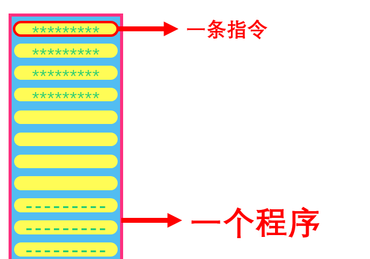

如果你想要运行一个程序，则需要将其调入内存运行

无论是从虚拟内存的角度，还是从提高内存利用率的角度，分页方式都是很好的一种方式，即使一段程序很大，我们可以将其分开，一页一页地调入，就像家里煮羊肉的时候，一整只羊放不进锅里，那就切开，一份一份地进锅煮，虽然一个锅不能放下整只羊，但我仍然可以说，我的锅可以完成煮羊肉的任务。这也是虚拟内存的一种理解方式；而且分页不会造成外部碎片，而且一段程序只可能在最后一页产生内部碎片，提高了内存的利用率。


扯远了，拉回来，我们在执行程序的时候，PC（指令地址寄存器）给出指令的位置，也就是指令的地址，


为什么分段需要检查偏移量，而分页不需要

因为分页的每一页大小固定，而且业内偏移在地址中的位数固定，页内一共有$2^{10}$​条指令，那么在设计地址的时候，业内偏移只有10位，不可能出现越界；但是分段的大小是不固定的


#### 动态重定位和静态重定位

#### 一维和二维的查找


## 一些概念

管道

> A pipe acts as a conduit allowing two processes to communicate. Pipes were
> one of the first IPC mechanisms in early UNIX systems. They typically provide
> one of the simpler ways for processes to communicate with one another,
> although they also have some limitations. In implementing a pipe, four issues
> must be considered:  
>
> **`<Operating System Concepts>`**

管程

> researchers have developed high-level language constructs. In this section, we describe one fundamental **high-level** synchronization construct—the monitor type.  
>
> ```
> monitor monitor name
> {
>     /* shared variable declarations */
>     function P1 ( . . . ) {
>     . . .
>     }
>     function P2 ( . . . ) {
>     . . .
>     }
>     . . .
>     function Pn ( . . . ) {
>     . . .
>     }
>     initialization code ( . . . ) {
>     . . .
>     }
> }
> ```
>
> The monitor construct ensures that only one process at a time is active within the monitor. Consequently, the programmer does not need to code this synchronization constraint explicitly.
>
> 来自<Operating System Concepts>

