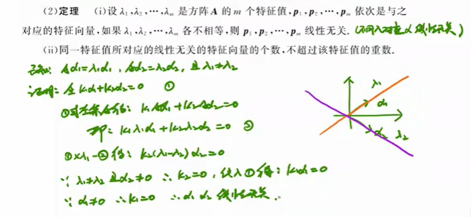

# 线性代数

## 特征值和特征向量

**证明不同特征值的特征向量线性无关**

## 基本公式

### 行列式公式

$$
\begin{aligned}
&1:|kA|=k^n|A|\\
&2:|AB|=|A||B|\\
&3:|A^T|=|A|\\
&4:|A^{-1}|=|A|^{-1}\\
&5:|A^*|=|A|^{n-1}\\
&6:|A|=\prod\limits_{i=1}^n\lambda_i,\lambda_i为特征值\\
&7:若A、B相似，则|A|=|B|
\end{aligned}
$$

### 秩

#### 性质

1. A为m×n阶矩阵，则r(A)≤min{m,n};
2. r(A+B)≤r(A)+r(B);
3. 设A为m×n阶矩阵，B为n×s阶矩阵，则r(AB)≤min{r(A), r(B)}
4. max{r(A), r(B)}≤r(A|B)≤r(A)+r(B)
5. r(A)=r(kA)(k≠0)
6. 设A为m×n阶矩阵，P为m阶可逆矩阵，Q为n阶可逆矩阵，则r(A)=r(PA)=r(AQ)=r(PAQ)
7. 设A为m×n阶矩阵，若r(A)=n，则r(AB)=r(B)；若r(A)=m，则r(BA)=r(B)
8. r(A)=r($A^T$)=r($A^TA$)=r($AA^T$​)
9. 设A为m×n阶矩阵，B为n×s阶矩阵，满足AB=0，则r(A)+r(B)≤n
10. $r(A^*)=\left\{\begin{array}{**lr**}n,&r(A)=n\\1, &r(A)=n-1\\0, &r(A)<n-1\end{array}\right.$
11. 

> 
>
> 
>
> **9：设A为m×n阶矩阵，B为n×s阶矩阵，满足AB=0，则r(A)+r(B)≤n**
> $$
> \begin{aligned}
> &将B分块，写作(\beta_1,\beta_2,\cdots,\beta_s)\\
> &则AB=(A\beta_1,A\beta_2,\cdots,A\beta_s)=0\\
> &\therefore A\beta_1=0,A\beta_2=0,\cdots,A\beta_s=0\\
> &\therefore \beta_1,\beta_2,\cdots,\beta_s可以由Ax=0的线性无关解来表示\\
> &\because Ax=0有n-r(A)个线性无关解\\
> &\therefore r(\beta_1\beta_2\cdots\beta_s)\le n-r(A)\\
> &即r(B)\le n-r(A)\\
> &\therefore r(A)+r(B)\le n
> \end{aligned}
> $$
> **10：证明**
> $$
> \begin{aligned}
> &①当r(A)=n时，|A|\ne0\\
> &\therefore |A^*|=|A|^{n-1}\ne 0\\
> &\therefore r(A^*) = n\\
> &②当r(A) < n-1时，A的所有n-1阶子式均为0\\
> &\therefore A的所有余子式均为0\\
> &\therefore A的所有代数余子式均为0\\
> &\therefore A^*=O\\
> &\therefore r(A^*)=0\\
> &③当r(A) = n - 1时，存在n-1阶子式不为0\\
> &\therefore A^*\ne O\\
> &\therefore r(A^*)\ge 1\\
> &\because AA^*=A|A|A^{-1}=|A|E=O\\
> &\therefore 根据性质9,r(A)+r(A^*)\le n\\
> &\because r(A)=n-1\\
> &\therefore r(A^*)=1
> \end{aligned}
> $$
> 

### 相似

若A~B，则A+kE~B+kE

证明：
$$
\begin{aligned}
&若A\sim B\\
&则\exist n阶可逆矩阵P，使得B=P^{-1}AP\\
&而 P^{-1}(A+kE)P=(P^{-1}A+kP^{-1}E)P=P^{-1}AP+kP^{-1}EP=B+kE\\
&即\exist  n阶可逆矩阵P，使得B+kE=P^{-1}(A+kE)P\\
&所以A+kE\sim B+kE
\end{aligned}
$$

