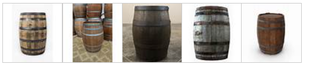
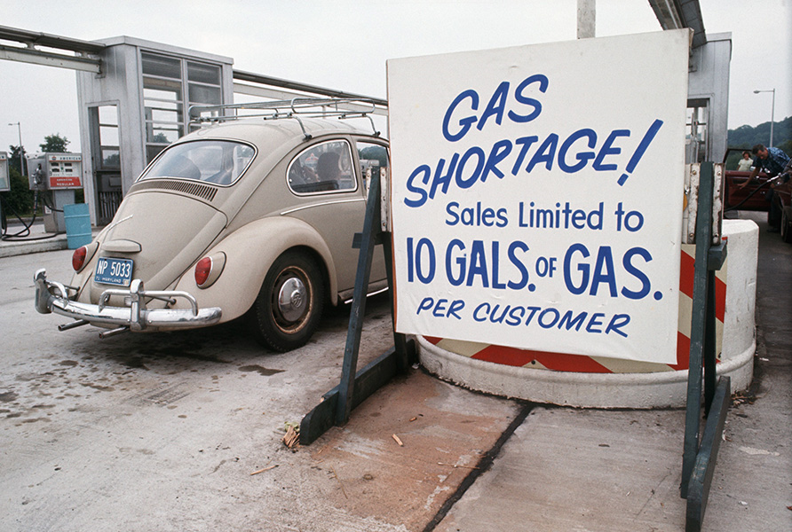
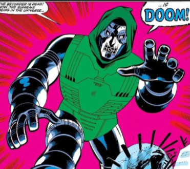

# 阅读训练

## 英语二 2002

### 2002 完形填空

​	**Comparisons wer drawn** between the development of television in the 20th century and the $diffusion_{n.传播；散布；【物】扩散；冗长}$​​​​ of printing in the 15th and 16th centuries.  Yet much had happend <u>between</u>.  As was discussed before, it was not  <u>until</u> in the 19th century that the newspaper became the dominant pre-electronic <u>medium</u>, following in the wake of the $pamphlet_{n. 小册子，手册}$​​​​, and the book and in the <u>company</u> of the $periodical_{n.(日报以外的)定期刊物,杂志}$​​​​​. It was during the same time that the communications revolution <u>speeded</u> up, beginning with transport , the railway, and leading <u>on</u> through the telegraph, the telephone, radio, and **$motion\ pictures_{电影}$​​​​​** <u>into</u> the 20th-centrury world of the motor car and the airplane. Not everyone sees that process in <u>perspective</u>. It is important to do so.

> **draw**
>
> 美 [drɔ]
>
> 英 [drɔː]
>
> - **n.**抽彩；抽奖；抽签；平局
> - **v.**描画；拖（动）；拉（动）；牵引
> - **网络**绘制；绘图；画画
>
> 1.描写;草拟,制订,拟(稿);描(图),绘制,画(线等),勾(轮廓)
>
> 2.画,描;制图3.惹,引,招,引起,招致,吸引(注意等)
>
> 4.拉,牵,曳,拖;拉开,张满;汲取
>
> 5.拔(牙、钉等),抽出(刀),从(容器等中)倒出(物品);取出(鸡等的)内脏
>
> 6.打(水),排干,汲出(水等液体);受,靠(人供给);领取,提取(钱款),获得(资源等),生(利),汲取(教训)
>
> 7.拉,牵,曳,张(弓等)
>
> 8.拔刀,拔枪
>
> 9.向(某处)移动,挨近,靠近,走近,靠拢(时间等)接近,逼近
>
> 10.【医学】(膏药等)吸脓,拔出牙齿
>
> draw a conclusion 
>
> draw a comparision
>
> 引出结论，引出比较。
>
> ---
>
> **diffusion**
>
> 美 [dɪ'fjuʒ(ə)n]
>
> 英 [dɪ'fjuːʒ(ə)n]
>
> - **n.**传播；散布；【物】扩散；冗长
> - **网络**漫射；扩散作用；弥散
>
> ---
>
> **periodical**
>
> 美 [.pɪri'ɑdɪk(ə)l]
>
> 英 [.pɪəri'ɒdɪk(ə)l]
>
> - **adj.**定期的；时常发生的；定期发行的
> - **n.**（学术）期刊
> - **网络**杂志；周期的；刊物
>
> ---
>
> **lead someone on**
>
> **1.** to guide someone onward. *We led him on so he could see more of the gardens.* *Please lead Mary on. There is lots more to see here.*
>
> 带领某人向前进，onward，adv 向前
>
> **2.** and **lead** someone **on** to tease someone; to encourage someone's romantic or sexual interest without sincerity. *You are just leading me on!* *It's not fair to continue leading him on.* *It's easy to lead on teenage boys.*
>
> See also: [lead](https://idioms.thefreedictionary.com/lead), [on](https://idioms.thefreedictionary.com/on)
>
> **lead on**
>
> to continue to lead onward. *The guide led on and we followed.* *Lead on, my friend. We are right behind you!*
>
> See also: [lead](https://idioms.thefreedictionary.com/lead), [on](https://idioms.thefreedictionary.com/on)
>
> McGraw-Hill Dictionary of American Idioms and Phrasal Verbs. © 2002 by The McGraw-Hill Companies, Inc.
>
> ---
>
> **motion picture**
>
> - **n.**电影
> - **adj.**电影的
>
> ---
>
> **perspective**
>
> 美 [pər'spektɪv]
>
> 英 [pə(r)'spektɪv]
>
> - **n.**观点；远景；景观；透视法
> - **adj.**(按照)透视画法的；透视的
> - **网络**透视图；视角；看法
>
> **in perspective**
>
> - **na.**按照透视画法的[地]；展望中的[地]；正确的[地]
> - **网络**正确地；观察合理地；符合透视法地

It is generally recognized, however, that the introduction of the computer in the early 20th century, followed by the invention of the integrated ciruit during the 1960s, radically changed the process, <u>although</u> its impact on the media was not immediately <u>apparent</u>. As time went by, computers became smaller and more powerful, and they became "personal" too, as well as <u>universal</u> , with display becoming sharper and storage <u>capacity</u> increasing. They were thought of, like people, <u>in terms of</u>  generations, with the distance between generations much <u>smaller</u>.

It was within the computer age that the term "infomation society" began to be widely used to describe the <u>context</u>  within which we now live. The communications revolution has influenced both work and leisure and how we think and feel both about place and time, but there has been controvertial views about its economic, political, social and cultural implications. "Benefits" have been weighed <u>against</u>.

### Text1

​	If you **intend** using humor in your talk to make people smile, you must know how to **identify** shared experiences and problems. Your humor must be **relevant** to the audience and should help to show them that you are one of them or that you **understand** their situation and are in **sympathy** with their point of view. Depending on whom you are addressing, the problems will be different. If you are talking to a group of managers, you may refer to the **disorganized** methods of their secretaries; alternatively if you are addressing secretaries, you may want to **comment** on their **disorganized** bosses.
Here is an example, which I heard at a nurses' **convention**, of a story which works well because the audience all shared the same view of doctors. A man arrives in heaven and is being shown around by St. Peter. He sees wonderful accommodations, beautiful gardens, sunny weather, and so on. Everyone is very **peaceful**, polite and friendly until, waiting in a line for lunch, the new arrival is suddenly pushed aside by a man in a white coat, who rushes to the head of the line, grabs his food and stomps over to a table by himself. "Who is that?" the new arrival asked St. Peter. "Oh, that's God," came the reply, "but sometimes he thinks he's a doctor."
​	If you are part of the group which you are addressing, you will be in a position to know the experiences and problems which are common to all of you and it'll be **appropriate** for you to make a passing remark about the inedible canteen food or the chairman's notorious bad taste in ties. With other audiences you mustn't attempt to cut in with humor as they will **resent** an outsider making disparaging remarks about their canteen or their chairman. You will be on safer ground if you **stick** to scapegoats like the Post Office or the telephone system.
​	If you feel **awkward** being **humorous**, you must practice so that it becomes more natural. Include a few casual and apparently off-the-cuff remarks which you can deliver in a **relaxed** and unforced manner. Often it's the **delivery** which causes the audience to smile, so speak slowly and remember that a raised **eyebrow** or an unbelieving look may help to show that you are making a light-hearted remark.
​	Look for the humor. It often comes from the **unexpected**. A **twist** on a familiar **quote** "If at first you don't succeed, give up" or a play on words or on a situation. Search for **exaggeration** and understatements. Look at your talk and pick out a few words or sentences which you can turn about and **inject** with humor.

### Text 2

​	Since the dawn of human **ingenuity****n. 聪明才智；独创力；心灵手巧**, people have **devised设计；制定；发明；创造** ever more **cunning****adj. 狡猾的；奸诈的；诡诈的；灵巧的** tools to cope with work that is dangerous, **boring**, **burdensomeadj.负担沉重的；难以承担的；繁重的**, or just **plain nasty****adj.肮脏的**. That **compulsionn.强制；冲动；强迫** has resulted in robotics — the science of **conferring** **v.授予；协商；商讨；交换意见**various human capabilities on machines. <u>And if scientists have yet to create the **mechanical****adj.机动的；机械驱动的；机械的；机器的** version of science **fiction**, they have begun to come close.</u>如果科学家们还没有在机械上实现科幻小说的幻想，那么他们也已经很接近这个目标了。

> > **ingenuity**
> >
> > 美 [.ɪndʒə'nuəti]
> >
> > 英 [.ɪndʒə'njuːəti]
> >
> > - **n.**聪明才智；独创力；心灵手巧
> > - **网络**独创性；机灵；精巧
>
> > **cunning**
> >
> > 美 ['kʌnɪŋ]
> >
> > 英 ['kʌnɪŋ]
> >
> > - **n.**狡猾；诡诈；狡黠
> > - **adj.**狡猾的；奸诈的；诡诈的；灵巧的
> > - **网络**狡诈的；巧妙的；可爱的
>
> > **burdensome**
> >
> > 美 ['bɜrd(ə)nsəm]
> >
> > 英 ['bɜː(r)d(ə)ns(ə)m]
> >
> > - **adj.**负担沉重的；难以承担的；繁重的
> > - **网络**累赘的；难以负担的；劳累的
>
> > **compulsion**
> >
> > 美 [kəm'pʌlʃ(ə)n]
> >
> > 英 [kəm'pʌlʃ(ə)n]
> >
> > - **n.**强制；冲动；强迫
> > - **网络**强迫行为；强迫症；难以抗拒的冲动
>
> > **confer**
> >
> > 美 [kən'fɜr]
> >
> > 英 [kən'fɜː(r)]
> >
> > - **v.**授予；协商；商讨；交换意见
> > - **网络**商议；商谈；赋予
>
> > **mechanical**
> >
> > 美 [mə'kænɪk(ə)l]
> >
> > 英 [mɪ'kænɪk(ə)l]
> >
> > - **adj.**机动的；机械驱动的；机械的；机器的
> > - **网络**机械工程；力学的；机械式
>
> > **devise**
> >
> > 美 [dɪˈvaɪz]
> >
> > 英 [dɪ'vaɪz]
> >
> > - **v.**设计；制定；发明；创造
> > - **n.**【法】遗赠财产的遗嘱(或其中的条款)；【法】遗赠的财产
> > - **网络**想出；策划；计划
>
> 

​	As a result, the modern world is increasingly **populated** by intelligent **gizmos** whose presence we barely notice but whose universal existence has removed much human labor. Our factories **hum** to the **rhythm** of robot **assembly** arms. Our banking is done at **automatedadj.自动的 tellern.出纳员；出纳机；提款机；（尤指议会投票时的）计票员 terminalsn.终端设备** that thank us with mechanical politeness for the **transaction**. Our subway trains are **controlled** by tireless robo-drivers. And thanks to the **continual** **miniaturization** of electronics and micro-mechanics, there are already robot systems that can **perform** some kinds of brain and **bone** **surgery** with **submillimeteradj.亚毫米的** accuracy — far greater **precision** than highly skilled physicians can achieve with their hands alone.

> > **populate**
> >
> > 美 ['pɑpjə.leɪt]
> >
> > 英 ['pɒpjʊleɪt]
> >
> > - **v.**居住于；生活于；构成…的人口；迁移
> > - **网络**填入；填充；居住于…中
>
> > **gizmo**
> >
> > 美 ['ɡɪzmoʊ]
> >
> > 英 ['ɡɪzməʊ]
> >
> > - **n.**小物件；小发明
> > - **网络**线框；小玩意儿；变形器
>
> > **hum**
> >
> > 美 [hʌm]
> >
> > 英 [hʌm]
> >
> > - **n.**嗡嗡声；交流声；哼哼声；嘈杂声
> > - **v.**哼(歌曲)；〈口语〉欺骗；发出嗡嗡声或呼呼声:；(在嘴里)咕咕哝哝
> > - **int.**哼!（表示轻蔑、踌躇、怀疑等）
> > - **网络**人族；吽；嗡嗡叫
>
> > **rhythm**
> >
> > 美 ['rɪðəm]
> >
> > 英 ['rɪðəm]
> >
> > - **n.**节奏；节律；韵律；规律
> > - **网络**律动；节拍；节奏感
>
> > **assembly**
> >
> > 美 [əˈsembli]
> >
> > 英 [əˈsembli]
> >
> > - **n.**装配；议会；集合；组合体
> > - **网络**组装；组件；程序集
> >
> > 1.	`[c]`
> > 立法机构；会议；议会a group of people who have been elected to meet together regularly and make decisions or laws for a particular region or country
> > 2.	`[u][c]`
> > 集会；（统称）集会者the meeting together of a group of people for a particular purpose; a group of people who meet together for a particular purpose
> > 3.	`[c][u]`
> > （全校师生的）晨会，朝会a meeting of the teachers and students in a school, usually at the start of the day, to give information, discuss school events or say prayers together
> > 4.	`[u]`
> > 装配；组装；总成the process of putting together the parts of sth such as a vehicle or piece of furniture
>
> > **teller**
> >
> > 美 ['telər]
> >
> > 英 ['telə(r)]
> >
> > - **n.**出纳员；出纳机；提款机；（尤指议会投票时的）计票员
> > - **网络**柜员；银行出纳员；银行职员
>
> > **terminal**
> >
> > 美 ['tɜrmɪn(ə)l]
> >
> > 英 ['tɜː(r)mɪn(ə)l]
> >
> > - **n.**终端；航站楼；终端机；航空终点站
> > - **adj.**晚期的；不治的；致命的；患绝症的
> > - **网络**端子；末端的；终端设备
>
> > **transaction**
> >
> > 美 [træn'zækʃ(ə)n]
> >
> > 英 [træn'zækʃ(ə)n]
> >
> > - **n.**处理；业务；办理
> > - **网络**交易；事务；事务处理
>
> > **continual**
> >
> > 美 [kən'tɪnjuəl]
> >
> > 英 [kən'tɪnjʊəl]
> >
> > - **adj.**（令人厌烦地）多次重复的；接连不断的；连续的；频频的
> > - **网络**频繁的；不断地；持续不断的
>
> > **surgery**
> >
> > 美 ['sɜrdʒəri]
> >
> > 英 ['sɜː(r)dʒəri]
> >
> > - **n.**外科手术；外科学；应诊时间；诊室
> > - **网络**手术室；诊所
>
> > **bone surgery**
> >
> > + **un.**骨科手术
> >
> > - **网络**骨科学科；骨头手术
>
> > **submillimeter**
> >
> > - **网络**亚毫米；亚毫米波；亚毫米的
>
> > **precision**
> >
> > 美 [prɪ'sɪʒ(ə)n]
> >
> > 英 [prɪ'sɪʒ(ə)n]
> >
> > - **n.**精确；准确；细致
> > - **adj.**精确的
> > - **网络**精度；精密度；精确度
>
> 

​	But if robots are to reach the next stage of laborsaving **[utility](#utility)**, they will have to operate with less human **[supervision](#supervision)** and be able to make at least a few decisions for themselves — goals that pose a real challenge. "While we know how to tell a robot to handle a specific error," says Dave Lavery, manager of a robotics program at NASA, "we can't yet give a robot enough 'common sense' to reliably interact with a dynamic world."

> > **utility**
> >
> > 美 [ju'tɪləti]
> >
> > 英 [juː'tɪləti]
> >
> > - **n.**公用事业；实用；效用；有用
> > - **adj.**多用途的；多效用的；多功能的
> > - **网络**功用；实用性；实用程序
>
> > **supervision**
> >
> > 美 [.supər'vɪʒ(ə)n]
> >
> > 英 [.suːpə(r)'vɪʒ(ə)n]
> >
> > - **n.**监督；管理
> > - **网络**监管；监视；督导

​	Indeed the quest for true artificial intelligence has produced very mixed results. Despite a spell of[ **initial**](#initial) **[optimism](#optimism)** in the 1960s and 1970s when it appeared that **[transistor](#transistor)** **[circuits](#circuit)** and **[microprocessors](#microprocessor)** might be able to copy the action of the human brain by the year 2010, researchers lately have begun to **[extend](#extend)** that forecast by decades if not centuries.

> > **initial**
> >
> > 美 [ɪ'nɪʃ(ə)l]
> >
> > 英 [ɪ'nɪʃ(ə)l]
> >
> > - **adj.**最初的；开始的；第一的
> > - **n.**（名字的）首字母；（全名的）首字母
> > - **v.**用姓名的首字母作标记（或签名）于
> > - **网络**初始；初始化；初始的
>
> > **optimism**
> >
> > 美 ['ɑptɪ.mɪzəm]
> >
> > 英 ['ɒptɪ.mɪzəm]
> >
> > - **n.**乐观；乐观主义
> > - **网络**乐观向上；乐观精神；乐观感
>
> > **transistor**
> >
> > 美 [træn'zɪstər]
> >
> > 英 [træn'zɪstə(r)]
> >
> > - **n.**晶体管；晶体管收音机
> > - **网络**电晶体；三极管；晶体三极管
>
> > **circuit**
> >
> > 美 [ˈsɜːrkɪt]
> >
> > 英 [ˈsɜːkɪt]
> >
> > - **n.**回路；巡回；循环；圈
> > - **v.**(绕…)环行
> > - **网络**电路；线路；电路，线路
>
> > **extend**
> >
> > 美 [ɪk'stend]
> >
> > 英 [ɪk'stend]
> >
> > - **v.**扩展；延长；扩大；提供
> > - **网络**延伸；扩充；伸展
>
> > **microprocessor**
> >
> > 美 [.maɪkroʊ'prɑ.sesər]
> >
> > 英 ['maɪkrəʊ.prəʊsesə(r)]
> >
> > - **n.**【计】微处理器
> > - **网络**微处理机；微处理装置；微型处理器

​	What they found, in attempting to model thought, is that the human brain's roughly one hundred billion nerve cells are much more talented — and human perception far more complicated — than previously imagined. They have built robots that can recognize the error of a machine panel [by a fraction of](#byafractionof) a millimeter in a **controlled** factory **environment**. But the human mind can **[glimpse](#glimpse)** a rapidly changing scene and immediately **[disregard](#disregard)** the 98 percent that is **irrelevant**, instantaneously focusing on the monkey at the side of a [**winding**](#winding) forest road or the single **suspicious** face in a big crowd. The most **advanced** computer systems on Earth can't **approach** that kind of ability, and neuroscientists still don't know quite how we do it.

> > **by a fraction of**
> >
> > 一小部分
> >
> > 例句：
> >
> > However it is achieved, after each layer is complete the build tray is lowered by a fraction of a millimetre and the next layer is added.
> > 无论用何种方式，每当一层完成后建造托盘被降低几微米，然后添加下一层。
>
> > **glimpse**
> >
> > 美 [ɡlɪmps]
> >
> > 英 [ɡlɪmps]
> >
> > - **v.**瞥见；〔诗〕闪现
> > - **n.**领悟；概况；见识；一睹
> > - **网络**一瞥；一瞥，一看；掠影
>
> > **disregard**
> >
> > 美 [.dɪsrɪ'ɡɑrd]
> >
> > 英 [.dɪsrɪ'ɡɑː(r)d]
> >
> > - **v.**漠视；不理会；不顾
> > - **n.**漠视；忽视
> > - **网络**不管；无视；轻视
>
> > **winding**
> >
> > 美 [ˈwaɪndiŋ]
> >
> > 英 ['waɪndɪŋ]
> >
> > - **n.**缠绕；曲折；一圈；【电子】线圈
> > - **adj.**曲折的；弯曲的；蜿蜒的
> > - **v.**"wind"的现在分词形式
> > - **网络**绕组；卷绕；绕线
> >
> > 

### Text 3

​	Could the bad old days of economic decline be about to return? Since OPEC agreed to **[supply-cuts](#supply-cuts)** in March, the price of crude oil has jumped to almost `$26` a **barrel**, up from less than `$10` last December. This **near-tripling** of oil prices calls up scary memories of the **1973 oil shock,** when prices **quadrupled**, and 1979-1980, when they also almost **tripled**. Both previous shocks resulted in **double-digit** **inflation** and global economic decline. So where are the headlines warning of gloom and **doom** this time?

> > **supply-cuts**
> >
> > > supply-cuts 意为cut supply，中心词为cuts。既然cuts后有词尾-s, 它就不可能是动词不定式，只能是名词复数形式。由此反推，to为介词。这个分析过程你自己本可以进行的，不必问别人。
> > >
> > > [supply-cuts是名词吗 - 柯帕斯英语网 (cpsenglish.com)](https://www.cpsenglish.com/question/34654)
> >
> > Opec hopes that the supply cuts agreed last week will stabilise the oil market, but has already said more reductions could be considered.
> > 欧佩克希望，上周达成的减产决议将稳定石油市场，但该组织已表示，可能会考虑更多减产。
>
> > **barrel**
> >
> > 美 ['berəl]
> >
> > 英 ['bærəl]
> >
> > - **n.**桶；枪管；一桶（的量）
> > - **v.**飞驰
> > - **网络**琵琶桶；圆筒；滚筒
> >
> > 
>
> > **triple**
> >
> > 美 ['trɪp(ə)l]
> >
> > 英 ['trɪp(ə)l]
> >
> > - **adj.**三倍的；三部分的；【法】三者间的
> > - **n.**三倍的数[量]；三个一组；【棒】三垒安打
> > - **v.**增至三倍
> > - **网络**三为一组；三重；三层
> >
> > **tripling**
> > v. （使）增至三倍；（某数）乘以三（triple 的现在分词）
> > n. 三倍增长
> > 双语例句
> >
> > 1. The IMF, however, emerged from the meetings with a promised tripling of its capital.
> > 而国际货币基金组织则从这次会议获得了增加3倍资本金的承诺。
> > www.ecocn.org
> > 2. The 2009 bill proposed tripling U.S. aid to the civilian government and placing military aid under some restrictions.
> > 2009年美国通过该法案，计划对巴基斯坦的非军事援助增至3倍，同时给军事援助设置了一些限制条件。
> > 3. Using traditional techniques such as crop rotation, compost and manure to supply the soil with nitrogen and other minerals would have required a tripling of the area under cultivation.
> > 如果采用传统技术如轮作和堆肥为土壤补充氮和其他物质，就需要耕地也增长三倍了。
> >
> > **near-triping **
> >
> > 接近三倍的
> >
> > ---
> >
> > 补充：
> >
> > **quadruple**
> >
> > 美 ['kwɑdrʊp(ə)l]
> >
> > 英 [kwɒ'druːp(ə)l]
> >
> > - **n.**四倍
> > - **adj.**四倍的；四重的；由四部份组成的；【乐】四节拍的
> > - **v.**(使)成四倍；以四乘
> > - **网络**翻了两番
> >
> > **quintuple**
> >
> > 美 [kwɪn'tup(ə)l]
> >
> > 英 [kwɪn'tjuːp(ə)l]
> >
> > - **adj.**由五部分（或人、群体）构成的；五方面的；五倍的
> > - **n.**五倍量；〈罕〉五个一套
> > - **v.**（使）成为五倍
> > - **网络**五个一组；五的；五重
> >
> > **sextuple**
> >
> > 美 ['sekstjʊpəl]
> >
> > 英 ['sekstjʊpl]
> >
> > - **adj.**六倍的；六重的；【乐】六拍子的
> > - **v.**(使)变成六倍
> > - **网络**六个；六个重复的；六维
>
> > **1973 oil shock**
> >
> > 1973年10月19日，在尼克松总统要求国会为以色列的"约姆·基普尔战争"提供22亿美元的紧急援助之后，阿拉伯石油输出国组织（欧佩克）立即对美国实施石油禁运（1995年帝国）。禁运停止了美国从参与的OAPEC国家的石油进口，并开始了一系列减产，改变了世界石油价格。这些减产使油价从禁运前的每桶2.90美元几乎翻了两番，达到1974年1月的每桶11.65美元。1974年3月，由于OAPEC内部在继续惩罚多久的问题上存在分歧，禁运正式解除。
> >
> > 
>
> > **inflation**
> >
> > 美 [inˈfleɪʃ(ə)n]
> >
> > 英 [ɪn'fleɪʃ(ə)n]
> >
> > - **n.**膨胀；【经】通货膨胀；自负；【天】宇宙大爆炸后的极速膨胀
> > - **网络**通胀；充气；通货膨涨
> >
> > inflation在本题目中是通货膨胀的意思
> >
> > **double-digit**
> >
> > - **adj.**两位数的
> > - **网络**双位数字；两位数增长；双位的
>
> > **doom**
> >
> > 美 [dum]
> >
> > 英 [duːm]
> >
> > - **n.**厄运；毁灭；劫数；死亡
> > - **v.**使…注定失败（或遭殃、死亡等）
> > - **网络**毁灭战士；末日；毁灭金属
> >
> > 
> >
> > 漫威经典反派，杜姆博士。

​	The oil price was given another push up this week when Iraq **suspended** oil exports. Strengthening economic growth, at the same time as winter grips the northern **hemisphere**, could push the price higher still in the short term反正前面什么半球的，知不知道没关系，只需要知道目前发生了一些事情，可能短时间内会让油价更高.
Yet there are good reasons to expect the economic consequences now to be less severe than in the 1970s有理由相信，less sever than 1970s，立马懂了，作者说目前的情况没1970年代严重. In most countries <u>the cost of **crude** oil now accounts for a smaller **share** of the price of **petrol**</u> than it did in the 1970s.感觉很重点的一句话：share是份额，crude占petrol的份额比70年代更小，这句话决定了我能不能读懂整个段，石油变成汽油，是美国自己做的，中东国家出口的是原油，但是原油的价格占精加工后的汽油价格的比例很小，比如一张纸卖一毛钱，我写了字之后能卖一万，然后这个纸涨价到了1块，但是对我影响不大，因为他占我的利润比例太小，涨价到一块对我的利润没太大影响，我自然不会大幅度提高我的字的价格。 In Europe, taxes **account for** up to four-fifths of the **retail** price那么在欧洲呢，汽油零售价格的4/5都是税，汽油的价格上涨，我的税比它多多了，涨点价格并不明显, so even quite big changes in the price of crude have a more **muted** effect on **pump prices** than in the past.

> > **suspend**
> >
> > 美 [sə'spend]
> >
> > 英 [sə'spend]
> >
> > - **v.**暂停；悬浮；中止；挂
> > - **网络**挂起；悬挂；吊
>
> > **hemisphere**
> >
> > 美 ['hemɪ.sfɪr]
> >
> > 英 ['hemɪ.sfɪə(r)]
> >
> > - **n.**（地球的）半球；（尤指）北半球；（大脑的）半球；（球体的）半球
> > - **网络**半球地图；大脑半球；半球体
> >
> > 
>
> > **crude**
> >
> > 美 [krud]
> >
> > 英 [kruːd]
> >
> > - **adj.**粗略的；简略的；大概的；粗糙的
> > - **n.**原油；石油
> > - **网络**天然的；粗鲁的；未加工的
> >
> > **petrol**
> >
> > 美 ['petrəl]
> >
> > 英 ['petrəl]
> >
> > - **v.**给…加汽油；用汽油消除
> > - **n.**汽油
> > - **网络**石油；汽油蓝；汽油味
>
> > **retail**
> >
> > 美 ['rɪteɪl]
> >
> > 英 [rɪ'teɪl]
> >
> > - **v.**零售；以…价格销售
> > - **n.**零售
> > - **adv.**零卖
> > - **网络**零售业；零售的；上市
>
> > **account for**
> >
> > - **na.**证明；由于；说明(银钱等的)用途；打死
> > - **网络**解释；占；说明…的原因
> >
> > On the face of it, the measures seem surprising given that foreigners account for only a small part of property investment.
> > 从表面上看，这些举措似乎让人感到惊讶，因为外国人仅占房地产投资中很小的一部分。
>
> > **mute**
> >
> > 美 ['mjutəd]
> >
> > 英 ['mjuːtɪd]
> >
> > - **adj.**哑的；缄默无言的；(一时)说不出话的；(猎狗)不叫的
> > - **n.**哑吧；沉默的人；【法律】拒绝答辩的被告人；鸟粪
> > - **v.**(鸟)拉屎；减弱…的声音；柔和…的色调
> > - **网络**静音；已静音；减弱的
>
> > **pump**
> >
> > 美 [pʌmp]
> >
> > 英 [pʌmp]
> >
> > - **n.**泵；抽水机；打气筒；船鞋
> > - **v.**追问；盘问；用泵（或泵样器官等）输送；涌出
> > - **abbr.**(=[politically upwardly mobile personality](https://cn.bing.com/dict/search?q=politically upwardly mobile personality&FORM=BDVSP6&cc=cn))政治新星
> > - **网络**水泵；帮浦；泵浦
> >
> > **pump-price**
> >
> > - **网络** 零售价
> >
> > China's last pump price adjustment was on February 19 and the price of Brent has since risen by more than 15 per cent.
> > 中国最近一次调整成品油零售价是在2月19日，而布伦特（Brent）原油价格自那以来已上涨逾15%。

​	Rich economies are also less **dependent** on oil than they were, and so less **sensitive** to <u>swings in the oil price</u>. Energy conservation, a **shift** to other fuels and a **decline** in the importance储存能源，转向其他燃料，减少重工业和能源密集型企业的比重 of heavy, energy-intensive能源密集 industries have reduced oil consumption. Software, consultancy and mobile telephones use far less oil than steel or car production. For each dollar of GDP (in **constant** prices) rich economies now use nearly 50% less oil than in 1973. The OECD estimates in its latest Economic Outlook that, if oil prices averaged `$22` a barrel for a full year, compared with `$13` in 1998, this would increase the oil **import** bill in rich economies by only 0.25~0.5% of GDP. That is less than one-quarter of the income loss in 1974 or 1980. <u>On the other hand, oil-importing **emerging** economies — to which heavy industry has shifted — have become more energy-intensive, and so could be more seriously squeezed.</u>另一方面，进口石油的新兴国家由于转向了重工业，消耗能量更大，因此可能会受到石油危机的强烈影响。

> > **shift**
> >
> > 美 [ʃɪft]
> >
> > 英 [ʃɪft]
> >
> > - **n.**转移；改变；变换；转换
> > - **v.**转移；改变；转向；推卸
> > - **网络**移动；移位；转变
>
> > **economies**
> >
> > 经济体，代指国家
> >
> > rich economies 发达国家（经济体）
> >
> > emerging economies 新兴的国家（经济体）

​	One more reason not to lose sleep over the rise in oil prices is that, unlike the rises in the 1970s, it has not occurred against the background of general commodity-price **inflation** and **global** **excess** demand. A sizable **portion** of the world is only just **emerging** from economic **decline**. The Economist's **commodity** price index is broadly **unchanging** from a year ago. In 1973 **commodity** prices jumped by 70%, and in 1979 by almost 30%.

> 另外一个不应因油价上升而失眠的原因是，与20世纪70年代不同，这次油价上升不是发生在普遍的物价暴涨及全球需求过旺背景之下。世界上很多地区才刚刚走出经济衰落。《经济学家》的商品价格指数与一年前相比总的来说也没有什么变化。1973年的商品价格跃升了70％，而1979年也上升了近30％

51. The main reason for the latest rise of oil price is ________.
    [A] **global** **inflation**
    [B] **reduction** in **supply**
    [C] fast growth in economy
    [D] Iraq's **suspension** of exports

52. It can be **inferred** from the text that the **retail** price of petrol will go up dramatically if ________.
    [A] price of crude rises
    [B] **commodity** prices rise
    [C] consumption rises
    [D] oil taxes rise

53. The estimates in Economic Outlook show that in rich countries ________.
    [A] heavy industry becomes more energy-intensive
    [B] income loss mainly results from **fluctuating** crude oil prices
    [C] manufacturing industry has been seriously squeezed
    [D] oil price changes have no significant **impact** on GDP

54. We can draw a **conclusion** from the text that ________.
    [A] oil-price shocks are less shocking now
    [B] **inflation** seems **irrelevant** to oil-price shocks
    [C] energy **conservation** can keep down the oil prices
    [D] the price rise of crude leads to the shrinking of heavy industry

55. From the text we can see that the writer seems ________.
    [A] **optimistic**
    [B] **sensitive**
    [C] **gloomy**
    [D] scared

