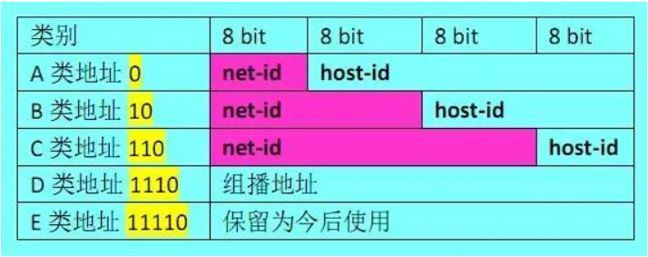
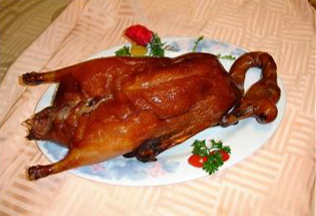
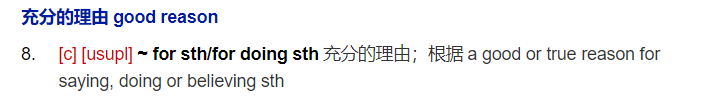

# 英语杂记

# 为了记住单词，一年轻男子竟做出这种事情

## coalition

> **coalition**
>
> 美 [.koʊə'lɪʃ(ə)n]
>
> 英 [.kəʊə'lɪʃ(ə)n]
>
> - **n.**联盟；联合；结合；（两党或多党）联合政府
> - **网络**合并；同盟；结合体，同盟
>
> co表示强调
>
> 拳王阿里（Ali），穆罕默德·阿里（Muhammad Ali）
>
> **强调（co）自己和阿里（Ali）组成了联盟（名词，-tion）**
>
> co-ali-tion
>
> 

## confederation

> **confederation**
>
> 美 [kən.fedə'reɪʃ(ə)n]
>
> 英 [kən.fedə'reɪʃ(ə)n]
>
> - **n.**联盟；联合体
> - **网络**邦联；联邦；同盟
>
> **federation**
>
> 美 [.fedə'reɪʃ(ə)n]
>
> 英 [.fedə'reɪʃ(ə)n]
>
> - **n.**联盟；联邦；（俱乐部、工会等的）联合会；同盟
> - **网络**联邦制；联邦政府；联邦国家
>
> **federal**
>
> 美 ['fed(ə)rəl]
>
> 英 ['fed(ə)rəl]
>
> - **n.**联邦主义者；【美史】北部联邦同盟盟员；联邦政府战士；联邦政府拥护者
> - **adj.**联邦制的；（在美国、加拿大等联邦制下）联邦政府的
> - **网络**联邦的；联盟的；联合的
>
> 

## anticipate

> **anticipate**
>
> 美 [æn'tɪsɪ.peɪt]
>
> 英 [æn'tɪsɪpeɪt]
>
> - **v.**预料；预期；预见；期望
> - **网络**期待；提前使用；预感
>
> > 一个C类IP地址是指，在IP地址的四段号码中，前三段号码为网络号码，剩下的一段抄号码为本地计算机的号袭码。 如果用二进制表示IP地址的话，C类IP地址就由3字节的网络地址和1字节主机地址组成，网络地址的最高位必须是“110”。 C类IP地址包含私有C类地址，地址的表示范围**为：192.0.0.0~223.255.255.255**。 C类地址分配给小型网络，如一般的局域网和校园网，它可连接的主机数量是最少的，采用把所属的用户分为若干的网段进行管理。 C 类网络可达 209 万余个，每个网络能容纳 254 个主机。
>
> anti- 反对，反...
>
> c ip C类IP地址
>
> **我反对（anti）C类IP地址（cip），虽然他还没被使用，但我提前反对他（动词ate）！**
>
> 

## nominate

>**nominate**
>
>美 ['nɑmɪ.neɪt]
>
>英 ['nɒmɪneɪt]
>
>- **v.**提名；推荐；任命；指派
>- **网络**命名；指定；提名
>
>**没有**（no）任何人是**小**（min）官，你们都被提名成为美国总统了（ate）
>
>no min nate
>
>

## designate

>**design**
>
>美 [dɪ'zaɪn]
>
>英 [dɪ'zaɪn]
>
>- **n.**设计；设计方案；构思；安排
>- **v.**设计；计划；构思；筹划
>- **网络**图案；图样；外观设计
>
>**designate**
>
>美 ['dezɪɡnət]
>
>英 ['dezɪɡneɪt]
>
>- **v.**指定；指派；命名；标示
>- **adj.**（已受委派）尚未上任；（已当选）尚未就职
>- **网络**指明；任命；指出
>
>这次的委任（designate）是我亲手设计的（design）

## audience

>**audience**
>
>美 [ˈɔːdiəns]
>
>英 
>
>- **n.**观众；读者；接见；晋见
>- **网络**听众；受众；阅听人
>
>台下的观众看到迈克尔杰克逊，直接噢(au)了一声，一激动，死了(die) +nce
>
>au die nce
>
>

## apprehend

> **apprehend**
>
> 美 [.æprɪ'hend]
>
> 英 [.æprɪ'hend]
>
> - **v.**理解；逮捕；拘押；认识到
> - **网络**领会理解；忧虑；领悟
>
> 利用app定位，我们很快就再次(re)逮捕到了这只母鸡(hen)的爹(d~~ad~~)
>
> apprehend

## alleviate

> # **alleviate**
>
> 美 [ə'livi.eɪt]
>
> 英 [ə'liːvieɪt]
>
> - **v.**减轻；缓解；缓和
> - **网络**使缓和；在痛苦方面的减轻；减轻痛苦
>
> 所有**(all)**的烤鹅**(e)**都喂**(v)**给我**(i)**吃，减轻我的饥饿**(ate)**。
>
> -ate，动词词根后缀
>
> 
>
> 

## deprive

># **deprive**
>
>美 [dɪ'praɪv]
>
>英 [dɪ'praɪv]
>
>- **v.**剥夺；免职(特指圣职)
>- **网络**使丧失；夺去；使失去
>
>de-
>
>词根，从...离开，比如depart
>
>-prive 
>
>词根，表示single，alone，单个，可以联想到private
>
>
>
>一个东西本来是自己私有的，就像咕噜拥有魔戒，但是霍比特人从他手里拿走了魔戒，使得魔戒不再为他私有
>
>de-private，远离private——>不再private——>不再prive——>deprive

## neutral

># **neutral**
>
>美 ['nutrəl]
>
>英 ['njuːtrəl]
>
>- **n.**中立国；（汽车排挡）空挡；中立者；素净色
>- **adj.**中立的；持平的；无倾向性的；中立国的
>- **网络**中性；中性的；空档
>
>NEU，东北大学（Northeastern University）
>
>
>
>东北大学(NEU)尝试(tr)保持中立的(al)。
>
>tr≈try，我胡编的，词根没有这一项，只是为了好记😂
>
>-al，词根，在最后表示...的

## 充足的

># **ample**
>
>美 ['æmp(ə)l]
>
>英 ['æmp(ə)l]
>
>- **adj.**足够的；丰裕的；丰满的；硕大的
>- **网络**充足的；宽敞的；丰富的
>
>词根
>
>amp- 大
>
>经典例句
>
>an ample bosom
>
>丰满的胸脯
>
>速记
>
>**一件(a)M尺码(m)的皮夹克(p)，足够让他乐(le)一天的，但是这皮夹克仍旧挡不住他丰满的胸脯**
>
>
>
>
>
>---
>
># **abundant**
>
>美 [ə'bʌndənt]
>
>英 [ə'bʌndənt]
>
>- **adj.**大量的；丰盛的；充裕的
>- **网络**丰富的；充足的；富裕
>
># **plentiful**
>
>美 ['plentɪf(ə)l]
>
>英 ['plentɪf(ə)l]
>
>- **adj.**大量的；众多的；充足的；丰富的
>- **网络**充裕的；富足；富裕的

## dread

> # **dread**
>
> 美 [drɛd]
>
> 英 [dred]
>
> - **n.**恐惧；〔古语〕敬畏；畏惧的事物；紧张
> - **v.**害怕；担心；〔古语〕敬畏；预感到
> - **网络**惧怕；恐怖；可怕
>
> 
>
> 爸爸(**d**~~ad~~)给我读(**read**)的睡前故事太恐怖了，睡不着了/(ㄒoㄒ)/~~
>
> dread，恐怖的东西，动词，害怕，担心

## paraphrase

># **paraphrase**
>
>美 ['perə.freɪz]
>
>英 ['pærə.freɪz]
>
>- **n.**释义；解释；意译
>- **v.**释义
>- **网络**改写；演绎曲；转述
>
>para- 词根，在旁边
>
>-phrase = speech，讲话

## appall

> # **appall**
>
> 美 [ə'pɔl]
>
> 英 [ə'pɔːl]
>
> - **v.**使胆寒
> - **网络**使惊骇；我怕；惊恐
>
> 我的**app**全部（**all**）都被删除了，太吓人了！
>
> 

## allot

> # **allot**
>
> 美 [ə'lɑt]
>
> 英 [ə'lɒt]
>
> - **v.**分配；分派（任务等）
> - **网络**配给；调配；拨款
>
> 给所有人(al)分配很多(lot)东西
>
> 

## soothe

> # **soothe**
>
> 美 [suð]
>
> 英 [suːð]
>
> - **v.**抚慰；安慰；减轻；劝慰
> - **网络**缓和；使平静；安抚
>
> **心理医生**：这个病人我已经**安抚**好了，So，另一个(other)病人呢？
>
> **护士**：那个人(r~~en~~)没了(other去掉r——>othe)
>
> soothe
>
> 

---

## -tinguish

> # **distinguish**
>
> 美 [dɪ'stɪŋɡwɪʃ]
>
> 英 [dɪ'stɪŋɡwɪʃ]
>
> - **v.**区分；辨别；分清；认出
> - **网络**区别；识别；分辨
>
> # **extinguish**
>
> 美 [ɪk'stɪŋɡwɪʃ]
>
> 英 [ɪk'stɪŋɡwɪʃ]
>
> - **v.**熄灭；扑灭；消灭；毁灭
> - **网络**偿清；压制；灭火

## delimma

> # **dilemma**
>
> 美 [dɪ'lemə]
>
> 英 [dɪ'lemə]
>
> - **n.**（进退两难的）窘境
> - **网络**困境；左右为难；进退两难的局面
>
> 弟弟(di)乐了(le)，妈妈(mm)又“啊”(a)的一声哭了，我左右为难
>
> di - le - mm - a

## deteriorate

> # **deteriorate**
>
> 美 [dɪˈtɪriəreɪt]
>
> 英 [dɪˈtɪəriəreɪt]
>
> - **v.**退化；变质；败坏(风俗)；降低(品质等)
> - **网络**恶化；变坏；使恶化
>
> ---
>
> 词根记忆法：
>
> deter- bad , lower，坏，低级
>
> -ior 表形容词，较...的
>
> -ate 表示动词
>
> ---
>
> 🦐98乱记法
>
> de- 从...离开
>
> teri
>
> ate 动词
>
> 
>
> 鸭嘴兽泰瑞，来自《飞哥与小佛》
>
> 离开(de)鸭嘴兽泰瑞（teri），否则我们会被他带坏(ate)

## sarcasm

> # **sarcasm**
>
> 美 ['sɑr.kæzəm]
>
> 英 ['sɑː(r)kæz(ə)m]
>
> - **n.**讽刺；嘲讽；挖苦
> - **网络**讥讽；反话；讽刺话
>
> 🦐记法
>
> 撒开(sarca)我，傻冒(sm)

## halt

> # **halt**
>
> 美 [hɔlt]
>
> 英 [hɔːlt]
>
> - **n.**停止；暂停；中断；常用于英式英语
> - **v.**阻止；(使)停止；(使)中断；(使)停下
> - **int.**站住；立定；停止前进
> - **adj.**〈旧〉跛的
> - **网络**停住；停机；加速寿命测试(Highly Accelerated Life Test)
>
> hat中间被一刀割开了， 我**犹豫**了好大会
>
> ha          🔪            t
>
> ha l t

## fad

> # **fad**
>
> 美 [fæd]
>
> 英 [fæd]
>
> - **n.**一时的风尚；短暂的狂热
> - **abbr.**(=[flavin adenine dinucleotide](https://cn.bing.com/dict/search?q=flavin adenine dinucleotide&FORM=BDVSP6&cc=cn))【生化】黄素腺嘌呤二核苷酸
> - **网络**黄素腺嘌呤二核苷酸(flavin adenine dinucleotide)；时尚；一时的流行
>
> **充满了F词（Fuck）的广告（ad）成为了一时的风尚**

## 颤抖

> # **quiver**
>
> 美 [ˈkwɪvə]
>
> 英 
>
> - **v.**颤抖；颤动；发抖；打颤
> - **n.**颤动；箭袋；冷战；箭筒
> - **网络**抖动；颤动声；箭囊
>
> # **shiver**
>
> 美 ['ʃɪvər]
>
> 英 ['ʃɪvə(r)]
>
> - **n.**颤抖；寒战
> - **v.**颤抖
> - **网络**发抖；打颤；战栗
>
> # **tremble**
>
> 美 [ˈtremb(ə)l]
>
> 英 ['trembl]
>
> - **v.**颤抖；发抖；震动；颤动
> - **n.**战栗
> - **网络**摇晃；震颤；哆嗦

## alledge

> # **allege**
>
> 美 [ə'ledʒ]
>
> 英 [ə'ledʒ]
>
> - **v.**声称
> - **网络**宣称；断言；硬说
>
> 我宣称所有的(all)领土边缘(edge)都是我的

## 讽刺相关

> # **sarcasm**
>
> 美 ['sɑr.kæzəm]
>
> 英 ['sɑː(r)kæz(ə)m]
>
> - **n.**讽刺；嘲讽；挖苦
> - **网络**讥讽；反话；讽刺话
>
> # **irony**
>
> 美 ['aɪrəni]
>
> 英 ['aɪrəni]
>
> - **n.**反语；反话；（出乎意料的）奇异可笑之处；有讽刺意味的情况
> - **adj.**铁的；铁似的；含铁的
> - **网络**反讽；讽刺之事；讽剌
>
> # **mock**
>
> 美 [mɑk]
>
> 英 [mɒk]
>
> - **v.**嘲笑；（模仿）嘲弄；不尊重；蔑视
> - **adj.**虚假的；不诚实的；模仿的；模拟的
> - **n.**（英国）模拟考试
> - **网络**模仿地嘲弄；愚弄
>
> # **ridicule**
>
> 美 ['rɪdɪ.kjul]
>
> 英 ['rɪdɪ.kjuːl]
>
> - **n.**嘲笑；奚落；讥笑
> - **v.**嘲笑；奚落；讥笑
> - **网络**嘲弄；取笑；荒谬无稽

## acquaint

> **acquaint**
>
> 美 [ə'kweɪnt]
>
> 英 [ə'kweɪnt]
>
> - **v.**使熟悉；使了解
> - **网络**认识；使认识；相识

## imperative

> **imperative**
>
> 美 [ɪm'perətɪv]
>
> 英 [ɪm'perətɪv]
>
> - **adj.**重要紧急的；迫切的；急需处理的；表示权威的
> - **n.**重要紧急的事；必要的事；祈使语气；祈使语气动词
> - **网络**命令式；强制的；祈使句 

# 真题中遇到的单词

## 【2021 英一 Text1】

### justify

> # **justify**
>
> 美 ['dʒʌstɪ.faɪ]
>
> 英 ['dʒʌstɪfaɪ]
>
> - **v.**证明…正确（或正当、有理）；对…作出解释；为…辩解（或辩护）
> - **网络**证明…是正当的；为…辩护；两端对齐

### grimly

># **grimly**
>
>美 [ˈɡrɪmlɪ]
>
>英 [ɡrɪmlɪ]
>
>- **adv.**严峻地；冷冷地；狞笑着；严格地
>- **网络**冷酷地；可怖地；可怕地

### ritual

> # **ritual**
>
> 美 ['rɪtʃuəl]
>
> 英 ['rɪtʃuəl]
>
> - **n.**习惯；程序；仪规；礼节
> - **adj.**仪式上的；庆典的；习惯的；老套的
> - **网络**典礼；宗教仪式；礼仪

### fraction

> # **fraction**
>
> 美 ['frækʃ(ə)n]
>
> 英 ['frækʃ(ə)n]
>
> - **n.**分数；小部分；小数；少量
> - **网络**碎片；片断；分式

### successive

># **successive**
>
>美 [sək'sesɪv]
>
>英 [sək'sesɪv]
>
>- **adj.**连续的；接连的；相继的
>- **网络**逐次的；继续的；继承的

ground

> # **ground**
>
> 美 [ɡraʊnd]
>
> 英 [ɡraʊnd]
>
> - **n.**地面；土；土地；土壤
> - **v.**触海底；使停飞；阻止…起飞；罚（儿童）不准出去玩
> - **adj.**磨细的；剁碎的
> - **网络**接地；地线；场地
>
> 
>
> 文中例句：Successive goverments have permitted such increases **on the grounds that**[出于...的原因] the cost of investing in and running the rail network should be borne by those who use it.

### subsidise 

> # **subsidise**
>
> 美 ['sʌbsɪdaɪz]
>
> 英 ['sʌbsɪdaɪz]
>
> - **v.**补助；资助；给…发津贴
> - **网络**消退；资助或补助；平息

### commute

> # **commute**
>
> 美 [kə'mjut]
>
> 英 [kə'mjuːt]
>
> - **n.**上下班路程
> - **v.**（乘公共汽车、火车、汽车等）上下班往返；减刑；代偿
> - **网络**通勤；交换；乘车上下班
>
> 第三人称单数：[commutes](https://cn.bing.com/dict/search?q=commutes&FORM=BDVSP6&cc=cn) 现在分词：[commuting](https://cn.bing.com/dict/search?q=commuting&FORM=BDVSP6&cc=cn) 过去式：[commuted](https://cn.bing.com/dict/search?q=commuted&FORM=BDVSP6&cc=cn) 

### travail

> # **travail**
>
> 美 ['træ.veɪl]
>
> 英 ['træveɪl]
>
> - **n.**艰辛；艰苦劳动；煎熬；痛苦
> - **v.**辛苦工作；发生[感到]阵痛
> - **网络**分娩；劳苦
>
> There's a sense that the travails of commuters in the South Easter have received too much attention compared to those who must endure the relatively poor infrastructure of the Midlands and the North.

### tumpet 

> # **trumpet**
>
> 美 ['trʌmpət]
>
> 英 ['trʌmpɪt]
>
> - **n.**喇叭；小号；喇叭形物；（尤指）绽开的水仙花
> - **v.**宣扬；鼓吹；吹嘘；吼叫
> - **网络**小喇叭；号角；吹号
>
> 川普（Trump）喜欢用 喇叭宣扬（trumpet）自己

### substantial

> # **substantial**
>
> 美 [səb'stænʃ(ə)l]
>
> 英 [səb'stænʃ(ə)l]
>
> - **adj.**大量的；价值巨大的；重大的；大而坚固的
> - **网络**实质的；牢固的；可观的
>
> # **substance**
>
> 美 ['sʌbstəns]
>
> 英 ['sʌbstəns]
>
> - **n.**物质；实质；主旨；物品
> - **网络**实体；本质；内容
>
> # **subscribe**
>
> 美 [səb'skraɪb]
>
> 英 [səb'skraɪb]
>
> - **v.**预订；申请；定期订购（或订阅等）；定期交纳（会员费）
> - **网络**签署；认购；捐助
>
> # **subscript**
>
> 美 ['sʌbskrɪpt]
>
> 英 ['sʌbskrɪpt]
>
> - **n.**下标
> - **adj.**写在下面的
> - **网络**写在下方的；上标；脚注
>
> # **subsection**
>
> 美 ['sʌb.sekʃ(ə)n]
>
> 英 ['sʌb.sekʃ(ə)n]
>
> - **n.**分段；分部；（尤指法律文件的）分款
> - **网络**小节；小组；分区

### cramped

> # **cramped**
>
> 美 [kræmpt]
>
> 英 [kræmpt]
>
> - **adj.**狭窄的；拥挤的；局促的
> - **v.**cramp的过去式和过去分词
> - **网络**窄小的；狭促的；狭小的

### punctuate

> # **punctuate**
>
> 美 ['pʌŋktʃu.eɪt]
>
> 英 ['pʌŋktʃueɪt]
>
> - **v.**不时打断；给…加标点符号
> - **网络**强调；加标点于；不时介入

### maintenance

> # **maintenance**
>
> 美 ['meɪntənəns]
>
> 英 ['meɪntənəns]
>
> - **n.**维护；维持；保养；保持
> - **网络**维修；维修保养；保养与维护
>
> Planned maintenance is managed incompetently.

### vengeance

> # **vengeance**
>
> 美 ['vendʒəns]
>
> 英 ['vendʒ(ə)ns]
>
> - **n.**复仇；报复；报仇
> - **网络**邪灵复仇；复仇之婚；复仇之魂
>
> # **avengers**
>
> - **n.**报仇者
> - **网络**复仇者系列；复仇组；复仇者们

### nationalisation

> # **nationalisation**
>
> 美 [ˌnæʃənlə'zeɪʃən]
>
> 英 [ˌnæʃənlɪ'zeɪʃən]
>
> - **n.**国家化
> - **网络**国有化；国家主义化；企业国有化

## 【2021 英一 Text2】

### bleak

> # **bleak**
>
> 美 [blik]
>
> 英 [bliːk]
>
> - **adj.**不乐观的；无望的；暗淡的；阴冷的
> - **n.**【鱼】(淡水产)银鲤
> - **网络**荒凉的；凄凉的；寒冷的

### deforestation

> # **deforestation**
>
> 美 [di.fɔrə'steɪʃ(ə)n]
>
> 英 [diː.fɒrɪ'steɪʃ(ə)n]
>
> - **n.**毁林；滥伐森林；烧林
> - **网络**森林砍伐；砍伐森林；采伐森林

### turnaround

> # **turnaround**
>
> 美 ['tɜrnə.raʊnd]
>
> 英 ['tɜː(r)nə.raʊnd]
>
> - **n.**转机；好转；（轮船、飞机的）终点装卸时间
> - **网络**转变；周转；转向

### conditional

> # **conditional**
>
> 美 [kən'dɪʃ(ə)nəl]
>
> 英 [kən'dɪʃ(ə)nəl]
>
> - **n.**条件句
> - **adj.**附带条件的；依…而定的
> - **网络**有条件的；条件式；条件响应

### degradation

> # **degration**
>
> - **网络**退化

### causality

> # **causality**
>
> 美 [kɔ'zæləti]
>
> 英 [kɔː'zæləti]
>
> - **n.**因果关系；因果律（或性）
> - **网络**因果性；因果推理；因果论

### institute

> # **institute**
>
> 美 ['ɪnstɪ.tut]
>
> 英 ['ɪnstɪ.tjuːt]
>
> - **v.**建立；实行；开始
> - **n.**（教育、专业等）机构
> - **网络**学院；研究所；学会

### cattle

> # **cattle**
>
> 美 ['kæt(ə)l]
>
> 英 ['kæt(ə)l]
>
> - **n.**牛
> - **网络**家畜；牲口；牲口，家畜

### tropical

> # **tropical**
>
> 美 ['trɑpɪk(ə)l]
>
> 英 ['trɒpɪk(ə)l]
>
> - **adj.**热带的；来自热带的；产于热带的
> - **网络**热情的；炎热的；热情的，比喻的

### satellite

> # **satellite**
>
> 美 ['sæt(ə)l.aɪt]
>
> 英 ['sætəlaɪt]
>
> - **n.**卫星；人造卫星；卫星城；卫星国
> - **v.**通过通讯卫星播送[传播]
> - **网络**卫星楼；随体；卫星赛

### rural

> # **rural**
>
> 美 ['rʊrəl]
>
> 英 ['rʊərəl]
>
> - **adj.**乡村的；农村的；似农村的
> - **网络**乡下的；田园的；乡村风味的

### makeshift

> # **makeshift**
>
> 美 [ˈmeɪkˌʃift]
>
> 英 ['meɪkʃɪft]
>
> - **n.**权宜之计；临时替代品
> - **adj.**临时的；凑合的
> - **网络**临时代用的物品；权宜的；临时代用品

### inclement

> # **inclement**
>
> 美 [ɪn'klemənt]
>
> 英 [ɪn'klemənt]
>
> - **adj.**恶劣的（指寒冷的、潮湿的等）
> - **网络**险恶的；严酷的；狂风暴雨的

### translate

> 使适应不同的情况，转化
>
> Whether this research translates elsewhere is anybody's guess.
>
> 这项研究是否能适用于其他地区还是个未知数

### anybody's guess

> 谁也拿不准的事情

### transferability

> 可转移性

### emission

> 排放物，散发物

## 【2021 英一 Text3】

### preoccupied 

> # **preoccupied**
>
> 美 [pri'ɑkjə.paɪd]
>
> 英 [pri'ɒkjʊpaɪd]
>
> - **adj.**心事重重；专注；一门心思
> - **v.**“preoccupy”的过去式和过去分词
> - **网络**被先占的；出神的；全神贯注的

### prudery

> # **prudery**
>
> 美 ['prudəri]
>
> 英 ['pruːdəri]
>
> - **n.**谈性色变的态度（或行为）；（对性问题的）大惊小怪
> - **网络**假正经；过分拘谨；假道学

### stir

> # **stir**
>
> 美 [stɜr]
>
> 英 [stɜː(r)]
>
> - **v.**搅拌；搅动；激发；搅和
> - **n.**搅拌；搅动；震动；搅和
> - **网络**搅拌法；轰动；激动

### portraiture

> # **portraiture**
>
> 美 ['pɔrtrə.tʃʊr]
>
> 英 ['pɔː(r)trɪtʃə(r)]
>
> - **n.**画像；画像技法；人像摄影法；肖像
> - **网络**人物肖像；肖像画；肖像画法
>
> 复数：[portraitures](https://cn.bing.com/dict/search?q=portraitures&FORM=BDVSP6&cc=cn) 

### miserably

> # **miserably**
>
> 美 [ˈmɪzərəblɪ]
>
> 英 ['mɪzrəblɪ]
>
> - **adv.**可怜地；糟糕地；卑劣地；大大地 (fail miserably)
> - **网络**悲惨地；痛苦地；可悲地

### backdrop

> # **backdrop**
>
> 美 ['bæk.drɑp]
>
> 英 ['bæk.drɒp]
>
> - **n.**（舞台的）背景幕布；（事件发生时）周围陪衬景物
> - **网络**背景板；交流声；舞台背景

### notoriously

> # **notoriously**
>
> 美 [noʊˈtɔrɪəslɪ]
>
> 英 [nəʊ'tɔ:rɪəslɪ]
>
> - **adv.**非常；众所周知的
> - **网络**众所周知地；臭名昭著地；声名狼藉地

### exposure

> # **exposure**
>
> 美 [ɪk'spoʊʒər]
>
> 英 [ɪk'spəʊʒə(r)]
>
> - **n.**暴露；显露；揭露；面临
> - **网络**曝光；力宝声；揭发

### daguerreotype

> # **daguerreotype**
>
> 美 [də'ɡerə.taɪp]
>
> 英 [də'ɡerə.taɪp]
>
> - **n.**（早期的）达盖尔银版照片
> - **网络**银板照相法；银版照相；银版摄影法

### copper

> # **copper**
>
> 美 ['kɑpər]
>
> 英 ['kɒpə(r)]
>
> - **n.**铜；铜币；警察
> - **adj.**铜(制)的；(紫)铜色的
> - **v.**用铜板[铜皮]盖[包]
> - **网络**红铜；紫铜；铜制器

### blurred

> # **blurred**
>
> 美 [blɜrd]
>
> 英 [blɜː(r)d]
>
> - **adj.**模糊不清的；记不清的；难以区分的；模棱两可的
> - **v.**“blur”的过去式和过去分词
> - **网络**模糊的；迷离；含混

### limb

> # **limb**
>
> 美 [lɪm]
>
> 英 [lɪm]
>
> - **n.**肢；腿；翼；主枝
> - **v.**割断…的四肢；砍树枝
> - **网络**大树枝；臂；分支

### grin

> # **grin**
>
> 美 [ɡrɪn]
>
> 英 [ɡrɪn]
>
> - **v.**露齿而笑；咧着嘴笑；粲然而笑
> - **n.**露齿的笑；咧着嘴笑
> - **adj.**龇牙咧嘴的
> - **网络**露齿笑；咧嘴笑；裂口笑

### contemplate

> # **contemplate**
>
> 美 ['kɑntəm.pleɪt]
>
> 英 ['kɒntəm.pleɪt]
>
> - **v.**考虑；沉思；思量；思忖
> - **网络**注视；凝视；打算

### non-committal

> # **non-committal**
>
> 美 [.nɑnkə'mɪt(ə)l]
>
> 英 [.nɒnkə'mɪt(ə)l]
>
> - **adj.**态度不明朗的；不表态的；含糊的
> - **网络**不承诺；不承担义务的

### instantaneous

> # **instantaneous**
>
> 美 [.ɪnstən'teɪniəs]
>
> 英 [.ɪnstən'teɪniəs]
>
> - **adj.**立即的；立刻的；瞬间的
> - **网络**即刻的；瞬时的；即时的

### sponetaneous

> # **spontaneous**
>
> 美 [spɑn'teɪniəs]
>
> 英 [spɒn'teɪniəs]
>
> - **adj.**自发的；非筹划安排的；常心血来潮的；自然的
> - **网络**自然产生的；本能的；自发性

### hesitate

> # **hesitate**
>
> 美 ['hezɪ.teɪt]
>
> 英 ['hezɪteɪt]
>
> - **v.**（对某事）犹豫；顾虑；疑虑
> - **网络**踌躇；迟疑；不愿

### dignity

> # **dignity**
>
> 美 ['dɪɡnəti]
>
> 英 ['dɪɡnəti]
>
> - **n.**尊严；高贵；尊贵；庄严
> - **网络**威严；爱的尊严；端庄

### conceal

> # **conceal**
>
> 美 [kən'sil]
>
> 英 [kən'siːl]
>
> - **v.**隐藏；隐瞒；掩盖
> - **网络**隐蔽；把…隐藏起来；掩饰

### maxim

> # **maxim**
>
> 美 ['mæksɪm]
>
> 英 ['mæksɪm]
>
> - **n.**格言；箴言；座右铭
> - **网络**美信；马克西姆；准则

### dentistry

> # **dentistry**
>
> 美 [ˈdɛntistri]
>
> 英 ['dentɪstri]
>
> - **n.**牙医业；牙科
> - **网络**牙科学；牙医学；牙医学院

### hygiene

> # **hygiene**
>
> 美 ['haɪdʒin]
>
> 英 ['haɪdʒiːn]
>
> - **n.**卫生
> - **网络**卫生学；保健；保健学

### gnashers

> # **gnashers**
>
> 美 ['næʃərz]
>
> 英 ['næʃə(r)z]
>
> - **n.**牙齿
> - **网络**呲牙裂嘴的大嘴怪兽

### tramp

> # **tramp**
>
> 美 [træmp]
>
> 英 [træmp]
>
> - **v.**流浪；践踏 (on； upon)；用沉重的脚步走；徒步旅行
> - **n.**艰苦的长途徒步旅行；徒步旅行者；流动工匠；流浪者
> - **网络**不定期船；不定期货船；流浪汉

### gurn

> # **gurn**
>
> 美 [gɜ:n]
>
> 英 [gɜ:n]
>
> - **v.**做俏皮相；扮鬼脸
> - **网络**权威；专家；古恩

### gum

> # **gum**
>
> 美 [ɡʌm]
>
> 英 [ɡʌm]
>
> - **n.**牙龈；树胶；齿龈；树脂
> - **v.**在…上涂胶；用黏胶粘
> - **网络**口香糖；胶质；橡胶

### portrait

> # **portrait**
>
> 美 ['pɔrtrət]
>
> 英 ['pɔː(r)trɪt]
>
> - **n.**肖像；描绘；半身画像；半身照
> - **adj.**竖向的；纵向打印格式的
> - **网络**人像；肖像画；人像摄影

### stern

> # **stern**
>
> 美 [stɜrn]
>
> 英 [stɜː(r)n]
>
> - **n.**艉；〈非正式〉(任何东西的)尾部；英语男子名
> - **adj.**严厉的；坚定的
> - **网络**船尾；斯特恩；纽约大学斯特恩商学院

