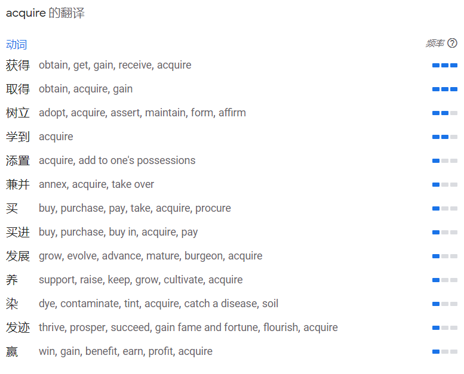

# 阅读训练

## 考研英语 2002（不分英一英二）

### 2002 完形填空

​	**Comparisons wer drawn** between the development of television in the 20th century and the $diffusion_{n.传播；散布；【物】扩散；冗长}$​​​​ of printing in the 15th and 16th centuries.  Yet much had happend <u>between</u>.  As was discussed before, it was not  <u>until</u> in the 19th century that the newspaper became the dominant pre-electronic <u>medium</u>, following in the wake of the $pamphlet_{n. 小册子，手册}$​​​​, and the book and in the <u>company</u> of the $periodical_{n.(日报以外的)定期刊物,杂志}$​​​​​. It was during the same time that the communications revolution <u>speeded</u> up, beginning with transport , the railway, and leading <u>on</u> through the telegraph, the telephone, radio, and **$motion\ pictures_{电影}$​​​​​** <u>into</u> the 20th-centrury world of the motor car and the airplane. Not everyone sees that process in <u>perspective</u>. It is important to do so.

> **draw**
>
> 美 [drɔ]
>
> 英 [drɔː]
>
> - **n.**抽彩；抽奖；抽签；平局
> - **v.**描画；拖（动）；拉（动）；牵引
> - **网络**绘制；绘图；画画
>
> 1.描写;草拟,制订,拟(稿);描(图),绘制,画(线等),勾(轮廓)
>
> 2.画,描;制图3.惹,引,招,引起,招致,吸引(注意等)
>
> 4.拉,牵,曳,拖;拉开,张满;汲取
>
> 5.拔(牙、钉等),抽出(刀),从(容器等中)倒出(物品);取出(鸡等的)内脏
>
> 6.打(水),排干,汲出(水等液体);受,靠(人供给);领取,提取(钱款),获得(资源等),生(利),汲取(教训)
>
> 7.拉,牵,曳,张(弓等)
>
> 8.拔刀,拔枪
>
> 9.向(某处)移动,挨近,靠近,走近,靠拢(时间等)接近,逼近
>
> 10.【医学】(膏药等)吸脓,拔出牙齿
>
> draw a conclusion 
>
> draw a comparision
>
> 引出结论，引出比较。
>
> ---
>
> **diffusion**
>
> 美 [dɪ'fjuʒ(ə)n]
>
> 英 [dɪ'fjuːʒ(ə)n]
>
> - **n.**传播；散布；【物】扩散；冗长
> - **网络**漫射；扩散作用；弥散
>
> ---
>
> **periodical**
>
> 美 [.pɪri'ɑdɪk(ə)l]
>
> 英 [.pɪəri'ɒdɪk(ə)l]
>
> - **adj.**定期的；时常发生的；定期发行的
> - **n.**（学术）期刊
> - **网络**杂志；周期的；刊物
>
> ---
>
> **lead someone on**
>
> **1.** to guide someone onward. *We led him on so he could see more of the gardens.* *Please lead Mary on. There is lots more to see here.*
>
> 带领某人向前进，onward，adv 向前
>
> **2.** and **lead** someone **on** to tease someone; to encourage someone's romantic or sexual interest without sincerity. *You are just leading me on!* *It's not fair to continue leading him on.* *It's easy to lead on teenage boys.*
>
> See also: [lead](https://idioms.thefreedictionary.com/lead), [on](https://idioms.thefreedictionary.com/on)
>
> **lead on**
>
> to continue to lead onward. *The guide led on and we followed.* *Lead on, my friend. We are right behind you!*
>
> See also: [lead](https://idioms.thefreedictionary.com/lead), [on](https://idioms.thefreedictionary.com/on)
>
> McGraw-Hill Dictionary of American Idioms and Phrasal Verbs. © 2002 by The McGraw-Hill Companies, Inc.
>
> ---
>
> **motion picture**
>
> - **n.**电影
> - **adj.**电影的
>
> ---
>
> **perspective**
>
> 美 [pər'spektɪv]
>
> 英 [pə(r)'spektɪv]
>
> - **n.**观点；远景；景观；透视法
> - **adj.**(按照)透视画法的；透视的
> - **网络**透视图；视角；看法
>
> **in perspective**
>
> - **na.**按照透视画法的[地]；展望中的[地]；正确的[地]
> - **网络**正确地；观察合理地；符合透视法地

It is generally recognized, however, that the introduction of the computer in the early 20th century, followed by the invention of the integrated ciruit during the 1960s, radically changed the process, <u>although</u> its impact on the media was not immediately <u>apparent</u>. As time went by, computers became smaller and more powerful, and they became "personal" too, as well as <u>universal</u> , with display becoming sharper and storage <u>capacity</u> increasing. They were thought of, like people, <u>in terms of</u>  generations, with the distance between generations much <u>smaller</u>.

It was within the computer age that the term "infomation society" began to be widely used to describe the <u>context</u>  within which we now live. The communications revolution has influenced both work and leisure and how we think and feel both about place and time, but there has been controvertial views about its economic, political, social and cultural implications. "Benefits" have been weighed <u>against</u>.

### Text 1

​	If you **intend** using humor in your talk to make people smile, you must know how to **identify** shared experiences and problems. Your humor must be **relevant** to the audience and should help to show them that you are one of them or that you **understand** their situation and are in **sympathy** with their point of view. Depending on whom you are addressing, the problems will be different. If you are talking to a group of managers, you may refer to the **disorganized** methods of their secretaries; alternatively if you are addressing secretaries, you may want to **comment** on their **disorganized** bosses.
Here is an example, which I heard at a nurses' **convention**, of a story which works well because the audience all shared the same view of doctors. A man arrives in heaven and is being shown around by St. Peter. He sees wonderful accommodations, beautiful gardens, sunny weather, and so on. Everyone is very **peaceful**, polite and friendly until, waiting in a line for lunch, the new arrival is suddenly pushed aside by a man in a white coat, who rushes to the head of the line, grabs his food and stomps over to a table by himself. "Who is that?" the new arrival asked St. Peter. "Oh, that's God," came the reply, "but sometimes he thinks he's a doctor."
​	If you are part of the group which you are addressing, you will be in a position to know the experiences and problems which are common to all of you and it'll be **appropriate** for you to make a passing remark about the inedible canteen food or the chairman's notorious bad taste in ties. With other audiences you mustn't attempt to cut in with humor as they will **resent** an outsider making disparaging remarks about their canteen or their chairman. You will be on safer ground if you **stick** to scapegoats like the Post Office or the telephone system.
​	If you feel **awkward** being **humorous**, you must practice so that it becomes more natural. Include a few casual and apparently off-the-cuff remarks which you can deliver in a **relaxed** and unforced manner. Often it's the **delivery** which causes the audience to smile, so speak slowly and remember that a raised **eyebrow** or an unbelieving look may help to show that you are making a light-hearted remark.
​	Look for the humor. It often comes from the **unexpected**. A **twist** on a familiar **quote** "If at first you don't succeed, give up" or a play on words or on a situation. Search for **exaggeration** and understatements. Look at your talk and pick out a few words or sentences which you can turn about and **inject** with humor.

### Text 2

​	Since the dawn of human **ingenuity****n. 聪明才智；独创力；心灵手巧**, people have **devised设计；制定；发明；创造** ever more **cunning****adj. 狡猾的；奸诈的；诡诈的；灵巧的** tools to cope with work that is dangerous, **boring**, **burdensomeadj.负担沉重的；难以承担的；繁重的**, or just **plain nasty****adj.肮脏的**. That **compulsionn.强制；冲动；强迫** has resulted in robotics — the science of **conferring** **v.授予；协商；商讨；交换意见**various human capabilities on machines. <u>And if scientists have yet to create the **mechanical****adj.机动的；机械驱动的；机械的；机器的** version of science **fiction**, they have begun to come close.</u>如果科学家们还没有在机械上实现科幻小说的幻想，那么他们也已经很接近这个目标了。

> > **ingenuity**
> >
> > 美 [.ɪndʒə'nuəti]
> >
> > 英 [.ɪndʒə'njuːəti]
> >
> > - **n.**聪明才智；独创力；心灵手巧
> > - **网络**独创性；机灵；精巧
>
> > **cunning**
> >
> > 美 ['kʌnɪŋ]
> >
> > 英 ['kʌnɪŋ]
> >
> > - **n.**狡猾；诡诈；狡黠
> > - **adj.**狡猾的；奸诈的；诡诈的；灵巧的
> > - **网络**狡诈的；巧妙的；可爱的
>
> > **burdensome**
> >
> > 美 ['bɜrd(ə)nsəm]
> >
> > 英 ['bɜː(r)d(ə)ns(ə)m]
> >
> > - **adj.**负担沉重的；难以承担的；繁重的
> > - **网络**累赘的；难以负担的；劳累的
>
> > **compulsion**
> >
> > 美 [kəm'pʌlʃ(ə)n]
> >
> > 英 [kəm'pʌlʃ(ə)n]
> >
> > - **n.**强制；冲动；强迫
> > - **网络**强迫行为；强迫症；难以抗拒的冲动
>
> > **confer**
> >
> > 美 [kən'fɜr]
> >
> > 英 [kən'fɜː(r)]
> >
> > - **v.**授予；协商；商讨；交换意见
> > - **网络**商议；商谈；赋予
>
> > **mechanical**
> >
> > 美 [mə'kænɪk(ə)l]
> >
> > 英 [mɪ'kænɪk(ə)l]
> >
> > - **adj.**机动的；机械驱动的；机械的；机器的
> > - **网络**机械工程；力学的；机械式
>
> > **devise**
> >
> > 美 [dɪˈvaɪz]
> >
> > 英 [dɪ'vaɪz]
> >
> > - **v.**设计；制定；发明；创造
> > - **n.**【法】遗赠财产的遗嘱(或其中的条款)；【法】遗赠的财产
> > - **网络**想出；策划；计划
>
> 

​	As a result, the modern world is increasingly **populated** by intelligent **gizmos** whose presence we barely notice but whose universal existence has removed much human labor. Our factories **hum** to the **rhythm** of robot **assembly** arms. Our banking is done at **automatedadj.自动的 tellern.出纳员；出纳机；提款机；（尤指议会投票时的）计票员 terminalsn.终端设备** that thank us with mechanical politeness for the **transaction**. Our subway trains are **controlled** by tireless robo-drivers. And thanks to the **continual** **miniaturization** of electronics and micro-mechanics, there are already robot systems that can **perform** some kinds of brain and **bone** **surgery** with **submillimeteradj.亚毫米的** accuracy — far greater **precision** than highly skilled physicians can achieve with their hands alone.

> > **populate**
> >
> > 美 ['pɑpjə.leɪt]
> >
> > 英 ['pɒpjʊleɪt]
> >
> > - **v.**居住于；生活于；构成…的人口；迁移
> > - **网络**填入；填充；居住于…中
>
> > **gizmo**
> >
> > 美 ['ɡɪzmoʊ]
> >
> > 英 ['ɡɪzməʊ]
> >
> > - **n.**小物件；小发明
> > - **网络**线框；小玩意儿；变形器
>
> > **hum**
> >
> > 美 [hʌm]
> >
> > 英 [hʌm]
> >
> > - **n.**嗡嗡声；交流声；哼哼声；嘈杂声
> > - **v.**哼(歌曲)；〈口语〉欺骗；发出嗡嗡声或呼呼声:；(在嘴里)咕咕哝哝
> > - **int.**哼!（表示轻蔑、踌躇、怀疑等）
> > - **网络**人族；吽；嗡嗡叫
>
> > **rhythm**
> >
> > 美 ['rɪðəm]
> >
> > 英 ['rɪðəm]
> >
> > - **n.**节奏；节律；韵律；规律
> > - **网络**律动；节拍；节奏感
>
> > **assembly**
> >
> > 美 [əˈsembli]
> >
> > 英 [əˈsembli]
> >
> > - **n.**装配；议会；集合；组合体
> > - **网络**组装；组件；程序集
> >
> > 1.	`[c]`
> > 立法机构；会议；议会a group of people who have been elected to meet together regularly and make decisions or laws for a particular region or country
> > 2.	`[u][c]`
> > 集会；（统称）集会者the meeting together of a group of people for a particular purpose; a group of people who meet together for a particular purpose
> > 3.	`[c][u]`
> > （全校师生的）晨会，朝会a meeting of the teachers and students in a school, usually at the start of the day, to give information, discuss school events or say prayers together
> > 4.	`[u]`
> > 装配；组装；总成the process of putting together the parts of sth such as a vehicle or piece of furniture
>
> > **teller**
> >
> > 美 ['telər]
> >
> > 英 ['telə(r)]
> >
> > - **n.**出纳员；出纳机；提款机；（尤指议会投票时的）计票员
> > - **网络**柜员；银行出纳员；银行职员
>
> > **terminal**
> >
> > 美 ['tɜrmɪn(ə)l]
> >
> > 英 ['tɜː(r)mɪn(ə)l]
> >
> > - **n.**终端；航站楼；终端机；航空终点站
> > - **adj.**晚期的；不治的；致命的；患绝症的
> > - **网络**端子；末端的；终端设备
>
> > **transaction**
> >
> > 美 [træn'zækʃ(ə)n]
> >
> > 英 [træn'zækʃ(ə)n]
> >
> > - **n.**处理；业务；办理
> > - **网络**交易；事务；事务处理
>
> > **continual**
> >
> > 美 [kən'tɪnjuəl]
> >
> > 英 [kən'tɪnjʊəl]
> >
> > - **adj.**（令人厌烦地）多次重复的；接连不断的；连续的；频频的
> > - **网络**频繁的；不断地；持续不断的
>
> > **surgery**
> >
> > 美 ['sɜrdʒəri]
> >
> > 英 ['sɜː(r)dʒəri]
> >
> > - **n.**外科手术；外科学；应诊时间；诊室
> > - **网络**手术室；诊所
>
> > **bone surgery**
> >
> > + **un.**骨科手术
> >
> > - **网络**骨科学科；骨头手术
>
> > **submillimeter**
> >
> > - **网络**亚毫米；亚毫米波；亚毫米的
>
> > **precision**
> >
> > 美 [prɪ'sɪʒ(ə)n]
> >
> > 英 [prɪ'sɪʒ(ə)n]
> >
> > - **n.**精确；准确；细致
> > - **adj.**精确的
> > - **网络**精度；精密度；精确度
>
> 

​	But if robots are to reach the next stage of laborsaving **[utility](#utility)**, they will have to operate with less human **[supervision](#supervision)** and be able to make at least a few decisions for themselves — goals that pose a real challenge. "While we know how to tell a robot to handle a specific error," says Dave Lavery, manager of a robotics program at NASA, "we can't yet give a robot enough 'common sense' to reliably interact with a dynamic world."

> > **utility**
> >
> > 美 [ju'tɪləti]
> >
> > 英 [juː'tɪləti]
> >
> > - **n.**公用事业；实用；效用；有用
> > - **adj.**多用途的；多效用的；多功能的
> > - **网络**功用；实用性；实用程序
>
> > **supervision**
> >
> > 美 [.supər'vɪʒ(ə)n]
> >
> > 英 [.suːpə(r)'vɪʒ(ə)n]
> >
> > - **n.**监督；管理
> > - **网络**监管；监视；督导

​	Indeed the quest for true artificial intelligence has produced very mixed results. Despite a spell of[ **initial**](#initial) **[optimism](#optimism)** in the 1960s and 1970s when it appeared that **[transistor](#transistor)** **[circuits](#circuit)** and **[microprocessors](#microprocessor)** might be able to copy the action of the human brain by the year 2010, researchers lately have begun to **[extend](#extend)** that forecast by decades if not centuries.

> > **initial**
> >
> > 美 [ɪ'nɪʃ(ə)l]
> >
> > 英 [ɪ'nɪʃ(ə)l]
> >
> > - **adj.**最初的；开始的；第一的
> > - **n.**（名字的）首字母；（全名的）首字母
> > - **v.**用姓名的首字母作标记（或签名）于
> > - **网络**初始；初始化；初始的
>
> > **optimism**
> >
> > 美 ['ɑptɪ.mɪzəm]
> >
> > 英 ['ɒptɪ.mɪzəm]
> >
> > - **n.**乐观；乐观主义
> > - **网络**乐观向上；乐观精神；乐观感
>
> > **transistor**
> >
> > 美 [træn'zɪstər]
> >
> > 英 [træn'zɪstə(r)]
> >
> > - **n.**晶体管；晶体管收音机
> > - **网络**电晶体；三极管；晶体三极管
>
> > **circuit**
> >
> > 美 [ˈsɜːrkɪt]
> >
> > 英 [ˈsɜːkɪt]
> >
> > - **n.**回路；巡回；循环；圈
> > - **v.**(绕…)环行
> > - **网络**电路；线路；电路，线路
>
> > **extend**
> >
> > 美 [ɪk'stend]
> >
> > 英 [ɪk'stend]
> >
> > - **v.**扩展；延长；扩大；提供
> > - **网络**延伸；扩充；伸展
>
> > **microprocessor**
> >
> > 美 [.maɪkroʊ'prɑ.sesər]
> >
> > 英 ['maɪkrəʊ.prəʊsesə(r)]
> >
> > - **n.**【计】微处理器
> > - **网络**微处理机；微处理装置；微型处理器

​	What they found, in attempting to model thought, is that the human brain's roughly one hundred billion nerve cells are much more talented — and human perception far more complicated — than previously imagined. They have built robots that can recognize the error of a machine panel [by a fraction of](#byafractionof) a millimeter in a **controlled** factory **environment**. But the human mind can **[glimpse](#glimpse)** a rapidly changing scene and immediately **[disregard](#disregard)** the 98 percent that is **irrelevant**, instantaneously focusing on the monkey at the side of a [**winding**](#winding) forest road or the single **suspicious** face in a big crowd. The most **advanced** computer systems on Earth can't **approach** that kind of ability, and neuroscientists still don't know quite how we do it.

> > **by a fraction of**
> >
> > 一小部分
> >
> > 例句：
> >
> > However it is achieved, after each layer is complete the build tray is lowered by a fraction of a millimetre and the next layer is added.
> > 无论用何种方式，每当一层完成后建造托盘被降低几微米，然后添加下一层。
>
> > **glimpse**
> >
> > 美 [ɡlɪmps]
> >
> > 英 [ɡlɪmps]
> >
> > - **v.**瞥见；〔诗〕闪现
> > - **n.**领悟；概况；见识；一睹
> > - **网络**一瞥；一瞥，一看；掠影
>
> > **disregard**
> >
> > 美 [.dɪsrɪ'ɡɑrd]
> >
> > 英 [.dɪsrɪ'ɡɑː(r)d]
> >
> > - **v.**漠视；不理会；不顾
> > - **n.**漠视；忽视
> > - **网络**不管；无视；轻视
>
> > **winding**
> >
> > 美 [ˈwaɪndiŋ]
> >
> > 英 ['waɪndɪŋ]
> >
> > - **n.**缠绕；曲折；一圈；【电子】线圈
> > - **adj.**曲折的；弯曲的；蜿蜒的
> > - **v.**"wind"的现在分词形式
> > - **网络**绕组；卷绕；绕线
> >
> > 

### Text 3

​	Could the bad old days of economic decline be about to return? Since OPEC agreed to **[supply-cuts](#supply-cuts)** in March, the price of crude oil has jumped to almost `$26` a **barrel**, up from less than `$10` last December. This **near-tripling** of oil prices calls up scary memories of the **1973 oil shock,** when prices **quadrupled**, and 1979-1980, when they also almost **tripled**. Both previous shocks resulted in **double-digit** **inflation** and global economic decline. So where are the headlines warning of gloom and **doom** this time?

> > **supply-cuts**
> >
> > > supply-cuts 意为cut supply，中心词为cuts。既然cuts后有词尾-s, 它就不可能是动词不定式，只能是名词复数形式。由此反推，to为介词。这个分析过程你自己本可以进行的，不必问别人。
> > >
> > > [supply-cuts是名词吗 - 柯帕斯英语网 (cpsenglish.com)](https://www.cpsenglish.com/question/34654)
> >
> > Opec hopes that the supply cuts agreed last week will stabilise the oil market, but has already said more reductions could be considered.
> > 欧佩克希望，上周达成的减产决议将稳定石油市场，但该组织已表示，可能会考虑更多减产。
>
> > **barrel**
> >
> > 美 ['berəl]
> >
> > 英 ['bærəl]
> >
> > - **n.**桶；枪管；一桶（的量）
> > - **v.**飞驰
> > - **网络**琵琶桶；圆筒；滚筒
> >
> > 
>
> > **triple**
> >
> > 美 ['trɪp(ə)l]
> >
> > 英 ['trɪp(ə)l]
> >
> > - **adj.**三倍的；三部分的；【法】三者间的
> > - **n.**三倍的数[量]；三个一组；【棒】三垒安打
> > - **v.**增至三倍
> > - **网络**三为一组；三重；三层
> >
> > **tripling**
> > v. （使）增至三倍；（某数）乘以三（triple 的现在分词）
> > n. 三倍增长
> > 双语例句
> >
> > 1. The IMF, however, emerged from the meetings with a promised tripling of its capital.
> > 而国际货币基金组织则从这次会议获得了增加3倍资本金的承诺。
> > www.ecocn.org
> > 2. The 2009 bill proposed tripling U.S. aid to the civilian government and placing military aid under some restrictions.
> > 2009年美国通过该法案，计划对巴基斯坦的非军事援助增至3倍，同时给军事援助设置了一些限制条件。
> > 3. Using traditional techniques such as crop rotation, compost and manure to supply the soil with nitrogen and other minerals would have required a tripling of the area under cultivation.
> > 如果采用传统技术如轮作和堆肥为土壤补充氮和其他物质，就需要耕地也增长三倍了。
> >
> > **near-triping **
> >
> > 接近三倍的
> >
> > ---
> >
> > 补充：
> >
> > **quadruple**
> >
> > 美 ['kwɑdrʊp(ə)l]
> >
> > 英 [kwɒ'druːp(ə)l]
> >
> > - **n.**四倍
> > - **adj.**四倍的；四重的；由四部份组成的；【乐】四节拍的
> > - **v.**(使)成四倍；以四乘
> > - **网络**翻了两番
> >
> > **quintuple**
> >
> > 美 [kwɪn'tup(ə)l]
> >
> > 英 [kwɪn'tjuːp(ə)l]
> >
> > - **adj.**由五部分（或人、群体）构成的；五方面的；五倍的
> > - **n.**五倍量；〈罕〉五个一套
> > - **v.**（使）成为五倍
> > - **网络**五个一组；五的；五重
> >
> > **sextuple**
> >
> > 美 ['sekstjʊpəl]
> >
> > 英 ['sekstjʊpl]
> >
> > - **adj.**六倍的；六重的；【乐】六拍子的
> > - **v.**(使)变成六倍
> > - **网络**六个；六个重复的；六维
>
> > **1973 oil shock**
> >
> > 1973年10月19日，在尼克松总统要求国会为以色列的"约姆·基普尔战争"提供22亿美元的紧急援助之后，阿拉伯石油输出国组织（欧佩克）立即对美国实施石油禁运（1995年帝国）。禁运停止了美国从参与的OAPEC国家的石油进口，并开始了一系列减产，改变了世界石油价格。这些减产使油价从禁运前的每桶2.90美元几乎翻了两番，达到1974年1月的每桶11.65美元。1974年3月，由于OAPEC内部在继续惩罚多久的问题上存在分歧，禁运正式解除。
> >
> > 
>
> > **inflation**
> >
> > 美 [inˈfleɪʃ(ə)n]
> >
> > 英 [ɪn'fleɪʃ(ə)n]
> >
> > - **n.**膨胀；【经】通货膨胀；自负；【天】宇宙大爆炸后的极速膨胀
> > - **网络**通胀；充气；通货膨涨
> >
> > inflation在本题目中是通货膨胀的意思
> >
> > **double-digit**
> >
> > - **adj.**两位数的
> > - **网络**双位数字；两位数增长；双位的
>
> > **doom**
> >
> > 美 [dum]
> >
> > 英 [duːm]
> >
> > - **n.**厄运；毁灭；劫数；死亡
> > - **v.**使…注定失败（或遭殃、死亡等）
> > - **网络**毁灭战士；末日；毁灭金属
> >
> > 
> >
> > 漫威经典反派，杜姆博士。

​	The oil price was given another push up this week when Iraq **suspended** oil exports. Strengthening economic growth, at the same time as winter grips the northern **hemisphere**, could push the price higher still in the short term反正前面什么半球的，知不知道没关系，只需要知道目前发生了一些事情，可能短时间内会让油价更高.
Yet there are good reasons to expect the economic consequences now to be less severe than in the 1970s有理由相信，less sever than 1970s，立马懂了，作者说目前的情况没1970年代严重. In most countries <u>the cost of **crude** oil now accounts for a smaller **share** of the price of **petrol**</u> than it did in the 1970s.感觉很重点的一句话：share是份额，crude占petrol的份额比70年代更小，这句话决定了我能不能读懂整个段，石油变成汽油，是美国自己做的，中东国家出口的是原油，但是原油的价格占精加工后的汽油价格的比例很小，比如一张纸卖一毛钱，我写了字之后能卖一万，然后这个纸涨价到了1块，但是对我影响不大，因为他占我的利润比例太小，涨价到一块对我的利润没太大影响，我自然不会大幅度提高我的字的价格。 In Europe, taxes **account for** up to four-fifths of the **retail** price那么在欧洲呢，汽油零售价格的4/5都是税，汽油的价格上涨，我的税比它多多了，涨点价格并不明显, so even quite big changes in the price of crude have a more **muted** effect on **pump prices** than in the past.

> > **suspend**
> >
> > 美 [sə'spend]
> >
> > 英 [sə'spend]
> >
> > - **v.**暂停；悬浮；中止；挂
> > - **网络**挂起；悬挂；吊
>
> > **hemisphere**
> >
> > 美 ['hemɪ.sfɪr]
> >
> > 英 ['hemɪ.sfɪə(r)]
> >
> > - **n.**（地球的）半球；（尤指）北半球；（大脑的）半球；（球体的）半球
> > - **网络**半球地图；大脑半球；半球体
> >
> > 
>
> > **crude**
> >
> > 美 [krud]
> >
> > 英 [kruːd]
> >
> > - **adj.**粗略的；简略的；大概的；粗糙的
> > - **n.**原油；石油
> > - **网络**天然的；粗鲁的；未加工的
> >
> > **petrol**
> >
> > 美 ['petrəl]
> >
> > 英 ['petrəl]
> >
> > - **v.**给…加汽油；用汽油消除
> > - **n.**汽油
> > - **网络**石油；汽油蓝；汽油味
>
> > **retail**
> >
> > 美 ['rɪteɪl]
> >
> > 英 [rɪ'teɪl]
> >
> > - **v.**零售；以…价格销售
> > - **n.**零售
> > - **adv.**零卖
> > - **网络**零售业；零售的；上市
>
> > **account for**
> >
> > - **na.**证明；由于；说明(银钱等的)用途；打死
> > - **网络**解释；占；说明…的原因
> >
> > On the face of it, the measures seem surprising given that foreigners account for only a small part of property investment.
> > 从表面上看，这些举措似乎让人感到惊讶，因为外国人仅占房地产投资中很小的一部分。
>
> > **mute**
> >
> > 美 ['mjutəd]
> >
> > 英 ['mjuːtɪd]
> >
> > - **adj.**哑的；缄默无言的；(一时)说不出话的；(猎狗)不叫的
> > - **n.**哑吧；沉默的人；【法律】拒绝答辩的被告人；鸟粪
> > - **v.**(鸟)拉屎；减弱…的声音；柔和…的色调
> > - **网络**静音；已静音；减弱的
>
> > **pump**
> >
> > 美 [pʌmp]
> >
> > 英 [pʌmp]
> >
> > - **n.**泵；抽水机；打气筒；船鞋
> > - **v.**追问；盘问；用泵（或泵样器官等）输送；涌出
> > - **abbr.**(=[politically upwardly mobile personality](https://cn.bing.com/dict/search?q=politically upwardly mobile personality&FORM=BDVSP6&cc=cn))政治新星
> > - **网络**水泵；帮浦；泵浦
> >
> > **pump-price**
> >
> > - **网络** 零售价
> >
> > China's last pump price adjustment was on February 19 and the price of Brent has since risen by more than 15 per cent.
> > 中国最近一次调整成品油零售价是在2月19日，而布伦特（Brent）原油价格自那以来已上涨逾15%。

​	Rich economies are also less **dependent** on oil than they were, and so less **sensitive** to <u>swings in the oil price</u>. Energy conservation, a **shift** to other fuels and a **decline** in the importance储存能源，转向其他燃料，减少重工业和能源密集型企业的比重 of heavy, energy-intensive能源密集 industries have reduced oil consumption. Software, consultancy and mobile telephones use far less oil than steel or car production. For each dollar of GDP (in **constant** prices) rich economies now use nearly 50% less oil than in 1973. The OECD estimates in its latest Economic Outlook that, if oil prices averaged `$22` a barrel for a full year, compared with `$13` in 1998, this would increase the oil **import** bill in rich economies by only 0.25~0.5% of GDP. That is less than one-quarter of the income loss in 1974 or 1980. <u>On the other hand, oil-importing **emerging** economies — to which heavy industry has shifted — have become more energy-intensive, and so could be more seriously squeezed.</u>另一方面，进口石油的新兴国家由于转向了重工业，消耗能量更大，因此可能会受到石油危机的强烈影响。

> > **shift**
> >
> > 美 [ʃɪft]
> >
> > 英 [ʃɪft]
> >
> > - **n.**转移；改变；变换；转换
> > - **v.**转移；改变；转向；推卸
> > - **网络**移动；移位；转变
>
> > **economies**
> >
> > 经济体，代指国家
> >
> > rich economies 发达国家（经济体）
> >
> > emerging economies 新兴的国家（经济体）

​	One more reason not to lose sleep over the rise in oil prices is that, unlike the rises in the 1970s, it has not occurred against the background of general commodity-price **inflation** and **global** **excess** demand. A sizable **portion** of the world is only just **emerging** from economic **decline**. The Economist's **commodity** price index is broadly **unchanging** from a year ago. In 1973 **commodity** prices jumped by 70%, and in 1979 by almost 30%.

> 另外一个不应因油价上升而失眠的原因是，与20世纪70年代不同，这次油价上升不是发生在普遍的物价暴涨及全球需求过旺背景之下。世界上很多地区才刚刚走出经济衰落。《经济学家》的商品价格指数与一年前相比总的来说也没有什么变化。1973年的商品价格跃升了70％，而1979年也上升了近30％

51. The main reason for the latest rise of oil price is ________.
    [A] **global** **inflation**
    [B] **reduction** in **supply**
    [C] fast growth in economy
    [D] Iraq's **suspension** of exports

52. It can be **inferred** from the text that the **retail** price of petrol will go up dramatically if ________.
    [A] price of crude rises
    [B] **commodity** prices rise
    [C] consumption rises
    [D] oil taxes rise

53. The estimates in Economic Outlook show that in rich countries ________.
    [A] heavy industry becomes more energy-intensive
    [B] income loss mainly results from **fluctuating** crude oil prices
    [C] manufacturing industry has been seriously squeezed
    [D] oil price changes have no significant **impact** on GDP

54. We can draw a **conclusion** from the text that ________.
    [A] oil-price shocks are less shocking now
    [B] **inflation** seems **irrelevant** to oil-price shocks
    [C] energy **conservation** can keep down the oil prices
    [D] the price rise of crude leads to the shrinking of heavy industry

55. From the text we can see that the writer seems ________.
    [A] **optimistic**
    [B] **sensitive**
    [C] **gloomy**
    [D] scared

### Text 4

The Supreme Court's decisions on physician-assisted suicide carry important implications for how medicine seeks to relieve dying patients of pain and suffering.

最高法庭关于医生协助病人结束生命问题的裁决，对于如何用药物减轻病危者的痛苦这个问题来说，具有重要的意义。

Although it ruled that there is no constitutional right to physician-assisted suicide, the Court in effect supported the medical principle of "double effect, "a centuries-old moral principle holding that an action having two effects — a good one that is intended and a harmful one that is foreseen — is **permissible** if the actor intends only the good effect.

尽管裁决认为，宪法没有赋予医生帮助病人自杀的权利，然而最高法庭实际上却认可了医疗界的“双效”原则，这个存在了好几个世纪的道德原则认为，如果某种行为具有双重效果（希望达到的好效果和可以预见得到的坏效果），那么，只要行为实施只是想达到好的效果，这个行为就是可以允许的。

> > **permissible**
> >
> > 美 [pər'mɪsəb(ə)l]
> >
> > 英 [pə(r)'mɪsəb(ə)l]
> >
> > - **adj.**容许的；许可的
> > - **网络**可允许的；可容许的；允许误差

Doctors have used that principle in recent years to **[justify using](#justifydoing)** high **[doses](#dose)** of **[morphine](#morphine)** to control **[terminally](#teminally)** ill patients' pain, even though increasing **[dosages](#dosage)** will eventually kill the patient.

近年来，医生们一直在借用这项原则，为自己替病危患者注射大剂量的吗啡镇痛的做法提供正当的理由，尽管他们知道，不断增加的剂量最终会杀死病人。

> > **justify doing sth**
> >
> > justify doing sth 证明(做)…正当;
> > 为(做)…辩护
>
> > **dose**
> >
> > 美 [doʊs]
> >
> > 英 [dəʊs]
> >
> > - **n.**剂量；(药的)一服；一次；讨厌的东西
> > - **v.**给(药)；把(药等)配分剂量；在(酒)中加料；服药
> > - **网络**药用量
>
> > **morphine**
> >
> > 美 ['mɔr.fin]
> >
> > 英 ['mɔː(r)fiːn]
> >
> > - **n.**吗啡
> > - **网络**止痛药；麻醉剂；吗啡碱
>
> > **terminally**
> >
> > 英 ['tɜːmɪnəli]
> >
> > - **adv.**在末端；每期；在学期末尾
> > - **网络**末期地，晚期地；一定时期地；处于末期症状上
>
> > **dosage**
> >
> > 美 ['doʊsɪdʒ]
> >
> > 英 ['dəʊsɪdʒ]
> >
> > - **n.**剂量；(酒的)增味剂；配料；配药
> > - **网络**作用剂量

Nancy Dubler, **[director](#director)** of **Montefiore Medical Center**, contends that the principle will **[shield](#shield)** doctors who "until now have very, very strongly insisted that they could not give patients sufficient mediation to control their pain if that might **[hasten](#hasten)** death."

蒙特非奥里医疗中心主任南希•都博勒认为，这项原则将消除部分医生的疑虑，这些医生在此之前一直强烈地认为，如果给病人充分的药品来止痛会加速他们的死亡的话工那就不能这样做。

> > **director**
> >
> > 美 [daɪ'rektər]
> >
> > 英 [daɪ'rektə(r)]
> >
> > - **n.**董事；经理；理事；（某一活动的）负责人
> > - **网络**导演；主任；总监
>
> > **Montefiore Medical Center,**
> >
> > 
>
> > **shield**
> >
> > 美 [ʃild]
> >
> > 英 [ʃiːld]
> >
> > - **n.**屏障；挡板；盾（牌）；保护人
> >
> > - **v.**保护某人或某物（免遭危险、伤害或不快）；给…加防护罩
> >
> > - **网络**盾牌；屏蔽；护盾
> >
> > 
>
> > **hasten**
> >
> > 美 ['heɪs(ə)n]
> >
> > 英 ['heɪs(ə)n]
> >
> > - **v.**促进；急忙进行；赶紧说（或做）；使加快
> > - **网络**催促；赶快；加速
>
> 

George Annas, chair of the health law department at Boston University, **[maintains](#maintain)** that, as long as a doctor **[prescribes](#prescribe)** a drug for a legitimate medical purpose, the doctor has done nothing illegal even if the patient uses the drug to hasten death. "It's like **[surgery](#surgery)**," he says. "We don't call those deaths **[homicides](#homicide)** because the doctors didn't intend to kill their patients, although they risked their death. If you're a **[physician](#physician)**, you can risk your patient's suicide as long as you don't intend their suicide."

波士顿大学健康法律系主任乔治•安纳斯坚持认为，只要医生是出于合理的医疗目的开药，那么即使服用此药会加速病人的死亡，医生的行为也没有违法。“这就像做手术，”他说，“我们不能称那些死亡为杀人是因为医生并没有想杀死病人，尽管他们敢冒病人死亡的危险。假定你是一名医生，只要你并没有想让病人自杀，你就可以去冒你的病人自杀的风险。”

> > **maintain**
> >
> > 美 [meɪnˈteɪn]
> >
> > 英 [meɪn'teɪn]
> >
> > - **v.**维护；保持；坚持；抚养
> > - **网络**维持；维修；保养
>
> > **prescribe**
> >
> > 美 [prɪ'skraɪb]
> >
> > 英 [prɪ'skraɪb]
> >
> > - **v.**规定；命令；指示；给…开（药）
> > - **网络**开处方；开药方
>
> > **homicide**
> >
> > 美 ['hɑmɪ.saɪd]
> >
> > 英 ['hɒmɪsaɪd]
> >
> > - **n.**（蓄意）杀人罪
> > - **网络**杀人犯；杀人者；他杀
>
> > **physician**
> >
> > 美 [fɪ'zɪʃ(ə)n]
> >
> > 英 [fɪ'zɪʃ(ə)n]
> >
> > - **n.**医师；（尤指）内科医生
> > - **网络**内科医师；主治医师；指医院的内科医生

On another level, many in the medical community acknowledge that the assisted-suicide debate has been **[fueled](#fuel)** in part by the despair of patients for whom modern medicine has **prolonged** the physical **agony** of **dying**.

另一方面，许多医疗界人士承认，致使医助自杀这场争论升温的部分原因是由于病人们的绝望情绪，对这些病人来说，现代医学延长了临终前肉体的痛苦。

> > **fuel**
> >
> > 美 [ˈfjuːəl]
> >
> > 英 
> >
> > - **n.**燃料；燃油；【新闻传媒】推动力；燃料；刺激物
> > - **v.**(给船等)上煤；(给…)加油；【新闻传媒】加速
> > - **网络**加燃料；鼓动；的例句
>
> > **prolong**
> >
> > 美 [proʊ'lɔŋ]
> >
> > 英 [prə'lɒŋ]
> >
> > - **v.**延长
> > - **网络**拖延；拉长；拖长
>
> > **agony**
> >
> > 美 ['æɡəni]
> >
> > 英 ['æɡəni]
> >
> > - **n.**（精神或肉体的）极度痛苦
> > - **网络**苦恼；极大的痛苦；极大痛苦
>
> > **dying**
> >
> > 美 ['daɪɪŋ]
> >
> > 英 ['daɪɪŋ]
> >
> > - **n.**垂死者；临终者
> > - **adj.**临终的；临死的；垂死的
> > - **v.**“die”的现在分词
> > - **网络**染色；死亡；濒死

Just three weeks before the Court's ruling on physician-assisted suicide, the National Academy of Science (NAS) released a **two-volume** report, *Approaching Death: Improving Care at the End of Life*. It identifies the <u>undertreatment of pain</u> and the <u>**aggressive** use of "ineffectual and forced medical procedures</u> that may prolong and even dishonor the period of dying" as the **twin problems** of end-of-life care.对疼痛的治疗、无效的药物滥用和医疗流程，临终关怀的一对大问题

就在最高法庭对医助自杀进行裁决的前三周，全国科学学会公布了一份长达两卷的报告——临近死亡：完善临终护理。报告指出了医院临终关怀护理中存在的两个问题：对病痛处理不力和大胆使用“无效而强制性的医疗程序，这些程序可能会延长死亡期，甚至会让死亡期难堪”。

> > **tow-volume**
> >
> > the National Academy of Science (NAS) released a two-volume report, Approaching Death: Improving Care at the End of Life.
> > 全国科学学会公布了一份两卷的报告《临近死亡：改善临终护理》。
> >
> > **volume**
> >
> > 美 ['vɑl.jum]
> >
> > 英 ['vɒljuːm]
> >
> > - **n.**体积；量；卷；容积
> > - **网络**音量；容量；成交量

The profession is taking steps to require young doctors to train in **hospices**, to test knowledge of aggressive pain management therapies, to develop a **[Medicare billing code](#medicarecode)**for hospital-based care, and to develop new standards for assessing and treating pain at the end of life.

“医疗行业采取步骤，让年轻医生去晚期病人休养所培训，对各种大胆的镇痛疗法方面的知识进行评估，为医院护理制定一份符合美国医疗保障方案的付款条例，以及为评估和治疗临终痛苦制定新的标准。

> > **hospice**
> >
> > 美 ['hɑspɪs]
> >
> > 英 ['hɒspɪs]
> >
> > - **n.**(特指教会,僧侣办的)旅客招待所；救济院；【医】末期护理
> > - **网络**济贫院；收容所；临终关怀医院
>
> > **Medicare billing code**
> >
> > 
> >
> > > 医疗编码是将医疗报告翻译成医疗保健行业使用的简短代码。这有助于将其他繁琐的医疗报告汇总为高效、数据友好的代码。虽然医疗编码复杂且细节驱动，但实际上归结到知道如何导航三个主要代码集：CPT、ICD 和 HCPCS。这些代码集帮助编码员记录患者的情况，并描述该患者根据病情执行的医疗程序。我们将培训您识别代码集是如何组织的，以及应该如何使用每个代码集。
> > >
> > > [医疗编码培训系列 - 专家教程视频 (medicalbillingandcoding.org)](https://www.medicalbillingandcoding.org/coding-training/)

Annas says lawyers can play a key role in insisting that these well-meaning medical **[initiatives](#initiative)** translate into better care. "Large numbers of physicians seem unconcerned with the pain their patients are needlessly and **predictably** suffering," **[to the extent](#totheextent)** that it constitutes "systematic patient abuse." He says **medical licensing boards** "must make it clear... that painful deaths are presumptively ones that are **incompetently managed** and should result in **license** **[suspension](#suspension)**."

安纳斯说，律师可以在要求把医疗界的这些善意的行为变成更好的护理行动方面发挥关键作用。“不少医生对病人所遭受的毫无必要的，可预见的痛苦无动于衷”，乃至于已构成“蓄意虐待病人”。他说，行医资格理事会“必须明确表明——病人痛苦地死亡，可以推定，是由于医生处理不力造成的，应该因此吊销其从医资格”。

> > **initiative**
> >
> > 美 [ɪ'nɪʃətɪv]
> >
> > 英 [ɪ'nɪʃətɪv]
> >
> > - **n.**倡议；第一步；主动精神；【军】(先发制人的)主动性
> > - **adj.**起始的
> > - **网络**积极性；创制权；发起
>
> > **to the extent**
> >
> > - **网络**表示到达这样的程度；达到……程度；是固定搭配
> >
> > >  "To the extent that there has been a real improvement, " Wexler added, "it begs the question: What took so long? "
> > > “达到真正改善的程度，”Wexler补充说“一个被回避的问题是：为什么这么久？”
> >
> > > To the extent that people aren't able to do that, people aren't able to worship freely is you know I think is a mistake.
> > > 从某种程度上来讲，人们不能做他们能做的，不可以自由崇拜信仰。这是个错误。
>
> > **predictably**
> >
> > - **adv.**可推断
> > - **网络**可预见地；可预言地；可预测地
>
> > **license suspension**
> >
> > - **网络**吊扣驾照；吊销执照；吊销许可证
> >
> > **suspension**
> >
> > 美 [sə'spenʃ(ə)n]
> >
> > 英 [sə'spenʃ(ə)n]
> >
> > - **n.**悬浮；悬浮液；暂令停职（或停学、停赛等）；暂缓
> > - **网络**暂停；悬架；悬挂

56. From the first three paragraphs, we learn that ________.
    [A] doctors used to increase drug dosages to control their patients' pain
    [B] it is still illegal for doctors to help the dying end their lives
    [C] the Supreme Court strongly opposes physician-assisted suicide
    [D] patients have no constitutional right to commit suicide
57. 🔺Which of the following statements is true according to the text?
    [A] Doctors will be held guilty if they risk their patients' death.//错，没有说医生产生负罪感
    [B] Modern medicine has assisted terminally ill patients in painless recovery.//错误，全文都在说药物无用
    [C] The Court ruled that high-dosage pain-relieving medication can be **prescribed**.//法庭规定医生可以开高量的环节疼痛的药物，如果不可以，那么文中的这些医生都该被抓起来
    [D] A doctor's medication is no longer justified by his intentions.//医生的用药不再由他自己的意愿，这个也是错的
58. 🔺According to the NAS's report, one of the problems in end-of-life care is ________.
    [A] prolonged medical procedures
    [B] inadequate treatment of pain
    [C] systematic drug abuse
    [D] insufficient hospital care

说实话，我还是不会做这个题，抄一段可可英语的解析

> It identifies the <u>undertreatment of pain</u> and the <u>**aggressive** use of "ineffectual and forced medical procedures</u> that may prolong and even dishonor the period of dying" as the **twin problems** of end-of-life care.对疼痛的治疗、无效的药物滥用和医疗流程，临终关怀的一对大问题
>
> [B]
> 此题的难度合适0.481，区分度很好0.322。
> 本题的答题依据是第七段的第二句话中的“the undertreatment of pain”，理解了该短语的意思，这道题也就迎刃而解了。在第六段中有这么句话： It identifies the undertreatment of pain and the **aggressive** use of "**ineffectual** and forced medical procedures that may **prolong** and even dishonor the period of dying" as the twin problems of end-of-life care. 其中the undertreatment of pain表明了对待疼痛的不足，undertreatment是处理不足的意思。因此明显B选项入选。而ACD选项都是对上面这句话的无根据延伸，我看大家选C的比较多，所谓**systematic** drug **abuse**是指系统药物的滥用，但是原文只是说to the **extent** that it constitutes "**systematic** patient **abuse**."这就说明，和原文越像的越不是答案....更何况，题目说的是According to the NAS's report，所以内容应该在第六段找。
>
> [2002年硕士入学考试英语阅读真题附答案详解:TEXT4_考研英语历年真题 - 可可考研 (kekenet.com)](http://www.kekenet.com/kaoyan/201405/299822_3.shtml)

56. Which of the following best defines the word "**aggressive**" (line 1, paragraph 7)?
    [A] Bold.
    [B] Harmful.
    [C] Careless.
    [D] Desperate.
57. George Annas would probably agree that doctors should be punished if they ________.
    [A] manage their patients incompetently
    [B] give patients more medicine than needed
    [C] reduce drug dosages for their patients
    [D] **prolong** the **needless** suffering of the patients

## 考研英语 2003

### 完形填空

​	Teachers need to be aware of the emotional, intellectual, and physical changes that young adults experience. And they also need to give serious __21__ to how they can be best __22__ such changes. Growing bodies need **movement** and __23__, but not just in ways that **emphasize** **competition**. __24__ they are adjusting to their new bodies and a whole host of new **intellectual** and **emotional** challenges, teenagers are especially self-**conscious** and need the __25__ that comes from achieving success and knowing that their accomplishments are __26__ by others. However, the **typical** teenage lifestyle is already filled with so much **competition** that it would be __27__ to plan activities in which there are more winners than losers, __28__, publishing newsletters with many student-written book reviews, __29__ student artwork, and sponsoring book discussion clubs. A **variety** of small clubs can provide __30__ opportunities for leadership, as well as for practice in <u>successful __31__ dynamics</u>. Making friends is **extremely** important to teenagers, and many shy students need the __32__ of some kind of organization with a supportive adult __33__ **visible** in the background.

> > **group dynamics**
> >
> > - **un.**〔政〕集体动力学；团体动力学
> > - **网络**群体动力学；群体动力理论；团体活力

​	In these activities, it is important to remember that the young teens have __34__ attention spans. A **variety** of activities should be **organized** __35__ participants can remain active as long as they want and then go on to __36__ else without feeling **guilty** and without letting the other participants __37__. This does not mean that adults must accept **irresponsibility**. __38__ they can help students **acquire** a sense of **commitment** by __39__ for roles that are within their __40__ and their attention spans and by having clearly stated rules.

😢21.[A] thought [B] idea [C] opinion [D] advice

> > **give thought to sth.** 
> >
> > **考虑；思考；考虑某事**
> >
> > 后面接物，考虑...东西，考虑...事情
> >
> > Consider these traits and then **give thought to your own style**.
> > 想想这些特点然后对照一下你自己。
> >
> > **What you give thought to** and desire to manifest will at some time do so.
> > 那些你所给予了想法和愿望的，希望实现的，将在某个时刻成真。
> >
> > Few **give thought to the suffering** that sin has caused our Creator.
> > 少有人思考罪恶给创造主所带来的痛苦。
>
> > idea
> >
> > **give somebody the idea of sth**
>
> > give opinion to 和 give advice to后面接的都是人
>
> 选A

😢22.[A] strengthen [B] accommodate [C] **stimulate** [D] **enhance**

> > **accommodate**
> >
> > 美 [ə'kɑmə.deɪt]
> >
> > 英 [ə'kɒmədeɪt]
> >
> > - **v.**容纳；顺应；提供住宿（或膳宿、座位等）；提供空间
> > - **网络**适应；调节；供应
>
> > **stimulate**
> >
> > 美 ['stɪmjə.leɪt]
> >
> > 英 ['stɪmjʊleɪt]
> >
> > - **v.**刺激；激发；促进；激励
> > - **网络**使兴奋；鼓励；鼓舞

23.[A] care [B] **nutrition** [C] exercise [D] leisure

24.[A] If [B] Although [C] Whereas [D] Because

25.[A] **assistance** [B] **guidance** [C] **confidence** [D] **tolerance**

26.[A] claimed [B] admired [C] ignored [D] surpassed

> > **surpass**
> >
> > 美 [sər'pæs]
> >
> > 英 [sə(r)'pɑːs]
> >
> > - **v.**超过；优于
> > - **网络**超越；超出；胜过

27.[A] **improper** [B] risky [C] fair [D] wise

28.[A] in effect [B] as a result [C] for example [D] in a sense

29.[A] displaying [B] describing [C] creating [D] exchanging

30.[A] **durable** [B] **excessive** [C] **surplus** [D] **multiple**

> > **durable**
> >
> > 美 [ˈdʊrəb(ə)l]
> >
> > 英 [ˈdjʊərəb(ə)l]
> >
> > - **adj.**耐用的；耐久的；长期的；长久的
> > - **n.**耐久品
> > - **网络**持久的；持久性；坚固
>
> > **excessive**
> >
> > 美 [ɪk'sesɪv]
> >
> > 英 [ɪk'sesɪv]
> >
> > - **adj.**过分的；过度的
> > - **网络**过多的；额外；极度的
>
> > **surplus**
> >
> > 美 ['sɜrpləs]
> >
> > 英 ['sɜː(r)pləs]
> >
> > - **n.**盈余；顺差；剩余；过剩
> > - **adj.**过剩的；剩余的；多余的
> > - **网络**结余
>
> > **multiple**
> >
> > 美 ['mʌltɪp(ə)l]
> >
> > 英 ['mʌltɪp(ə)l]
> >
> > - **adj.**数量多的；多种多样的
> > - **n.**倍数
> > - **网络**多重的；复合的；多次

31.[A] groups [B] individual [C] **personnel** [D] **corporation**

> > **group dynamics**
> >
> > - **un.**〔政〕集体动力学；团体动力学
> > - **网络**群体动力学；群体动力理论；团体活力

32.[A] **consent** [B] **insurance** [C] admission [D] **security**

> > **consent**
> >
> > 美 [kən'sent]
> >
> > 英 [kən'sent]
> >
> > - **n.**同意；允许；赞同；准许
> > - **v.**同意；允许；准许
> > - **网络**赞成；答应；许可
>
> > **admission**
> >
> > 美 [əd'mɪʃ(ə)n]
> >
> > 英 [əd'mɪʃ(ə)n]
> >
> > - **n.**入场费；进入权；招供；门票费
> > - **网络**允许进入；承认；接纳

33.[A] particularly [B] barely [C] definitely [D] rarely

34.[A] similar [B] long [C] different [D] short

35.[A] if only [B] now that [C] so that [D] even if

36.[A] everything [B] anything [C] nothing [D] something

37.[A] off [B] down [C] out [D] alone

38.[A] On the **contrary** [B] On the average [C] On the whole [D] On the other hand

39.[A] making [B] standing [C] planning [D] taking

> > 

40.[A] **capability** [B] responsibility [C] **proficiency** [D] **efficiency**

### Text 1

​	Wild Bill Donovan would have loved the Internet. The American spymaster who built the Office of Strategic Services in the World War II and later **laid** the roots for the CIA was fascinated with information. Donovan believed in using whatever tools **came to hand** in the “great game” of **espionage** -- spying as a “profession.” These days the Net, which has already re-made such everyday pastimes as buying books and sending mail, is reshaping Donovan’s **vocation** as well.

> >  Office of Strategic Services **战略服务办公室**
> >
> > 战略服务办公室（OSS）是二战期间成立的美国情报机构。它是一个战时情报机构，也是中央情报局（CIA）的前身。建立OSS是为了协调美国武装部队分队敌后间谍活动。其他OSS职能包括使用宣传、颠覆和战后规划。
>
> > **lay**
> >
> > 美 [leɪ]
> >
> > 英 [leɪ]
> >
> > - **adj.**外行的；非专业的；缺少专门知识的；平信徒的
> > - **v.**（尤指轻轻地或小心地）放置；铺设（尤指在地板上）；涂；用一层…覆盖
> > - **n.**性伙伴；（尤指）性交的女人；（供吟唱的）叙事诗
> >
> > This ***laid the foundation*** for today's synchronizer development and manufacturing expertise.
> >
> > 这为公司今天拥有的同步器开发和制造技术[*奠定了基础*]
>
> > **espionage**
> >
> > 美 ['espiə.nɑʒ]
> >
> > 英 ['espiənɑːʒ]
> >
> > - **n.**间谍活动；谍报活动；刺探活动
> > - **网络**间谍行为；侦探；刺探效果加成
>
> > **come to hand**
> >
> > - **na.**拿到手
> > - **网络**收到
> >
> > By contrast, today's political leaders are fighting the economic crisis with whatever tools come to hand.
> > 相比之下，今日的政治领袖正采取一切可用手段来对抗经济危机。
> >
> > Now she feels the time has come to hand over to someone else.
> > 先在她感觉到了移交权力的时候了。
>
> > **vocation**
> >
> > 美 [vəʊˈkeɪʃ(ə)n]
> >
> > - **n.**职业；天职；使命；工作
> > - **网络**行业；才能；天命
> >
> > **vacation**
> >
> > 美 [vəˈkeɪʃ(ə)n]
> >
> > - **v.**度假
> > - **n.**假期；放假；〈正式〉腾空
> > - **网络**休假；假日；休闲度假

​	The latest revolution isn’t simply a matter of gentlemen reading other gentlemen’s e-mail. That kind of electronic spying has been going on for decades. In the past three or four years, the World Wide Web has given birth to a whole industry of point-and-click spying. The **spooks** call it “**open-source intelligence**,” and as the Net grows, it is becoming increasingly influential. In 1995 the CIA held a **contest** to see who could compile the most data about Burundi. The winner, by a large **margin**, was a tiny Virginia company called Open Source Solutions, whose clear advantage was its **mastery** of the electronic world.

> > **intelligence**
> >
> > 美 [ɪn'telɪdʒəns]
> >
> > 英 [ɪn'telɪdʒ(ə)ns]
> >
> > - **n.**智力；智慧；才智；（尤指关于敌国的）情报
> > - **网络**智能；聪明；理解力
>
> > **spook**
> >
> > 美 [spuk]
> >
> > 英 [spuːk]
> >
> > - **n.**鬼；〈美俚〉出没无常行踪古怪的人；〈美俚〉代笔者
> > - **v.**鬼怪般地出没于；惊吓；(因受惊吓而)逃窜
> > - **网络**神出鬼没；军情五处；幽灵
>
> > **open-source intelligence**
> >
> > 开源情报 (**Open** **Source** **Intelligence**, 简称 OSINT) 工作是近十多年来引起广泛关注的情报课题。根据美国国家情报局和国防部的定义, 开源情报工作是从公开可获得的来源收集信息, 对这些信息进行开发并及时传递给特定用户以满足其情报需求的工作 。
>
> > **by a large margin**
> >
> > - **网络**大幅度；以较大差距赢利；一很大的优势
> >
> > But investors grumble that the company's share price underperforms those of its European rivals by a large margin.
> > 但是投资者抱怨说公司的股价表现不佳，大幅低于欧洲的对手。
>
> > **mastery**
> >
> > 美 ['mæstəri]
> >
> > 英 ['mɑːstəri]
> >
> > - **n.**精通；控制；熟练掌握；驾驭
> > - **网络**优势；专精；精通级

​	Among the firms **making the biggest splash** in the new world is Straitford, Inc., a private **intelligence**-**analysis** firm based in Austin, Texas. Straitford makes money by selling the results of spying (**covering** nations from Chile to Russia) to **corporations** like energy-services firm McDermott International. Many of its predictions are **available** online at www.straitford.com.

> > **splash**
> >
> > 美 [splæʃ]
> >
> > 英 [splæʃ]
> >
> > - **v.**泼洒；哗啦哗啦地溅；噼里啪啦地落；溅在…上
> > - **n.**落水声；溅泼声；溅上的液体；溅洒后留下的污渍
> > - **网络**飞溅；美人鱼；水花
>
> > **corporation**
> >
> > 美 [.kɔrpə'reɪʃ(ə)n]
> >
> > 英 [.kɔː(r)pə'reɪʃ(ə)n]
> >
> > - **n.**法人；〈美〉(股份有限)公司；团体；协会
> > - **网络**公司法；有限公司；企业

​	Straitford president George Friedman says he sees the online world as a kind of **mutually** reinforcing tool for both information **collection** and **distribution**, a spymaster’s dream. Last week his firm was busy **vacuuming** up data bits from the far corners of the world and predicting a crisis in Ukraine. “As soon as that report runs, we’ll suddenly get 500 new Internet sign-ups from Ukraine,” says Friedman, a former political science professor. “And we’ll hear back from some of them.” Open-**source** spying does have its risks, of course, since it can be difficult to **tell** good information from bad. That’s **where Straitford earns its keep**.

> > **mutually**
> >
> > 美 ['mjutʃuəli]
> >
> > 英 ['mjuːtʃuəli]
> >
> > - **adv.**彼此；相互地；共同地
> > - **网络**互相地；互助；相互的
>
> > **vacuum**
> >
> > 美 ['vækjum]
> >
> > 英 ['vækjʊəm]
> >
> > - **n.**真空；真空状态；空虚；空白
> > - **adj.**真空的；用以产生真空的；利用真空的
> > - **v.**用真空吸尘器清扫
> > - **网络**真空度；用吸尘器打扫；负压
>
> > **tell**
> >
> > 美 [tel]
> >
> > 英 [tel]
> >
> > - **v.**告诉；说；讲述；知道
> > - **n.**【考古】(层层覆盖古代遗址的)人工丘阜；传闻
> > - **网络**吩咐；辨别；电话

​	Friedman relies on a lean staff in Austin. Several of his staff members have **military**-**intelligence** backgrounds. He sees the firm’s **outsider status** as the key to its success. Straitford’s briefs don’t sound like the usual Washington back-and-forthing, whereby agencies **avoid** **dramatic** declarations on the chance they might be wrong. Straitford, says Friedman, takes **pride** in its **independent** voice.

> > **outsider status**
> >
> > - **网络**局外人的地位；外来者身份
>
> > **back-and-forthing**
> >
> > - **网络**来来回回；闪烁其词；游移不定的说法

41.The **emergence** of the Net has ________.

[A] received support from fans like Donovan

[B] remolded the **intelligence** services

[C] **restored** many common pastimes

[D] revived spying as a profession

42.Donovan’s story is mentioned in the text to ________.

[A] introduce the topic of online spying

[B] show how he fought for the U.S.

[C] give an **episode** of the information war

[D] honor his **unique** services to the CIA

> > **episode**
> >
> > 美 ['epɪ.soʊd]
> >
> > 英 ['epɪsəʊd]
> >
> > - **n.**插曲；（人生的）一段经历；（电视连续剧或广播剧的）一集
> > - **网络**片段；一段情节；事件

43.The **phrase** “making the biggest splash” (Line 1, Paragraph 3) most probably means ________.

[A] causing the biggest trouble

[B] **exerting** the greatest effort

[C] achieving the greatest success

[D] enjoying the widest **popularity**

> > **exert**
> >
> > 美 [ɪɡ'zɜrt]
> >
> > 英 [ɪɡ'zɜː(r)t]
> >
> > - **v.**使受(影响等) (on； upon)；用(力)
> > - **网络**发挥；顶端压力

44.It can be learned from Paragraph 4 that ________.

[A] Straitford’s **prediction** about Ukraine has proved true

[B] Straitford guarantees the **truthfulness** of its information

[C] Straitford’s business is characterized by unpredictability

[D] Straitford is able to provide fairly **reliable** information

45.Straitford is most proud of its ________.

[A] official **status**

[B] **nonconformist** image

[C] **efficient** staff

[D] **military** background

> > **nonconformist**
> >
> > 美 [.nɑnkən'fɔrmɪst]
> >
> > 英 [.nɒnkən'fɔː(r)mɪst]
> >
> > - **n.**（英格兰和威尔士）不从国教者；不遵循传统规范的人
> > - **adj.**不信奉国教的；不墨守成规的
> > - **网络**非国教徒；不墨守成规的人；不符合传统规范的人

### Text 2

To **paraphrase** 18th-century statesman Edmund Burke, “all that is needed for the **triumph** of a **misguided cause** is that good people do nothing.” 好人的沉默和旁观，可以导致受错误思想的胜利，就像马丁路德金也曾经说过类似的话：我们这一代人终将感到悔恨，不仅因为坏人可憎的言行，更因为好人可怕的沉默。One such cause now seeks to end biomedical research because of the theory that animals **have rights** **ruling out** their use in research. Scientists need to respond forcefully to animal rights advocates, whose arguments are confusing the public and thereby threatening advances in health knowledge and care. Leaders of the animal rights movement **target** biomedical research because it depends on public funding, and few people understand the process of health care research. Hearing **allegations** of cruelty to animals in research settings, many are perplexed that anyone would deliberately harm an animal.

> > **paraphrase**
> >
> > 美 ['perə.freɪz]
> >
> > 英 ['pærə.freɪz]
> >
> > - **n.**释义；解释；意译
> > - **v.**释义
> > - **网络**改写；演绎曲；转述
>
> > **triumph**
> >
> > 美 ['traɪəmf]
> >
> > 英 ['traɪʌmf]
> >
> > - **v.**战胜；成功；打败
> > - **n.**巨大成功；重大成就；伟大胜利；喜悦
> > - **网络**黛安芬；凯旋；获得胜利
>
> > **misguided cause**
> >
> > - **网络**误导原因
>
> > **have rights doing sth**
>
> > **rule out**
> >
> > - **na.**排除
> > - **网络**排除…的可能性；划去；拒绝考虑
> >
> > It is unlikely that the President could ever become a dictator, Congress, the press and the people between them rule out such a possibility.
> > 美国总统不可能变为独裁者。国会、新闻界和人民共同监督，排除了这种可能性。
>
> > **target**
> >
> > 美 ['tɑrɡət]
> >
> > 英 ['tɑː(r)ɡɪt]
> >
> > - **n.**目标；靶；指标；对象
> > - **v.**面向；把…作为攻击目标；把…作为批评的对象
> > - **网络**塔吉特；靶子；塔吉特百货
>
> > **allegation**
> >
> > 美 [.ælə'ɡeɪʃ(ə)n]
> >
> > 英 [.ælə'ɡeɪʃ(ə)n]
> >
> > - **n.**（无证据的）说法
> > - **网络**断言；指控；主张

For example, <u>a grandmotherly woman **staffing** an animal rights **booth** at a recent street fair was distributing a **brochure**</u>在最近的一次街头集市上，一位在动物权利保护协会的老太太在散发小册子/在近期的一次集市上，一位老奶奶站在动物权利宣传点前散发小册子 that encouraged readers not to use anything that comes from or is tested in animals-no meat, no fur, no medicines. Asked if she **opposed** immunizations, she wanted to know if vaccines come from animal research. When assured that they do, she replied, “Then I would have to say yes.” Asked what will happen when **epidemics** return, she said, “Don’t worry, scientists will find some way of using computers.” Such well-meaning people just don’t understand.

> > **staff**
> >
> > 美 [stæf]
> >
> > 英 [stɑːf]
> >
> > - **n.**五线谱；拐杖；权杖；全体职工（或雇员）
> > - **v.**在…工作；任职于；为…配备职员
> > - **网络**员工；工作人员；全体职员
>
> > **booth**
> >
> > 美 [buθ]
> >
> > 英 [buːð]
> >
> > - **n.**不受干扰的划定空间（如电话亭、投票间等）
> > - **网络**货摊；布斯；摊位
>
> > **brochure**
> >
> > 美 [broʊ'ʃʊr]
> >
> > 英 ['brəʊʃə(r)]
> >
> > - **n.**资料（或广告）手册
> > - **网络**小册子；宣传册；宣传小册子
>
> > **epidemic**
> >
> > 美 [.epɪ'demɪk]
> >
> > 英 [.epɪ'demɪk]
> >
> > - **n.**流行病；(风尚等的)流行；(流行病的)蔓延
> > - **adj.**传染病；流行性的
> > - **网络**疫情；流行性传染病；地区流行

Scientists must communicate their message to the public in a **compassionate**, understandable way -- in human terms, not in the language of **molecular** biology. We need to make clear the connection between animal research and a grandmother’s **hip replacement**, a father’s **bypass** operation, a baby’s **vaccinations**, and even a pet’s shots. To those who are unaware that animal research was needed to produce these treatments, as well as new treatments and vaccines, animal research seems wasteful at best and cruel at worst.

> > **compassionate**
> >
> > 美 [kəm'pæʃ(ə)nət]
> >
> > 英 [kəm'pæʃ(ə)nət]
> >
> > - **v.**怜悯
> > - **adj.**有同情心的；表示怜悯的
> > - **网络**富于同情心的；富有同情心的；慈悲的
>
> > **molecular**
> >
> > 美 [mə'lekjələr]
> >
> > 英 [mə'lekjʊlə(r)]
> >
> > - **adj.**分子的
> > - **网络**克分子的；由分子组成的；分子学
>
> > **hip replacement**
> >
> > - **网络**髋关节置换手术；髋关节置换术；髋关节取代
> >
> > **hip**
> >
> > 美 [hɪp]
> >
> > 英 [hɪp]
> >
> > - **n.**髋；臀部；臀部…的；野蔷薇果
> > - **v.**使(家畜)扭脱股关节；用屁股撞；【建】使做成四坡屋顶；使忧郁
> > - **adj.**赶时髦的
> > - **int.**(集体的)喝采[欢呼]声
> > - **网络**臀围(hipline)；热等静压(hot isostatic pressing)；坐围
>
> > **bypass**
> >
> > 美 ['baɪ.pæs]
> >
> > 英 ['baɪ.pɑːs]
> >
> > - **n.**搭桥术；旁道；旁通管
> > - **v.**绕过；避开；不顾（规章制度）；不请示
> > - **网络**旁路；绕道；回避
> >
> > n.
> >
> > 1.	
> >    （绕过城市的）旁路，旁道a road that passes around a town or city rather than through the centre
> > 2.	（给心脏接旁通管的）转流术，搭桥术；旁通管a medical operation on the heart in which blood is directed along a different route so that it does not flow through a part that is damaged or blocked; the new route that the blood takes
> >
> > v.
> >
> > 1.	
> >    ~ sth
> >    绕过；避开to go around or avoid a place
> > 2.	~ sth
> >    不顾（规章制度）；不请示to ignore a rule, an official system or sb in authority, especially in order to get sth done quickly
>
> > **vaccination**
> >
> > 美 [ˌvæksiˈneɪʃ(ə)n]
> >
> > - **n.**【医】预防接种；牛痘疤
> > - **网络**疫苗接种；打预防针；接种之疫苗

Much can be done. Scientists could “adopt” middle school classes and present their own research. They should be quick to respond to letters to the editor, **lest** animal rights misinformation go **unchallenged** and acquire a **deceptive** appearance of truth. Research institutions could be opened to tours, to show that laboratory animals receive humane care. Finally, because the **ultimate** stakeholders are patients, the health research **community** should actively **recruit** to its cause not only well-known personalities such as Stephen Cooper, who has made **courageous** statements about the value of animal research, but all who receive medical treatment. If good people do nothing there is a real possibility that an uninformed citizenry will extinguish the precious **embers** of medical progress.

最后，由于最终的利益相关者是患者，因此健康研究界不仅应积极招募知名人士（例如对动物研究的价值发表勇敢声明的斯蒂芬·库珀），还应积极招募所有接受治疗的人。如果好人什么都不做，一个不知情的公民很有可能会熄灭医学进步的宝贵余烬。

> > **lest**
> >
> > 美 [lest]
> >
> > 英 [lest]
> >
> > - **conj.**〈正式〉以免
> > - **网络**免得；唯恐；惟恐
>
> > **unchallenged**
> >
> > 美 [ʌn'tʃæləndʒd]
> >
> > 英 [ʌn'tʃælɪndʒd]
> >
> > - **adj.**不被怀疑的；完全接受的；没有异议的；无人反对的
> > - **网络**无可匹敌的；无异议的；未受挑战的
>
> > **deceptive**
> >
> > 美 [dɪ'septɪv]
> >
> > 英 [dɪ'septɪv]
> >
> > - **adj.**欺骗性的；误导的；骗人的
> > - **网络**欺骗的；虚伪的；靠不住的
>
> > **ultimate**
> >
> > 美 ['ʌltɪmət]
> >
> > 英 ['ʌltɪmət]
> >
> > - **adj.**最后的；最终的；终极的；极端的
> > - **n.**最好（或先进、伟大等）的事物；极品；精华
> > - **网络**根本的；最大的
>
> > **recruit**
> >
> > 美 [rɪ'krut]
> >
> > 英 [rɪ'kruːt]
> >
> > - **n.**新兵；新警员；新成员
> > - **v.**吸收（新成员）；征募（新兵）；动员…（提供帮助）；（通过招募）组成
> > - **网络**招聘；招收；补充
>
> > **ember**
> >
> > 美 ['embər]
> >
> > 英 ['embə(r)]
> >
> > - **adj.**【宗】四季大斋日的
> > - **n.**余火未尽的木块（或煤块）
> > - **网络**灰烬；余烬；馀烬
>
> > **cause**
> >
> > 美 [kɔz]
> >
> > 英 [kɔːz]
> >
> > - **n.**原因；事业；病因；理由
> > - **v.**导致；使；引起；产生
> > - **网络**造成；起因
> >
> > **recruit to its cause**
> >
> > 邀请...参与这项事业

46.The author begins his article with Edmund Burke’s words to ________.

[A] call on scientists to take some actions

[B] **criticize** the misguided cause of animal rights

[C] warn of the doom of biomedical research

[D] show the **triumph** of the animal rights **movement**

47.Misled people **tend** to think that using an animal in research is ________.

[A] cruel but natural

[B] inhuman and **unacceptable**

[C] **inevitable** but **vicious**

[D] **pointless** and wasteful

> > **vicious**
> >
> > 美 ['vɪʃəs]
> >
> > 英 ['vɪʃəs]
> >
> > - **adj.**狂暴的；残酷的；凶猛危险的；充满仇恨的
> > - **网络**邪恶的；恶毒的；恶性的

48.The example of the grandmotherly woman is used to show the public’s ________.

[A] **discontent** with animal research

[B] **ignorance** about medical science

[C] **indifference** to epidemics

[D] **anxiety** about animal rights

49.The author believes that, in face of the **challenge** from animal rights advocates, scientists should ________.

[A] **communicate** more with the public

[B] **employ** hi-tech means in research

[C] feel no shame for their cause

[D] **strive** to develop new cures

> > **strive**
> >
> > 美 [straɪv]
> >
> > 英 [straɪv]
> >
> > - **v.**努力；奋斗；力求；力争
> > - **网络**斗争；努力奋斗

50.From the text we learn that Stephen Cooper is ________.

[A] a well-known humanist

[B] a medical **practitioner**

[C] an **enthusiast** in animal rights

[D] a supporter of animal research

> > **practitioner**
> >
> > 美 [præk'tɪʃ(ə)nər]
> >
> > 英 [præk'tɪʃ(ə)nə(r)]
> >
> > - **n.**（尤指医学或法律界的）从业人员；习艺者；专门人才
> > - **网络**从业者；开业者；实践者

### Text 3

In recent years, railroads have been combining with each other, merging into super systems, causing heightened concerns about **monopoly**. As recently as 1995, the top four railroads accounted for under 70 percent of the total ton-miles moved by rails. Next year, after a series of mergers is completed, just four railroads will control well over 90 percent of all the **freight** moved by major rail carriers.只有四条铁路将控制主要铁路承运商运输的所有货物的90%以上。

> > **monopoly**
> >
> > 美 [mə'nɑpəli]
> >
> > 英 [mə'nɒpəli]
> >
> > - **n.**垄断；独占；专利；专营服务
> > - **网络**大富翁；专卖；垄断者
>
> > **freight**
> >
> > 美 [freɪt]
> >
> > 英 [freɪt]
> >
> > - **v.**货运；寄送；使充满（某种心情或口气）
> > - **n.**货运；（海运、空运或陆运的）货物
> > - **网络**运费；运输；船货

Supporters of the new super systems argue that these mergers will allow for **substantial** cost reductions and better **coordinated** service. Any threat of monopoly, they argue, is removed by fierce competition from trucks. But many **shipper**s **complain** that for heavy **bulk** commodities traveling long distances, such as coal, chemicals, and **grain**, trucking is too costly and the railroads therefore have them by the throat.

> > **substantial**
> >
> > 美 [səb'stænʃ(ə)l]
> >
> > 英 [səb'stænʃ(ə)l]
> >
> > - **adj.**大量的；价值巨大的；重大的；大而坚固的
> > - **网络**实质的；牢固的；可观的
> >
> > **sustainable**
> >
> > 美 [sə'steɪnəb(ə)l]
> >
> > 英 [sə'steɪnəb(ə)l]
> >
> > - **adj.**（对自然资源和能源的利用）不破坏生态平衡的；可持续的
> > - **网络**永续；可持续性；养得起的
>
> > **coordinate**
> >
> > 美 [koʊ'ɔrdɪ.neɪt]
> >
> > 英 [kəʊ'ɔː(r)dɪneɪt]
> >
> > - **n.**坐标；（颜色协调的）配套服装
> > - **v.**协调；使协调；使相配合；使（身体各部位）动作协调
> > - **adj.**同等的；配合的；【语】对等的；【数】坐标的
> > - **网络**座标；调整；并列的
>
> > **shipper**
> >
> > 美 ['ʃɪpər]
> >
> > 英 ['ʃɪpə(r)]
> >
> > - **n.**（船运货物的）托运人
> > - **网络**发货人；货主；发运人
>
> > **bulk**
> >
> > 美 [bʌlk]
> >
> > 英 [bʌlk]
> >
> > - **n.**大部分；主体；（大）体积；大（量）
> > - **v.**扩展；增大；堆积起来；形成大块
> > - **网络**散装；大批；大量
>
> > **grain**
> >
> > 美 [ɡreɪn]
> >
> > 英 [ɡreɪn]
> >
> > - **n.**谷物；颗粒；谷粒；一点儿
> > - **v.**把…作成细粒；使(皮等)表面粗糙；染透；刮去(皮上的)毛
> > - **网络**粮食；谷类；格令

The vast **consolidation** within the rail industry means that most shippers are served by only one rail company. Railroads typically charge such “captive” shippers 20 to 30 percent more than they do when another railroad is competing for the business. Shippers who feel they are being overcharged have the right to appeal to the federal government’s Surface Transportation Board for rate relief, but the process is expensive, time-consuming, and will work only in truly extreme cases.

> > **consolidation**
> >
> > 英 [kənˌsɒlɪ'deɪʃən]
> >
> > - **n.**固结；合并；巩固；凝固
> > - **网络**整合；盘整；巩固练习
>
> > **captive**
> >
> > 美 ['kæptɪv]
> >
> > 英 ['kæptɪv]
> >
> > - **n.**俘虏；囚徒；战俘
> > - **adj.**被监禁的；被关起来的；被困住的；人身自由受限制的
> > - **网络**被俘虏的；被迷住的；被监禁的人

Railroads justify rate **discrimination** against captive shippers **on the grounds that** in the long run it reduces everyone’s cost. If railroads charged all customers the same average rate, they argue, shippers who have the option of switching to trucks or other forms of transportation would do so, leaving remaining customers to **shoulder** the cost of keeping up the line. It’s a theory to which many economists **subscribe**, but in practice it often leaves railroads in the position of determining which companies will **flourish** and which will fail. “Do we really want railroads to be the **arbiters** of who wins and who loses in the marketplace?” asks Martin Bercovici, a Washington lawyer who frequently represents shipper.

铁路公司认为对“受控制的”托运人实行价格歧视是合理的，因为从长远来看，这会降低每个人的成本。他们认为，如果铁路向所有客户收取相同的平均费率，那么可以选择卡车或其他运输方式的发货人就会这样做，而让剩下的客户来承担维持铁路运营的成本。这是一个许多经济学家都赞同的理论，但在实践中，它往往让铁路公司处于决定哪些公司会繁荣，哪些公司会失败的地位。“我们真的想让铁路成为市场中谁赢谁输的仲裁者吗?”经常代表托运人的华盛顿律师马丁·贝尔科维奇(Martin Bercovici)问道。

> > **discrimination**
> >
> > 美 [dɪ.skrɪmɪ'neɪʃ(ə)n]
> >
> > 英 [dɪ.skrɪmɪ'neɪʃ(ə)n]
> >
> > - **n.**歧视；识别；辨别；区别
> > - **网络**辨别力；识别力；差别待遇
>
> > **on the grounds that**
> >
> > - **un.**基于；由于
> > - **网络**因为；基于…理由；为理由
>
> > **shoulder**
> >
> > 美 ['ʃoʊldər]
> >
> > 英 ['ʃəʊldə(r)]
> >
> > - **n.**肩；肩膀；肩胛；…肩膀的
> > - **v.**承担；担负；挑；挤
> > - **adj.**峰肩的(指航空客运量开始由高峰回落时期等)
> > - **网络**肩宽；肩部；路肩
>
> > **subscribe**
> >
> > 美 [səb'skraɪb]
> >
> > 英 [səb'skraɪb]
> >
> > - **v.**预订；申请；定期订购（或订阅等）；定期交纳（会员费）
> > - **网络**签署；认购；捐助
> >
> > **subscribe to**
> >
> > - **v.**同意；赞成；订阅；定期捐款
> > - **网络**订购；认购；赞同
>
> > **flourish**
> >
> > 美 ['flɜrɪʃ]
> >
> > 英 ['flʌrɪʃ]
> >
> > - **v.**繁荣；兴旺；昌盛；茁壮成长
> > - **n.**（为引起注意的）夸张动作；给人深刻印象的行动；令人难忘的方式；修饰
> > - **网络**茂盛；挥舞；挥动
>
> > **arbiter**
> >
> > 美 ['ɑrbɪtər]
> >
> > 英 ['ɑː(r)bɪtə(r)]
> >
> > - **n.**公断人；裁决者
> > - **网络**仲裁者

Many captive shippers also worry they will soon be hit with a round of huge rate increases. The railroad industry as a whole, despite its brightening fortunes, still does not earn enough to cover the cost of the **capital** it must invest to keep up with its **surging** traffic. Yet railroads continue to borrow billions to acquire one another, with Wall Street cheering them on. Consider the `$`10.2 billion **bid** by Norfolk Southern and CSX to **acquire** Conrail this year. Conrail’s net railway operating income in 1996 was just $​427 million, less than half of the carrying costs of the **transaction**. Who’s going to pay for the rest of the bill? Many captive shippers fear that they will, as Norfolk Southern and CSX increase their grip on the market.

许多专属托运人还担心他们很快就会受到一轮大幅加息的打击。 铁路行业作为一个整体，尽管它的命运越来越好，但仍然不足以支付它必须投资以跟上其激增的交通量的资本成本。 然而，铁路公司继续借入数十亿美元来相互收购，华尔街为他们加油。 考虑今年诺福克南方公司和 CSX 以 102 亿美元收购 Conrail 的出价。 1996 年，Conrail 的净铁路营业收入仅为 4.27 亿美元，不到交易持有成本的一半。 谁来支付剩下的账单？ 随着 Norfolk Southern 和 CSX 增加对市场的控制，许多专属托运人担心他们会这样做。

> > **capital**
> >
> > 美 ['kæpɪt(ə)l]
> >
> > 英 ['kæpɪt(ə)l]
> >
> > - **n.**资本；资金；首都；大写字母
> > - **adj.**死刑的；大写的；顶好的；极好的
> > - **网络**资产；首府；省会
>
> > **surge**
> >
> > 美 [sɜrdʒ]
> >
> > 英 [sɜː(r)dʒ]
> >
> > - **v.**振荡；高涨；蜂拥而来；【电】电涌
> > - **n.**高涨；大浪；波涛汹涌的大海；【机】波动
> > - **网络**湍振；喘振；浪涌
>
> > **bid**
> >
> > 美 [bɪd]
> >
> > 英 [bɪd]
> >
> > - **n.**（买方的）出价；投标；努力争取；叫牌
> > - **v.**出（价）；（尤指拍卖中）喊价；投标；努力争取
> > - **网络**递盘；买价；命令
>
> > **transaction**
> >
> > 美 [træn'zækʃ(ə)n]
> >
> > 英 [træn'zækʃ(ə)n]
> >
> > - **n.**处理；业务；办理
> > - **网络**交易；事务；事务处理
>
> > **acquire**
> >
> > 

51.According to those who support mergers, railway **monopoly** is **unlikely** because ________.

[A] cost **reduction** is based on **competition**

[B] services call for cross-trade **coordination**

[C] outside competitors will continue to exist

[D] shippers will have the railway by the throat

52.What is many captive shippers’ attitude towards the **consolidation** in the rail industry?

[A] Indifferent.

[B] Supportive.

[C] Indignant.

[D] Apprehensive.

53.It can be **inferred** from Paragraph 3 that ________.

[A] shippers will be charged less without a **rival** railroad

[B] there will soon be only one railroad company nationwide

[C] overcharged shippers are **unlikely** to **appeal** for rate **relief**

[D] a government board ensures fair play in railway business

54.The word “arbiters” (Line 7, Paragraph 4) most probably refers to those ________.

[A] who work as coordinators

[B] who **function** as judges

[C] who **supervise** transactions

[D] who **determine** the price

55.According to the text, the cost increase in the rail industry is mainly caused by ________.

[A] the continuing **acquisition**

[B] the growing traffic

[C] the cheering Wall Street

[D] the shrinking market

### Text 4

It is said that in England death is **pressing**, in Canada **inevitable** and in California **optional**. Small wonder. Americans’ life expectancy has nearly doubled over the past century. Failing hips can be replaced, **clinical** **depression** **controlled**, cataracts removed in a 30-**minutes** surgical **procedure**. Such advances offer the aging **population** a **quality** of life that was unimaginable when I entered medicine 50 years ago. But not even a great health-care system can cure death -- and our failure to **confront** that reality now threatens this greatness of ours.

Death is normal; we are **genetically** programmed to disintegrate and **perish**, even under ideal conditions. We all **understand** that at some level, yet as medical consumers we treat death as a problem to be solved. Shielded by third-party payers from the cost of our care, we demand everything that can possibly be done for us, even if it’s useless. The most **obvious** example is late-stage cancer care. Physicians -- frustrated by their **inability** to cure the disease and fearing loss of hope in the patient -- too often offer **aggressive** treatment far beyond what is scientifically justified.

In 1950, the U.S. spent $12.7 billion on health care. In 2002, the cost will be $1,540 billion. Anyone can see this **trend** is unsustainable. Yet few seem **willing** to try to **reverse** it. Some scholars **conclude** that a government with **finite** resources should simply stop paying for medical care that sustains life beyond a **certain** age -- say 83 or so. Former Colorado governor Richard Lamm has been quoted as saying that the old and **infirm** “have a duty to die and get out of the way,” so that younger, healthier people can realize their **potential**.

I would not go that far. Energetic people now routinely work through their 60s and beyond, and remain dazzlingly **productive**. At 78, Viacom chairman Sumner Redstone jokingly claims to be 53. Supreme Court Justice Sandra Day O’Connor is in her 70s, and former **surgeon** general C. Everett Koop chairs an Internet start-up in his 80s. These leaders are living proof that **prevention** works and that we can manage the health problems that come naturally with age. As a mere 68-year-old, I wish to age as productively as they have.

Yet there are limits to what a society can spend in this pursuit. Ask a **physician**, I know the most **costly** and **dramatic** measures may be **ineffective** and painful. I also know that people in Japan and Sweden, countries that spend far less on medical care, have achieved longer, healthier lives than we have. As a nation, we may be overfunding the **quest** for **unlikely** cures while underfunding research on humbler therapies that could improve people’s lives.

56.What is implied in the first sentence?

[A] Americans are better prepared for death than other people.

[B] Americans enjoy a higher life **quality** than ever before.

[C] Americans are over-**confident** of their medical technology.

[D] Americans take a **vain** **pride** in their long life expectancy.

57.The author uses the example of cancer patients to show that ________.

[A] medical resources are often wasted

[B] doctors are **helpless** against **fatal** diseases

[C] some treatments are too **aggressive**

[D] medical costs are becoming unaffordable

58.The author’s attitude toward Richard Lamm’s remark is one of ________.

[A] strong **disapproval**

[B] **reserved** **consent**

[C] **slight** **contempt**

[D] **enthusiastic** support

59.In **contrast** to the U.S., Japan and Sweden are funding their medical care ________.

[A] more flexibly

[B] more extravagantly

[C] more cautiously

[D] more reasonably

60.The text intends to express the idea that ________.

[A] medicine will further **prolong** people’s lives

[B] life beyond a **certain** limit is not worth living

[C] death should be accepted as a fact of life

[D] **excessive** demands increase the cost of health care

## 考研英语 2004

### Text 4

Americans today don't place a very high value on intellect. Our heroes are athletes, entertainers, and entrepreneurs, not scholars. Even our schools are where we send our children to get a practical education -- not to **pursue** knowledge for the **sake** of knowledge. **Symptoms** of **pervasive** anti-intellectualism in our schools aren't difficult to find.

> >  **pursue**
> >
> > 美 [pər'su]
> >
> > 英 [pə(r)'sjuː]
> >
> > - **v.**追求；追逐；追赶；跟踪
> > - **网络**从事；追踪；继续
>
> > **sake**
> >
> > 美 [seɪk]
> >
> > 英 [seɪk]
> >
> > - **n.**日本清酒
> > - **网络**缘故；理由；日本米酒
>
> > **symptom**
> >
> > 美 ['sɪmptəm]
> >
> > 英 ['sɪmptəm]
> >
> > - **n.**症状；征兆；【医】症状
> > - **网络**病症；症候；病征
>
> > **pervasive**
> >
> > 美 [pər'veɪsɪv]
> >
> > 英 [pə(r)'veɪsɪv]
> >
> > - **adj.**遍布的；充斥各处的；弥漫的
> > - **网络**普遍的；普遍深入的；渗透的

“Schools have always been in a society where practical is more important than intellectual,” says education writer Diane Ravitch. “Schools could be a **counterbalance**.” Ravitch's latest book, Left Back: A Century of Failed School Reforms, traces the roots of anti-intellectualism in our schools, <u>concluding they are anything but a counterbalance to the American **distaste** for intellectual **pursuits**.</u>得出结论：学校可以是任何东西，除了不是与美国人厌恶追求知识这件事的抗衡物。言下之意就是每个学校没有实现消除美国人厌恶知识的任务

> > **counterbalance**
> >
> > 美 ['kaʊntər.bæləns]
> >
> > 英 ['kaʊntə(r).bæləns]
> >
> > - **v.**抵消；抗衡；对…起平衡作用
> > - **n.**平衡抵消物；平衡重（或块、锤）
> > - **网络**使平衡；弥补；平衡力
>
> > **distaste**
> >
> > 美 [dɪs'teɪst]
> >
> > 英 [dɪs'teɪst]
> >
> > - **n.**厌恶；不喜欢；反感
> > - **网络**嫌恶；讨厌；忌讳
>
> > **pursuit**
> >
> > 美 [pər'sut]
> >
> > 英 [pə(r)'sjuːt]
> >
> > - **n.**追求；追踪；工作；驱逐
> > - **网络**余暇与嗜好；无悔追梦人；事务

But they could and should be但他们本可以，而且应该如此。很像我们的人生，追求目标失败，最痛苦的不是我没有做到，而是我本可以，美国的学校教育本可以完成这一任务，让美国人形成热爱知识的品格，但是他没有做到. Encouraging kids to reject the life of the mind leaves them **vulnerable** to **exploitation** and control"鼓励他们反对精神生活"让他们很脆弱，容易被剥削控制，不看书不学习，就很容易被控制，很容易产生不必要的无能狂怒，并且容易被操纵剥削，老一代人常常被保健品广告诈骗. Without the ability to think critically, to defend their ideas and understand the ideas of others, they cannot fully participate in our democracy. Continuing along this path, says writer Earl Shorris, “We will become a second-rate country. We will have a less civil society.”

> > **life of the mind**
> >
> > - **网络**精神生活；想象的境界；想像的境界
>
> > **vulnerable**
> >
> > 美 ['vʌln(ə)rəb(ə)l]
> >
> > 英 ['vʌln(ə)rəb(ə)l]
> >
> > - **adj.**（身体上或感情上）脆弱的
> > - **网络**易受攻击的；易受伤的；易受伤害的
>
> > **exploitation**
> >
> > 美 [.eksplɔɪ'teɪʃ(ə)n]
> >
> > 英 [.eksplɔɪ'teɪʃ(ə)n]
> >
> > - **n.**开发；开采；利用；剥削
> > - **网络**自私的利用；宣传；广告
> >
> > Indeed, it is often the economic exploitation that necessitates the violence.
> > 确实，经常是经济剥削引发了暴力。

“Intellect is **resented** as a form of power or privilege,” writes historian and professor Richard Hofstadter in Anti-Intellectualism in American Life, a Pulitzer-Prize winning book on the roots of anti-intellectualism in US politics, religion, and education. From the beginning of our history, says Hofstadter, our **democratic** and **populist** **urges** have driven us to reject anything that smells of **elitism**. 越是追求民主，追求众生平等，就越容易看不起所谓的知识分子的做派，“知识分子”往往意味着对平民的鄙夷，所以百姓“闻到”任何和精英阶级有关的动心都会本能地厌恶。  Practicality, common sense, and **native intelligence** have been considered more **noble** qualities than anything you could learn from a book.

> > **resent**
> >
> > 美 [rɪ'zent]
> >
> > 英 [rɪ'zent]
> >
> > - **v.**憎恨
> >
> > - **网络**愤恨；愤慨；忠言逆耳
> >
> >   v.	
> >   1.对...感觉不愉快;愤恨;怨恨:
> >   2.憎恨,愤恨
> >   3.怪,抱怨,对…感到不满,对…大为不满
> >   4.感到愤懑,对…耿耿于怀,对…愤愤不平,对…恨入骨髓,对于…有嫉恨的心理
> >   5.生气,对…很生气;有点窝火
> >   6.对...忿恨
> >   7.不接受;不喜欢
> >   8.报复
>
> > **democratic**
> >
> > 美 [.demə'krætɪk]
> >
> > 英 [.demə'krætɪk]
> >
> > - **adj.**民主的；民主政体的；民主制度的；民主权利的
> > - **网络**民主党；民主主义的；民主式
> >
> > **populist**
> >
> > 美 ['pɑpjəlɪst]
> >
> > 英 ['pɒpjʊlɪst]
> >
> > - **n.**人民党党员
> > - **网络**民粹主义；民粹主义者；平民主义者
>
> > **urge**
> >
> > 美 [ɜrdʒ]
> >
> > 英 [ɜː(r)dʒ]
> >
> > - **v.**鼓励；催促；强烈要求；推进
> > - **n.**冲动；推动力
> > - **网络**欲望；敦促；呼吁
>
> > **elitism**
> >
> > 美 [ɪ'lit.ɪzəm]
> >
> > 英 [ɪ'liː.tɪz(ə)m]
> >
> > - **n.**精英统治；精英主义；高人一等的优越感
> > - **网络**菁英主义；精英论；精英统治论
>
> > **native intelligence**
> >
> > 天生的智力
>
> > **noble**
> >
> > 美 ['noʊb(ə)l]
> >
> > 英 ['nəʊb(ə)l]
> >
> > - **adj.**崇高的；品质高尚的；宏伟的；壮丽的
> > - **n.**出身高贵的人；贵族成员
> > - **网络**贵族的

Ralph Waldo Emerson and other **Transcendentalist philosophers** thought schooling and **rigorous** book learning put unnatural restraints on children: “We are shut up in schools and college **recitation** rooms for 10 or 15 years and come out at last with a **bellyful** of words and do not know a thing.” Mark Twain's马克吐温 Huckleberry Finn **exemplified** American anti-intellectualism. Its hero avoids being civilized -- going to school and learning to read -- so he can preserve his **innate** goodness.

> > **transcendentalist**
> >
> > 美 [ˌtrænsen'dentəlɪst]
> >
> > 英 [ˌtrænsen'dentəlɪst]
> >
> > - **n.**先验论者
> > - **网络**超验主义者；一八四二年与有超验论思想；先验主义者
> >
> > 超验主义（transcendentalism）的核心观点是主张人能超越感觉和理性而直接认识真理，强调直觉的重要性，其认为人类世界的一切都是宇宙的一个缩影--"世界将其自身缩小成为一滴露水"（爱默生语），其随着实践哲学诞生而淡化。超验主义者强调万物本质上的统一，万物皆受"超灵"制约，而人类灵魂与"超灵"一致。这种对人之神圣的肯定使超验主义者蔑视外部的权威与传统，依赖自己的直接经验。"相信你自己"这句爱默生的名言，成为超验主义者座右铭。这种超验主义观点强调人的主观能动性，有助于打破加尔文教的"人性恶"、"命定论"等教条的束缚，为热情奔放，抒发个性的浪漫主义文学奠定了思想基础。
>
> > **rigorous**
> >
> > 美 ['rɪɡərəs]
> >
> > 英 ['rɪɡərəs]
> >
> > - **adj.**谨慎的；细致的；彻底的；严格的
> > - **网络**严厉的；严酷的；严峻的
>
> > **recitation**
> >
> > 美 [.resɪ'teɪʃ(ə)n]
> >
> > 英 [.resɪ'teɪʃ(ə)n]
> >
> > - **n.**朗诵；朗读；逐一列举；逐个叙述
> > - **网络**背诵；详述；吟诵
>
> > **bellyful**
> >
> > 美 ['beli.fʊl]
> >
> > 英 ['belifʊl]
> >
> > - **n.**过多；过量
> > - **网络**满肚子；满腹；一满腹
> >
> > **belly**
> >
> > 美 ['beli]
> >
> > 英 ['beli]
> >
> > - **adj.**有腹的；膨胀的；凸起的；张满的
> > - **n.**腹部；肚子；（物体的）圆形或凸起部分；腹部…形的
> > - **v.**胀满；鼓起
> > - **网络**胃；炉腰；肚皮
> >
> > have had a bellyful of sb/sth
> >
> > (informal)
> >
> > 受够了某人╱某事物to have had more than enough of sb/sth, so that you cannot deal with any more
>
> > **exemplify**
> >
> > 美 [ɪɡ'zemplɪ.faɪ]
> >
> > 英 [ɪɡ'zemplɪfaɪ]
> >
> > - **v.**举例证明[解释]；示范；作…的范例；【法】复印
> > - **网络**举例说明；为例；典型
> >
> > Does Whitehall today still have something of the influence, the ethics and the culture that Sir Humphrey exemplified?
> > 如今的白厅仍然具有汉弗莱爵士所展示的那种影响力、道德观和文化吗？
> >
> > Some central places, as best exemplified by the ancient agora, have acted as the meeting point of these different people.
> > 一些中部地区，作为最好的例证是古代的变革，充当了相遇点的这些不同的人。
>
> > **innate**
> >
> > 美 [ˌiˈneɪt]
> >
> > - **adj.**天生的；内在的；心里的
> > - **网络**先天的；固有的；生来的

Intellect, according to Hofstadter, is different from native intelligence, a quality we **reluctantly** admire. Intellect is the critical, creative, and **contemplative** side of the mind. Intelligence seeks to **grasp**, manipulate, re-order, and adjust, while intellect examines, **ponders**, wonders, theorizes, criticizes and imagines.天生的智力，基本上用来处理一些人类本能上的功能，比如理解、操纵、整理、调整，然而后天习得的智识则会让你沉思、产生疑惑并且试图形成自己的成体系的理论来解释疑惑，批判或者想象

> > **reluctantly**
> >
> > 英 [rɪ'lʌktəntli]
> >
> > - **adv.**勉强；懊丧地；小心地；厌恶地
> > - **网络**不情愿地；勉强地；不情愿的
>
> > **contemplative**
> >
> > 美 [kənˈtɛmplətiv]
> >
> > 英 [kən'templətɪv]
> >
> > - **adj.**深思熟虑的；沉思的
> > - **n.**冥想者
> > - **网络**好沉思的；冥想的；熟思的
>
> > **grasp**
> >
> > 美 [ɡræsp]
> >
> > 英 [ɡrɑːsp]
> >
> > - **v.**理解；领会；抓紧；明白
> > - **n.**领会；紧握；控制；紧抓
> > - **网络**抓住；掌握；抓牢
>
> > **ponder**
> >
> > 美 [ˈpɒndər]
> >
> > - **v.**〈正式〉深思；仔细考虑
> > - **网络**沉思；思考；思索

School remains a place where intellect is mistrusted. Hofstadter says our country's educational system is in the **grips** of people who “joyfully and **militantly** their hostility to intellect and their eagerness to **identify with** children who show the least intellectual promise.”

> > **grip**
> >
> > 美 [ɡrɪp]
> >
> > 英 [ɡrɪp]
> >
> > - **n.**手柄；把手；紧握；了解；【摄】手柄；同“grippe”；〈英〉小阳沟；吸引力
> > - **v.**把握；牢牢抓住；吸住(注意力)；煞住；紧握；紧抓；使感兴趣；使激动
> > - **网络**把套；夹点；握把
>
> > **militantly**
> >
> > - **网络**好斗地；好战地；好斗地
>
> > **identify with**
> >
> > - **v.**相同于
> > - **网络**认同；认为…等同于；与…认同

56.What do American parents expect their children to **acquire** in school?

[A] The habit of thinking independently.

[B] **Profound** knowledge of the world.

[C] Practical abilities for future career.

[D] The confidence in intellectual pursuits.

> > **profound**
> >
> > 美 [prə'faʊnd]
> >
> > 英 [prə'faʊnd]
> >
> > - **adj.**巨大的；深切的；深远的；知识渊博的
> > - **n.**大洋；深渊；(灵魂)深处
> > - **网络**深刻的；深奥的；意义深远的

57.We can learn from the text that Americans have a history of ________.

[A] undervaluing **intellect**

[B] favoring intellectualism

[C] supporting school reform

[D] suppressing native intelligence

58.The views of Ravitch and Emerson on schooling are ________.

[A] identical

[B] similar

[C] complementary

[D] opposite

> > **identical**
> >
> > 美 [aɪ'dentɪk(ə)l]
> >
> > 英 [aɪ'dentɪk(ə)l]
> >
> > - **adj.**完全同样的；相同的；同一的
> > - **网络**完全相同的；相等的；恒等
> >
> > **similar**
> >
> > 美 ['sɪmɪlər]
> >
> > 英 ['sɪmɪlə(r)]
> >
> > - **adj.**类似的；相像的；相仿的
> > - **n.**类似物；相像的人；相似物
> > - **网络**相似的；选区相似；同样的
> >
> > **complementary**
> >
> > 美 [.kɑmplə'ment(ə)ri]
> >
> > 英 [.kɒmplɪ'ment(ə)ri]
> >
> > - **adj.**互补的；补充的；相互补足的
> > - **网络**互补性；补色；互余
> >
> > **opposite**
> >
> > 美 ['ɑpəzɪt]
> >
> > 英 ['ɒpəzɪt]
> >
> > - **n.**反面；对立面；对立的人（或物）
> > - **adj.**对面的；另一边的；相反的；迥然不同的
> > - **prep.**与…相对；在…对面；与…合演；与…联袂演出
> > - **adv.**在对面
> > - **网络**在……对面；相对的；对生

59.Emerson, according to the text, is probably ________.

[A] a pioneer of education **reform**

[B] an **opponent** of intellectualism

[C] a scholar in favor of **intellect**

[D] an **advocate** of regular schooling

> > **opponent**
> >
> > 美 [ə'poʊnənt]
> >
> > 英 [ə'pəʊnənt]
> >
> > - **n.**对手；竞争者；反对者；阻止者
> > - **adj.**反对的
> > - **网络**敌手；对立的；比洞赛中的对手

60.What does the author think of **intellect**?

[A] It is second to **intelligence**.

[B] It evolves from common sense.

[C] It is to be pursued.

[D] It underlies power.它是权力的基础

> > **pursue**
> >
> > 美 [pər'su]
> >
> > 英 [pə(r)'sjuː]
> >
> > - **v.**追求；追赶；奉行；贯彻
> > - **网络**追击；追踪；苦苦追寻
>
> > **underlie**
> >
> > 美 [.ʌndər'laɪ]
> >
> > 英 [.ʌndə(r)'laɪ]
> >
> > - **v.**位处在…下面；成为…的基础；【经】拥有优先于…的权利
> >
> > 1.成为…的基础,构成…的基础,是…的基础
> > 2.位处在…下面;成为…的基础
> > 3.作为的依据
> > 4.放在...的下面
> > 5.横在…的下面
> > 6.横在…之下
> > 7.位于...之下
> > 8.【经济学】拥有优先于…的权利,作为优先于…的担保[抵押品]
> > 9.【语言学】成为(派生语的)语根

## 考研英语2005

### 完型填空

The human nose is an **underrated** tool. Humans are often thought to be insensitive smellers compared with animals, **but** this is largely because, <u>**unlike** animals</u>这个傻逼把状语放在中间，弄得我没看懂，其实就是unlike引导一个比较状语，完全可以删去，不影响理解, we stand **upright**. This means that our noses are **limited** to perceiving those smells which float through the air, **missing**ignore有主观忽视的意味，所以miss这种被动丢失更适合这个句子 the majority of smells which stick to surfaces. In fact这里in fact，其实是针对前面，人类看起来啥都闻不到的表面现象，in fact有转折的意味，然而，实际上，人类的嗅觉还是很灵敏的, **though**所以这里的though应该是”然而“的意思，和in fact一样，表示转折, we are extremely sensitive to smells, **even if** we do not generally realize it很明显，两句话是表达的相反的意思，黄句子说我们对味道很敏感，粉句子说我们没有意识到它，这就像“你很美，___你自己没有发现”，这种语法出现的时候，我们一般说“你很美，即使你自己没发现”或者“你很美，虽然你自己没有发现”. Our noses are capable of  **detecting** human smells even when these are **diluted**dissolve专指固体溶于液体，直接排除，disperse和diffuse都有”扩散的程度较大“这层意思了，后边不需要用表示程度的状语修饰，所以这两个不符合要求 to far below one part in one million.

> > **underrate**
> >
> > 美 [.ʌndər'reɪt]
> >
> > 英 [.ʌndə'reɪt]
> >
> > - **v.**过低评价；低估
> > - **网络**看轻；估计过低；轻视
>
> > **upright**
> >
> > 美 ['ʌp.raɪt]
> >
> > 英 ['ʌpraɪt]
> >
> > - **n.**立柱
> > - **adj.**直立的；挺直的；竖直的；垂直的
> > - **adv.**竖立着；垂直着
> > - **网络**正直的；支柱；诚实的
>
> > **though**
> >
> > 美 [ðoʊ]
> >
> > 英 [ðəʊ]
> >
> > - **conj.**虽然；尽管；然而；即使
> > - **adv.**然而
> > - **网络**可是；不过；虽然尽管
>
> > **dilute**
> >
> > 美 [daɪ'lu:t]
> >
> > 英 [daɪ'lu:t]
> >
> > - **v.**稀释；(加水等使液体或颜色)变稀；变淡；冲淡:
> > - **adj.**稀释的；淡的；稀薄的
> > - **网络**稀的；冲淡的
> >
> > **dissolve**
> >
> > 美 [dɪ'zɑlv]
> >
> > 英 [dɪ'zɒlv]
> >
> > - **vi.**溶；禁不住(笑起来或哭起来等)
> > - **vt.**使(固体)溶解；解除(婚姻关系)；终止(商业协议)；解散(议会)
> > - **n.**【影视】(电影、电视等画面的)渐隐，溶暗
> > - **网络**使溶解；融化；分解
> >
> > **disperse**
> >
> > 美 [dɪ'spɜrs]
> >
> > 英 [dɪ'spɜː(r)s]
> >
> > - **v.**驱散；散开；传播；疏散
> > - **adj.**分散的；【物】弥散的
> > - **网络**消散；散布；解散
> >
> > **diffuse**
> >
> > 美 [dɪ'fjuz]
> >
> > 英 [dɪ'fjuːz]
> >
> > - **v.**扩散；使(水分)渗出；发散；散布(谣言等)
> > - **adj.**四散的；散乱的；啰嗦的
> > - **网络**扩散的；分散；散开

Strangely, some people find that they can smell one type of flower but not another, **wheras**别选when就对了，别问我为什么，问就是答案这么写的 others are sensitive to the smells of both flowers. This may be because some people do not have the genes necessary to generate **particular** smell receptors in the nose. These receptors are the cells which sense smells and send **message** to the brain. However, it has been found that even people insensitive to a certain smell **at first** can suddenly become sensitive to it when **exposed** to it often enough.

> > **whereas**
> >
> > 美 [hwer'æz]
> >
> > 英 [weər'æz]
> >
> > - **conj.**尽管；（用于正式文件中句子的开头）鉴于
> > - **网络**然而；反之；却
>
> > **impulse**
> >
> > 美 ['ɪm.pʌls]
> >
> > 英 ['ɪmpʌls]
> >
> > - **n.**冲动；冲量；推动力；刺激
> > - **v.**推动
> > - **网络**脉冲；冲击
> >
> > **stimulus**
> >
> > 美 ['stɪmjələs]
> >
> > 英 ['stɪmjʊləs]
> >
> > - **n.**刺激；刺激物；促进因素；【虫】针
> > - **网络**外部刺激；外界刺激；刺激信号
> >
> > 复数：👉[stimuli](https://cn.bing.com/dict/search?q=stimuli&FORM=BDVSP6&cc=cn)

The explanation for insensitivity to smell seems to be that brain finds it **inefficient** to keep all smell receptors working all the time but can **create** new receptors if necessary. This may **also** explain why we are not usually sensitive to our own smells we simply do not need to be. We are not **aware** of the usual smell of our own house but we **notice** new smells when we visit someone else's. The brain finds it best to keep smell receptors **avaliable** for unfamiliar and emergency signals **such as** the smell of smoke, which might indicate the danger of fire.

> > **ineffective**
> >
> > 美 [.ɪnɪ'fektɪv]
> >
> > 英 [.ɪnɪ'fektɪv]
> >
> > - **adj.**无效果的；不起作用的；不奏效的
> > - **网络**无效的；失效的；效率低的
> >
> > **incompetent**
> >
> > 美 [ɪn'kɑmpət(ə)nt]
> >
> > 英 [ɪn'kɒmpɪt(ə)nt]
> >
> > - **adj.**无能力的；不胜任的；不称职的
> > - **n.**不称职（或不能胜任、无能）的人
> > - **网络**无能的；不够格的；不能胜任的
> >
> > **inefficient**
> >
> > 美 [.ɪnɪ'fɪʃ(ə)nt]
> >
> > 英 [.ɪnɪ'fɪʃ(ə)nt]
> >
> > - **adj.**效率低的；能力差的；浪费的
> > - **网络**无效率的；无能的；无效的
> >
> > **insufficient**
> >
> > 美 [.ɪnsə'fɪʃ(ə)nt]
> >
> > 英 [.ɪnsə'fɪʃ(ə)nt]
> >
> > - **adj.**不充分的；不足的；不够重要的
> > - **网络**不适当的；不够的；不充足的
>
> > **subject**
> >
> > 美 ['sʌb.dʒekt]
> >
> > 英 ['sʌbdʒɪkt]
> >
> > - **n.**主题；论题；主因；科目
> > - **adj.**受支配的；易受…的；有关本科目的；以…为条件[转移]的
> > - **v.**委托；使患…；加；使隶属
> > - **网络**隶属的；题目；受到
>
> > **summon**
> >
> > 美 ['sʌmən]
> >
> > 英 ['sʌmən]
> >
> > - **v.**召唤；鼓起；召集；传唤
> > - **网络**号召；唤起
>
> > **sick**
> >
> > 美 [sɪk]
> >
> > 英 [sɪk]
> >
> > - **n.**病人；呕吐物
> > - **adj.**恶心；晕船；有病的；想呕吐
> > - **v.**攻击；追击；(纵狗)追击；〈美〉嗾使(狗等)去咬[去攻击]
> > - **网络**施克；生病的；西克
>
> > **identifiable**
> >
> > 美 [aɪ'dentɪ.faɪəb(ə)l]
> >
> > 英 [aɪ'dentɪ.faɪəb(ə)l]
> >
> > - **adj.**可识别的；可辨认的
> > - **网络**可以确认的；可认明的；可确认的
> >
> > **identical**
> >
> > 美 [aɪ'dentɪk(ə)l]
> >
> > 英 [aɪ'dentɪk(ə)l]
> >
> > - **adj.**完全同样的；相同的；同一的
> > - **网络**完全相同的；相等的；恒等
>
> > **repel**
> >
> > 美 [rɪ'pel]
> >
> > 英 [rɪ'pel]
> >
> > - **v.**排斥；相斥；击退；驱逐
> > - **网络**使厌恶；拒绝；抵制
>
> > **aside from**
> >
> > 美 
> >
> > 英 
> >
> > - **na.**暂置不论；加之；除…外
> > - **网络**除...外；除…之外；除了

### Text 1

Everybody loves a **fat pay rise**. **Yet** pleasure at your own can **vanish** if you learn that a colleague has been given a bigger one. Indeed, if he has a reputation for **slacking**, you might even be outraged. Such behaviour is regarded as “**all too human**,” with the **underlying** **assumption** that other animals would not be capable of this finely developed sense of **grievance**. But a study by Sarah Brosnan and Frans de Waal of Emory University in Atlanta, Georgia, which has just been published in Nature, suggests that it is all too monkey, as well.

> > **fat pay rise**
> >
> > - [a fat pay rise](https://www.hujiang.com/ciku/a_fat_pay_rise/) 大幅度的涨薪
> > - [pay rise](https://www.hujiang.com/ciku/pay_rise/) 【英】加薪
>
> > **yet**
> >
> > 美 [jet]
> >
> > 英 [jet]
> >
> > - **conj.**然而；但是
> > - **adv.**还；现在；迄今为止；用于否定句和疑问句
> > - **网络**仍然；尚；已经
>
> > **vanish**
> >
> > 美 [ˈvæniʃ]
> >
> > 英 ['vænɪʃ]
> >
> > - **v.**销声匿迹；(突然)消失；隐没；完全消失
> > - **网络**消灭；消散；不见
>
> > **slack**
> >
> > 美 [slæk]
> >
> > 英 [slæk]
> >
> > - **v.**懒散；偷懒；放松；放慢
> > - **adj.**懒惰的；松弛的；(衣服,绳子等)松的；(商业等)呆滞的
> > - **adv.**松弛地；缓慢地；不活泼地；不充分地
> > - **n.**煤渣；淡季；〈口〉闲散；〈美〉(男女)运动裤
> > - **网络**熟化；懈怠；偷懒的
>
> > **underlying assumption**
> >
> > - **网络**基本假设；基于的假设；所基于的假设
>
> > **grievance**
> >
> > 美 ['ɡrivəns]
> >
> > 英 ['ɡriːv(ə)ns]
> >
> > - **n.**委屈；抱怨；牢骚；不平的事
> > - **网络**申诉；不满；冤情

The researchers studied the behaviour of female brown **capuchin** monkeys. They look cute. They are good-natured, co-operative creatures, and they share their food readily. Above all, like their female human counterparts, they tend to pay much closer attention to the value of “goods and services” than males.

> > **Capuchin**
> >
> > 美 ['kæpjʊˌtʃɪn]
> >
> > 英 ['kæpjʊˌtʃɪn]
> >
> > - **n.**【动】(南美的)卷尾猴；(天主教的)圣方济会托钵僧
> > - **网络**圣芳济教会；嘉布遣会；僧帽猴
>
> > **readily**
> >
> > 美 ['redɪli]
> >
> > 英 ['redɪli]
> >
> > - **adv.**欣然地；乐意地；快捷地；轻而易举地
> > - **网络**容易地；轻易地；迅速地

Such characteristics make them perfect **candidates** for Dr. Brosnan's and Dr. de Waal's study. The researchers spent two years teaching their monkeys to exchange **tokens** for food. Normally, the monkeys were happy enough to exchange pieces of rock for slices of cucumber. However, when two monkeys were placed in **separate** but adjoining chambers, so that each could **observe** what the other was getting in return for its rock, their behaviour became markedly different.

> > **candidate**
> >
> > 美 [ˈkændiˌdeɪt]
> >
> > 英 ['kændɪdeɪts]
> >
> > - **n.**候选人；理想对象；〈正式〉考生
> > - **网络**人选；候选者；候选会员
>
> > **token**
> >
> > 美 ['toʊkən]
> >
> > 英 ['təʊkən]
> >
> > - **n.**标记；代币；纪念品；表示物
> > - **adj.**作为标志的；象征性的
> > - **网络**令牌；记号；语言符号

In the world of capuchins, grapes are luxury goods (and much preferable to cucumbers). So when one monkey was handed a grape in exchange for her token, the second was **reluctant** to hand hers over不愿意hand hers over，这里的hers是“她的“，指的是”她的token" for a **mere** piece of cucumber. And if one received a grape without having to provide her token in exchange at all, the other either tossed her own token at the researcher or out of the chamber, or refused to accept the slice of cucumber. Indeed, the mere presence of a grape in the other chamber (without an actual monkey to eat it) was enough to **induce** **resentment** in a female capuchin.

> > **reluctant**
> >
> > 美 [rɪ'lʌktənt]
> >
> > 英 [rɪ'lʌktənt]
> >
> > - **adj.**不情愿的；勉强的
> > - **网络**难得到的；不愿意；难处理
>
> > **hand (sth) over**
> >
> > — **phrasal verb** with hand**verb**
> >
> >  **UK** /hænd/ **US** 
> >
> > to give someone [else](https://dictionary.cambridge.org/dictionary/english/else) [control](https://dictionary.cambridge.org/dictionary/english/control) of or [responsibility](https://dictionary.cambridge.org/dictionary/english/responsibility) for something:
>
> > **mere**
> >
> > 美 [mɪr]
> >
> > 英 [mɪə(r)]
> >
> > - **adj.**只不过；仅仅的；只凭…就足以
> > - **n.**小湖；池塘
> > - **网络**纯粹的；只不过的
>
> > **induce**
> >
> > 美 [ɪn'dus]
> >
> > 英 [ɪn'djuːs]
> >
> > - **v.**导致；引起；诱使；劝说
> > - **网络**劝诱；引诱；诱导
>
> > **resentment**
> >
> > 美 [rɪ'zentmənt]
> >
> > 英 [rɪ'zentmənt]
> >
> > - **n.**怨恨；愤恨
> > - **网络**忿恨；憎恨；怒火

The researchers suggest that capuchin monkeys, like humans, are guided by **social** emotions. In the wild, they are a co-operative, group-living species. Such co-operation is likely to be stable only when each animal feels it is not being cheated. Feelings of **righteous** **indignation**, it seems, are not the **preserve** of people alone. Refusing a lesser reward completely makes these feelings **abundantly** clear to other members of the group. However, whether such a sense of fairness **evolved** independently in capuchins and humans, or whether it **stems** from the common ancestor that the species had 35 million years ago, is, as yet, an unanswered question.

> > **righteous**
> >
> > 美 ['raɪtʃəs]
> >
> > 英 ['raɪtʃəs]
> >
> > - **adj.**公正的；正直的；正当的；公平合理的
> > - **网络**正义的；义人；公义
>
> > **indignation**
> >
> > 美 [ˌɪndɪɡˈneʃ(ə)n]
> >
> > 英 [ˌɪndɪɡˈneɪʃ(ə)n]
> >
> > - **n.**愤慨；愤怒；义愤；气愤
> > - **网络**义愤填膺；块垒；义愤感
>
> > **preserve**
> >
> > 美 [prɪ'zɜrv]
> >
> > 英 [prɪ'zɜː(r)v]
> >
> > - **v.**保留；保护；保存；维护
> > - **n.**（某人或群体活动、工作等的）专门领域；果酱；腌菜；泡菜
> > - **网络**保持；维持；保藏
>
> > **abundantly**
> >
> > 美 [ə'bʌndəntli]
> >
> > 英 [ə'bʌndəntli]
> >
> > - **adv.**十分清楚；非常明白；大量地；丰盛地
> > - **网络**丰富地；充足地；大量的
>
> > **evolve**
> >
> > 美 [ɪ'vɑlv]
> >
> > 英 [ɪ'vɒlv]
> >
> > - **v.**进化；发展；发出(热等)；使进化
> > - **网络**演变；进化了的；演化出来
> >
> > **involve**
> >
> > 美 [ɪn'vɑlv]
> >
> > 英 [ɪn'vɒlv]
> >
> > - **v.**需要；包含；牵涉；影响
> > - **网络**包括；涉及；使卷入
>
> > **stem**
> >
> > 美 [stem]
> >
> > 英 [stem]
> >
> > - **n.**（花草的）茎；柄；（高脚酒杯的）脚；烟斗柄
> > - **adj.**有茎[梗]的；装有小柄的；去掉茎(或梗)的；去掉茎[梗,柄]的
> > - **v.**阻止；封堵；遏止
> > - **abbr.**(=[Scanning transmission electron microscope](https://cn.bing.com/dict/search?q=Scanning transmission electron microscope&FORM=BDVSP6&cc=cn))扫描透射式电子显微镜
> > - **网络**阀杆；词干；茎干
> >
> > THE 20S ARE LIKE the **stem cell** of human development, the pluripotent moment when any of several outcomes is possible.
> > 这些20来岁的人就像是人类发展当中的**干细胞**，是不同结果都有可能发生的多潜能性时刻。
> >
> > It would be better to derive human stem cell lines from the body's mature cells, he said, a method that researchers are still working on.
> > 由身体成熟细胞培养为人类胚胎干细胞会是一个更好的办法，不过研究人员还在努力研究这项技术。

### Text 2

Do you remember all those years when scientists argued that smoking would kill us but the doubters insisted that we didn't know for sure? That the evidence was **inconclusive**, the science uncertain? That the antismoking **lobby** was out to destroy our way of life and the government should stay out of the way? Lots of Americans **bought** that nonsense, and over three decades, some 10 million smokers went to early graves.

> > **inconclusive**
> >
> > 美 [.ɪnkən'klusɪv]
> >
> > 英 [.ɪnkən'kluːsɪv]
> >
> > - **adj.**非决定性的；无定论的；不确定的
> > - **网络**无结果的；非结论性的；非决定的
>
> > **lobby**
> >
> > 美 ['lɒbi]
> >
> > 英 ['lɒbi]
> >
> > - **n.**门厅；休息室；接待室；(表决时分别投票的)投票厅
> > - **v.**〔美国〕(在会议室中)运动议员；运动通过议案；暗中运动；游说
> > - **网络**大厅；大堂；酒店大堂
>
> > v.
> > 用钱with money
> > 1.	[t][i]买；购买to obtain sth by paying money for it
> > 2.	[t]~ sth够支付to be enough to pay for sth
> > 3.	[t]~ sb
> > 买通；收买；贿赂to persuade sb to do sth dishonest in return for money
> > 获得obtain
> > 4.	
> > [t][usupass]
> > ~ sth
> > 付出极大的代价而获得to obtain sth by losing sth else of great value
> > 相信believe
> > 5.	[t]
> > (informal)
> > ~ sth
> > **相信（尤指不大可能的事）to believe that sth is true, especially sth that is not very likely**

There are upsetting **parallels** today, as scientists in one wave after another try to awaken us to the growing threat of global warming. The latest was a **panel** from the National Academy of Sciences, **enlisted** by the White House, to tell us that the Earth's atmosphere is definitely warming and that the problem is largely man-made. The clear message is that we should get moving to protect ourselves. The president of the National Academy, Bruce Alberts, added this key point in the **preface** to the panel's report: “Science never has all the answers. But science does provide us with the best available guide to the future, and **it is critical that** **our nation and the world base important policies on the best judgments** that **science can provide** **concerning the future consequences of present actions**.”

> > **parallel**
> >
> > 美 ['perə.lel]
> >
> > 英 ['pærəlel]
> >
> > adj.	
> > 1.平行;并行不悖
> > 2.并列的
> > 3.相同的,同样的,相似的,对应的
> > 4.类似的
> > 5.相似的;相应
> > 6.对着
> > 7.可以相比的
> > 8.同一方向的,同一目的的
> > 9.平行的;并行的; 【电学】并联的
> >
> > ---
> >
> > n.	
> > 1.并行
> > 2.平行线[面]
> > 3.相似,类似;相似物,相当的人[物]
> > 4.类似性;共同点;雷同之处
> > 5.比较,对比
> > 6.类比;对比;比拟
> > 7.纬度圈,纬线
> > 8.【电学】并联
> > 9.【军事】平行堑壕
> > 10.【印刷】平行号 〔‖〕
> >
> > ---
> >
> > v.	
> > 1.与…相平行;与…同时并行
> > 2.使成平行;与…平行
> > 3.相似于
> > 4.对比,比较…
> > 5.平衡
> > 6.与…相匹[配得上,相应]
> > 7.与…相应;与…相关;与…一致
> > 8.可与…相比,与…不相上下;与…是同样的
>
> > **panel**
> >
> > 美 [ˈpæn(ə)l]
> >
> > 英 ['pæn(ə)l]
> >
> > - **n.**镶板；仪表盘；钣金；（衣服上的）镶条
> > - **v.**镶板（用木或玻璃板等镶嵌或装饰）
> > - **网络**面板；专家组；专门小组
>
> > **enlist**
> >
> > 美 [ɪn'lɪst]
> >
> > 英 [ɪn'lɪst]
> >
> > - **v.**争取；征募；（使）入伍；从军
> > - **网络**招募；参军；征召
>
> > **preface**
> >
> > 美 ['prefəs]
> >
> > 英 ['prefəs]
> >
> > - **n.**序言
> > - **v.**为…写序言；以…为开端；作…的开场白
> > - **网络**前言；序文；卷首语

Just as on smoking, voices now come from many quarters insisting that the science about global warming is incomplete, that it's OK to keep pouring **fumes** into the air until we know for sure. This is a dangerous game: by the time 100 percent of the evidence is in, it may be too late. With the risks obvious and growing, a **prudent** people would take out an insurance policy now.

> > **fume**
> >
> > 美 [fjum]
> >
> > 英 [fjuːm]
> >
> > - **n.**烟气；烟雾；臭气；熏烟
> > - **v.**冒烟；（对…）大为生气；冒气
> > - **网络**发怒；汽；烟尘
>
> > **prudent**
> >
> > 美 ['prud(ə)nt]
> >
> > 英 ['pruːd(ə)nt]
> >
> > - **adj.**谨慎的；慎重的；精明的
> > - **网络**审慎的；明智的；节俭的

Fortunately, the White House is starting to pay attention. But it's obvious that a majority of the president's advisers still don't take global warming seriously. Instead of a plan of action, they continue to press for more research -- a classic case of “**paralysis** by **analysis**.”

> > **paralysis**
> >
> > 美 [pə'ræləsɪs]
> >
> > 英 [pə'ræləsɪs]
> >
> > - **n.**麻痹；瘫痪；（活动、工作等）能力的完全丧失
> > - **网络**中风；停顿；风瘫
>
> > **analysis**
> >
> > 美 [ə'næləsɪs]
> >
> > 英 [ə'næləsɪs]
> >
> > - **n.**分析结果；（对物质成分的）分析
> > - **网络**分解；解析；分析报告

To serve as responsible **stewards** of the planet, we must press forward on deeper **atmospheric** and oceanic research. But research alone is inadequate. If the Administration won't take the **legislative** **initiative**, Congress should help to begin **fashioning** conservation measures. A bill by Democratic Senator Robert Byrd of West Virginia, which would offer financial incentives for private industry, is a **promising** start. Many see that the country is getting ready to build lots of new power **plants** to meet our energy needs. If we are **ever** going to protect the atmosphere, it is **crucial** that those new plants be environmentally **sound**.

> > **steward**
> >
> > 美 ['stuərd]
> >
> > 英 ['stjuːə(r)d]
> >
> > - **n.**管家；(学校等的)膳务员；(轮船,飞机,旅馆等的)服务员
> > - **网络**干事；管事部服务员；管事部员工
>
> > **legislative**
> >
> > 美 ['ledʒɪ.sleɪtɪv]
> >
> > 英 ['ledʒɪslətɪv]
> >
> > - **n.**立法权；立法机关
> > - **adj.**立法的；制定法律的
> > - **网络**有立法权的；立法机构；立法机关的
>
> > **fashion**
> >
> > 美 ['fæʃ(ə)n]
> >
> > 英 ['fæʃ(ə)n]
> >
> > - **n.**时兴；时装业；（衣服、发式等的）流行款式
> > - **v.**塑造
> > - **网络**时尚；风尚；方式
>
> > **promising**
> >
> > 美 ['prɑmɪsɪŋ]
> >
> > 英 ['prɒmɪsɪŋ]
> >
> > - **adj.**有希望的；有前途的；有出息的
> > - **v.**“promise”的现在分词
> > - **网络**有为；有前景的；大有希望的
>
> > **plant**
> >
> > 美 [plænt]
> >
> > 英 [plɑːnt]
> >
> > - **n.**植物；工厂；设备；发电厂
> > - **v.**种植；栽种；播种；在（某处）栽种
> > - **网络**厂房
>
> > **ever**
> >
> > 美 ['evər]
> >
> > 英 ['evə(r)]
> >
> > - **adv.**曾经；从来；总是；到底
> > - **网络**永远；究竟；在任何时候
>
> > **sound**
> >
> > 美 [saʊnd]
> >
> > 英 [saʊnd]
> >
> > - **adj.**明智的；合理的；正确的；可靠的
> > - **n.**声音；响声；声响；音响
> > - **v.**听起来…的；响；鸣警报；拉响警报
> > - **adv.**酣（睡）；（睡得）沉
> > - **linkv.**听起来好像；让人听着好像
> > - **网络**音效；声音设置

26.An argument made by supporters of smoking was that ________.

[A] there was no scientific **evidence** of the **correlation** between smoking and death

[B] the number of early deaths of smokers in the past decades was **insignificant**

[C] people had the freedom to choose their own way of life

[D] antismoking people were usually talking nonsense

> > **insignificant**
> >
> > 美 [.ɪnsɪɡ'nɪfɪkənt]
> >
> > 英 [.ɪnsɪɡ'nɪfɪkənt]
> >
> > - **adj.**微不足道的；无足轻重的
> > - **网络**无意义的；无价值的；无关紧要的

27.According to Bruce Alberts, science can serve as ________.

[A] a protector

[B] a judge

[C] a **critic**

[D] a guide

28.What does the author mean by “**paralysis** by **analysis**” (Last line, Paragraph 4)?

[A] Endless studies kill action.

[B] Careful investigation reveals truth.

[C] Prudent planning hinders progress.

[D] Extensive research helps **decision**-making.

29.According to the author, what should the Administration do about **global** warming?

[A] Offer aid to build cleaner power plants.

[B] Raise public **awareness** of **conservation**.

[C] Press for further scientific research.

[D] Take some **legislative** measures.

30.The author associates the **issue** of **global** warming with that of smoking because ________.

[A] they both suffered from the government's **negligence**

[B] a lesson from the latter is **applicable** to the former

[C] the **outcome** of the latter **aggravates** the former

[D] both of them have turned from bad to worse

> > **negligence**
> >
> > 美 ['neɡlɪdʒəns]
> >
> > 英 ['neɡlɪdʒ(ə)ns]
> >
> > - **n.**过失；疏忽；失职；失误
> > - **网络**粗心大意；过失侵权；过失行为
>
> > **aggravate**
> >
> > 美 ['æɡrə.veɪt]
> >
> > 英 ['æɡrəveɪt]
> >
> > - **v.**加重(病情等)；使恶化；激怒
> > - **网络**加剧

### Text 3

Of all the components of a good night's sleep, dreams seem to be least within our control. In dreams, a window opens into a world where logic is **suspended** and dead people speak. A century ago, Freud formulated his revolutionary theory that dreams were the **disguised** shadows of our unconscious desires and fears; by the late 1970s, **neurologists** had switched to thinking of them as just “mental noise” -- the random byproducts of the neural-repair work that goes on during sleep. Now researchers suspect that dreams are part of the mind's emotional **thermostat**, regulating moods while the brain is “off-line.” And one leading authority says that these intensely powerful mental events can be not only **harnessed** but actually brought under conscious control, to help us sleep and feel better, “It's your dream,” says Rosalind Cartwright, chair of **psychology** at Chicago's Medical Center. “If you don't like it, change it.”

> > **suspend**
> >
> > 美 [sə'spend]
> >
> > 英 [sə'spend]
> >
> > - **v.**暂停；悬浮；中止；挂
> > - **网络**挂起；悬挂；吊
>
> > **disguise**
> >
> > 美 [dɪs'ɡaɪz]
> >
> > 英 [dɪs'ɡaɪz]
> >
> > - **v.**伪装；掩饰；假扮；装扮
> > - **n.**伪装；假扮；装扮；伪装物
> > - **网络**假装；化装；隐瞒
>
> > **neurologist**
> >
> > 美 [njʊə'rɒlədʒɪst]
> >
> > 英 [njʊə'rɒlədʒɪst]
> >
> > - **n.**神经病学家；神经科医生
> > - **网络**神经学家；神经科医师；神经专家
>
> > **thermostat**
> >
> > 美 ['θɜrmə.stæt]
> >
> > 英 ['θɜː(r)məʊstæt]
> >
> > - **n.**恒温器；温控器
> > - **网络**节温器；自动调温器；温度调节器
>
> > **harness**
> >
> > 美 ['hɑrnəs]
> >
> > 英 ['hɑː(r)nɪs]
> >
> > - **n.**马具；挽具；（用于人，起固定或保护作用的）背带
> > - **v.**控制；给（马等）上挽具；用挽具把…套到…上
> > - **网络**利用；治理；线束
>
> > **psychology**
> >
> > 美 [saɪˈkɑːlədʒɪ]
> >
> > 英 [saɪˈkɒlədʒɪ]
> >
> > - **n.**【心】心理学；心理特征；〈非正式〉【心】看穿别人心理的能力
> > - **网络**心理状态；心理学专业；心理学系

Evidence from brain imaging supports this view. The brain is as active during REM (rapid eye movement) sleep -- when most vivid dreams occur -- as it is when fully awake, says Dr, Eric Nofzinger at the University of Pittsburgh. But not all parts of the brain are equally involved; the **limbic** system (the “emotional brain”) is especially active, while the **prefrontal** **cortex** (the center of intellect and reasoning) is relatively quiet. “We wake up from dreams happy or depressed, and those feelings can stay with us all day.” says Stanford sleep researcher Dr. William Dement.

> > **limbic**
> >
> > 美 ['lɪmbɪk]
> >
> > 英 ['lɪmbɪk]
> >
> > - **adj.**边缘的；边缘叶的
> > - **网络**大脑缘叶；大脑边缘叶；边的
>
> > **prefrontal**
> >
> > 美 
> >
> > 英 
> >
> > - **adj.**【解】前额的；前额骨的
> > - **n.**前额骨
> > - **网络**额叶前部的；前额叶；前头叶的
>
> > **cortex**
> >
> > 美 ['kɔr.teks]
> >
> > 英 ['kɔː(r)teks]
> >
> > - **n.**皮质；皮层；（尤指）大脑皮层
> > - **网络**皮质层；大脑皮质；外皮

The link between dreams and emotions shows up among the patients in Cartwright's clinic. Most people seem to have more bad dreams early in the night, progressing toward happier ones before awakening, suggesting that they are working through negative feelings generated during the day. Because our conscious mind is occupied with daily life we don't always think about the emotional significance of the day's events -- until, it appears, we begin to dream.

And this process need not be left to the unconscious. Cartwright believes one can exercise conscious control over **recurring** bad dreams. As soon as you awaken, identify what is upsetting about the dream. Visualize how you would like it to end instead; the next time it occurs, try to wake up just enough to control its **course**. With much practice people can learn to, literally, do it in their sleep.

> > **recur**
> >
> > 美 [rɪ'kɜr]
> >
> > 英 [rɪ'kɜː(r)]
> >
> > - **v.**再发生；反复出现
> > - **网络**重现；复发；重演
>
> > **course**
> >
> > 美 [kɔː(r)s]
> >
> > 英 [kɔː(r)s]
> >
> > - **adv.**〈口〉当然
> > - **n.**过程；航向；球场；【教】课程
> > - **v.**(某种液体)流下；(某种感觉)突然变得很强烈；(带着猎犬)打猎
> > - **网络**一道菜；路线；经过

At the end of the day, there's probably little reason to pay attention to our dreams at all unless they keep us from sleeping or “we wake up in a panic,” Cartwright says. Terrorism, economic uncertainties and general feelings of insecurity have increased people's anxiety. Those suffering from **persistent** nightmares should seek help from a **therapist**. For the rest of us, the brain has its ways of working through bad feelings. Sleep -- or rather dream -- on it and you'll feel better in the morning.

> > **persistent**
> >
> > 美 [pər'sɪstənt]
> >
> > 英 [pə(r)'sɪstənt]
> >
> > - **adj.**执着的；不屈不挠的；坚持不懈的；连绵的
> > - **网络**坚持的；固执的；持续的
>
> > **therapist**
> >
> > 美 ['θerəpɪst]
> >
> > 英 ['θerəpɪst]
> >
> > - **n.**（某治疗法的）治疗专家
> > - **网络**临床医学家；治疗师；物理治疗

31.Researchers have come to believe that dreams ________.

[A] can be modified in their courses

[B] are **susceptible** to **emotional** changes

[C] **reflect** our innermost desires and fears

[D] are a **random** **outcome** of neural repairs

> **susceptible**
>
> 美 [sə'septəb(ə)l]
>
> 英 [sə'septəb(ə)l]
>
> - **adj.**敏感；易受影响（或伤害等）；过敏；好动感情的
> - **网络**易受影响的；敏感的；易受感染的

32.By referring to the limbic system, the author intends to show ________.

[A] its **function** in our dreams

[B] the **mechanism** of REM sleep

[C] the relation of dreams to emotions

[D] its difference from the prefrontal cortex

33.The **negative** feelings generated during the day **tend** to ________.

[A] **aggravate** in our **unconscious** mind

[B] develop into happy dreams

[C] persist till the time we fall asleep

[D] show up in dreams early at night

> **aggravate**
>
> 美 ['æɡrə.veɪt]
>
> 英 ['æɡrəveɪt]
>
> - **v.**使严重；使恶化；（尤指故意地）激怒
> - **网络**加重；加剧；加重，使之恶化
>
> ---

34.Cartwright seems to suggest that ________.

[A] waking up in time is **essential** to the ridding of bad dreams

[B] visualizing bad dreams helps bring them under **control**

[C] dreams should be left to their natural progression

[D] dreaming may not entirely belong to the unconscious

35.What advice might Cartwright give to those who sometimes have bad dreams?

[A] Lead your life as usual.

[B] Seek **professional** help.

[C] Exercise **conscious** **control**.

[D] Avoid **anxiety** in the daytime.

## 短语

**历年考研阅读必备短语大集合（2005年）**

**作者：宋鹏昊**

**济南新东方国内考试部**

a reputation for … 一个…的名声

all too human 人之常情

underlying assumption 潜在假设

be capable of 有…能力的 可以…的

good-natured 性情温和的

goods and services 物品与服务

exchange … for… 把…换成…

in return for 作为…的交换

markedly different 明显不同

luxury goods 奢侈品

be reluctant to 不情愿…

social emotion 社会情感

in the wild 在野外

stem from 源于

common ancestor 共同祖先

an unanswered question 一个尚未解答的问题

pose a contrast 提出一个对比

justify an assumption 证明一个假设是合理的

make a comparison 作出比较

explain a phenomenon 解释一个现象

be jealous of 嫉妒

be inclined to 倾向于

for sure 毫无疑问

way of life 生活方式

out to do 决定做某事

upsetting parallels 令人心烦的类似情况

in one wave after another 一阵一阵地

global warming 全球变暖

get moving 采取行动

a prudent people 一个谨慎的民族

insurance policy 保险措施

a majority of 大多数

take … seriously 认真对待…

a classic case of 一个…的典型案例

paralysis by analysis 分析性瘫痪

take the initiative 采取主动

conservation measures 保护措施

financial incentives 经济刺激政策

private industry 私营企业

a promising start 一个有前景的开端

power plant 发电厂

meet a need 满足需求

scientific evidence 科学证据

careful investigations 仔细的调查

raise public awareness of 提高公众的…意识

be applicable to 应用于

take some legislative measures 采取法律措施

the component of 构成…的因素

within our control 处于我们的控制之中

revolutionary theory 革命性的理论

unconscious desires and fears 潜意识的欲望和恐惧

switch to 转向

random byproduct 随机的副产品

neural-repair work 神经修复工作

off-line 离线

bring … under control 控制…

brain imaging 脑成像

rapid eye movement sleep 快速眼动睡眠

vivid dreams 生动的梦境

limbic system 边缘系统

prefrontal cortex 前额皮层

wake up 醒来

be occupied with 被…占据

daily life 日常生活

exercise control over 对…进行控制

pay attention to 关注 集中注意于

persistent nightmares 持续的噩梦

seek help 寻求帮助

be susceptible to 易受…影响的

the relation of …的关系

belong to 属于

avoid anxiety 避免焦虑

no longer 不再

public figure 公众人物

skill and gift 技巧和天赋

aspire to 渴望

well regarded 受到推崇的

since then 从此之后

triumph over 战胜

think straight 正确思考

talk proper 讲话得体

grieve over 为…伤痛

**历年考研阅读必备短语大集合（2006年）**

**作者：宋鹏昊**

**济南新东方国内考试部**

in spite of 尽管

a culture of consumption 消费文化

dress and discourse 衣着和服饰

department store 百货商店

cater to 迎合…的需求

regardless of 不管… 不顾…

mass media 大众传媒

fit into 适应

common culture 大众文化

indices of assimilation 同化指数

resistant to 抵抗

prior to 先于 优于

a majority of 大多数

immigrant family 移民家庭

home ownership rate 住房拥有率

rate of intermarriage 通婚率

remote village 遥远的村庄

immune to 不受…影响

turbulent past 动荡的过去

social indices 社会指数

social environment 社会环境

exert a great influence on 对…有很大影响

as we all know 众所周知

distinctly separate 泾渭分明

increasingly hostile 越来越敌对

live off 依靠…生活

on the side 另外

take in 参观

sight-seeing 观光

playgoer 戏迷

sightseer 观光者

attendance record 上座率

in a row 连续

drive away 赶走

short of 缺乏

on and off stage 台上台下

on good terms 关系好

short of 缺乏

ticket price 票价

a detached attitude 超然的态度

prehistoric man 史前人类

become extinct 灭绝

actual biomass 实际生物量

long-fished areas 长期捕鱼的区域

fishing technology 捕鱼技术

satellites and sonar 卫星和声纳

a higher proportion 更大的比例

a correct baseline 一个正确的基准

take into account 考虑

marine biologist 海洋生物学家

fail to do 无法作 未能作

the massive changes 巨大的变化

a relatively short time 一个相对短暂的时间

sustainable yield 可持续产量

be vulnerable to 易受…伤害

out of date 过时的

focus on 聚焦于 集中注意于

forms of art 艺术形式

be suited for 适合于

after all 毕竟

dedicate to 献身于… 致力于…

commercial culture 商业文化

mass communication 大众通讯

in danger 处于危险中

be surround with 被…围绕

skeptical of 对…怀疑

in the wake of 随…而来

a major source of information 主要信息来源

an illusion of happiness 幸福的错觉

be inclined to 倾向于
