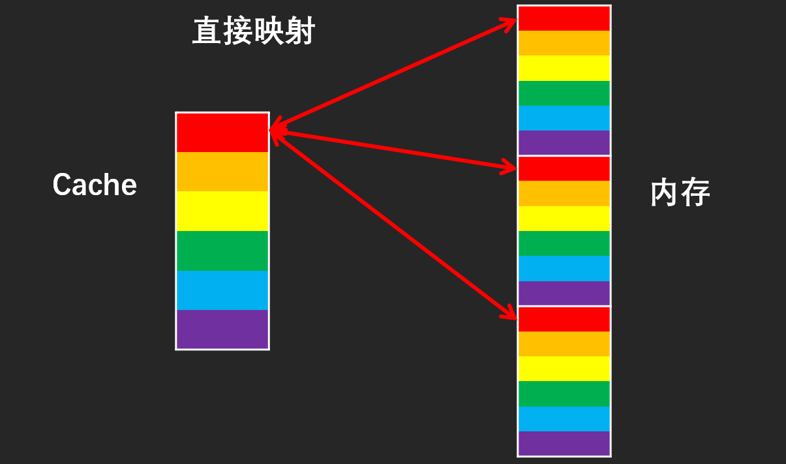

# 计组-Cache-主存地址映射

## 词汇辨析

> %运算:a%b
> 由于我们知道位运算比较高效，在某些情况下，当b为2的n次方时，有如下替换公式：
> a % b = a & (b-1)(b=2n)
> 即：a % 2n = a & (2n-1)
>
> 例如：14%8，取余数，相当于取出低位，而余数最大为7，14二进制为1110，8的二进制1000，8-1 = 7的二进制为0111，由于现在低位全为1，让其跟14做&运算，正好取出的是其低位上的余数。1110&0111=110即6=14%8；（此公式只适用b=2n，是因为可以保证b始终只有最高位为1，其他二进制位全部为0，减去1，之后，可以把高位1消除，其他位都为1，而与1做&运算，会保留原来的数。）
> ————————————————
> 版权声明：本文为CSDN博主「lonyw」的原创文章，遵循CC 4.0 BY-SA版权协议，转载请附上原文出处链接及本声明。
> 原文链接：https://blog.csdn.net/lonyw/article/details/80519652

### Cache Line

> cache分成多个组，每个组分成多个行，linesize是cache的基本单位，从主存向cache迁移数据都是按照linesize为单位替换的。比如linesize为32Byte，那么迁移必须一次迁移32Byte到cache。 这个linesize比较容易理解，想想我们前面书的例子，我们从书架往书桌搬书必须以书为单位，肯定不能把书撕了以页为单位。书就是linesize。当然了现实生活中每本书页数不同，但是同个cache的linesize总是相同的。

PC中的地址是逻辑地址

MDR中是物理地址

