# 计组——数的表示和运算

## 数的表示

### 无符号数

### 有符号数

#### 原码

整数原码定义：
$$
\begin{equation}
[x]_原=
\begin{cases}
0,x& \text{ $ 2^n > x \ge 0 $ } \\
2^n - x& \text{ $ 0 \ge x > -2^n $ }
\end{cases}
\end{equation}
$$
小数原码定义：
$$
\begin{equation}
[x]_原 = 
\begin{cases}
x & \text{$1>x\ge 0$}\\
1-x & \text{$0 \ge x > -1$}
\end{cases}
\end{equation}
$$

**注意整数用逗号将符号位和数值部分隔开，小数的符号位用小数点与数值位之间隔开**

## 定点运算

### 移位运算

有符号数的移位称为算术移位

对于正数，移位之后出现的空位均以0添之

不论是正数还是负数，移位之后其符号位均不变

左移操作（<<）

规则：

右边空出的位用0填补

高位左移溢出则舍弃该高位。

计算机中常用补码表示数据：

数据 127，补码和原码一样：0111 1111。

左移一位： 1111 1110  -> 这个补码对应的原码为：1000 0010  对应十进制：-2

左移二位： 1111 1100  -> 这个补码对应的原码为：1000 0100  对应十进制：-4

左移三位： 1111 1000  -> 这个补码对应的原码为：1000 1000  对应十进制：-8

左移四位： 1111 0000  -> 这个补码对应的原码为：1001 0000  对应十进制：-16

左移五位： 1110 0000  -> 这个补码对应的原码为：1010 0000  对应十进制：-32

左移六位： 1100 0000  -> 这个补码对应的原码为：1100 0000  对应十进制：-64

左移七位： 1000 0000  -> 这个补码对应的原码为：1000 0000  对应十进制：-128

左移八位： 0000 0000  -> 这个补码对应的原码为：0000 0000  对应十进制：0

注：

原码到补码的计算方式：取反+1，

补码到原码的计算方式：-1再取反。

数据-1，它的原码为1000 0001,补码为1111 1111

左移一位： 1111 1110  -> 这个补码对应的原码为：1000 0010  对应十进制：-2

左移二位： 1111 1100  -> 这个补码对应的原码为：1000 0100  对应十进制：-4

左移三位： 1111 1000  -> 这个补码对应的原码为：1000 1000  对应十进制：-8

左移四位： 1111 0000  -> 这个补码对应的原码为：1001 0000  对应十进制：-16

左移五位： 1110 0000  -> 这个补码对应的原码为：1010 0000  对应十进制：-32

左移六位： 1100 0000  -> 这个补码对应的原码为：1100 0000  对应十进制：-64

左移七位： 1000 0000  -> 这个补码对应的原码为：1000 0000  对应十进制：-128

左移八位： 0000 0000  -> 这个补码对应的原码为：0000 0000  对应十进制：0

可以看出127和-1的结果完全一样。移位操作与正负数无关，它只是忠实的将所有位进行移动，补0，舍弃操作。

右移操作（>>）

规则：

左边空出的位用0或者1填补。正数用0填补，负数用1填补。注：不同的环境填补方式可能不同；

低位右移溢出则舍弃该位。

1、127的补码：0111 1111

右移一位： 0011 1111  -> 原码同补码一样  对应十进制：63

右移二位： 0001 1111  -> 原码同补码一样  对应十进制：31

右移三位： 0000 1111  -> 原码同补码一样  对应十进制：15

右移四位： 0000 0111  -> 原码同补码一样  对应十进制：7

右移五位： 0000 0011  -> 原码同补码一样  对应十进制：3

右移六位： 0000 0001  -> 原码同补码一样  对应十进制：1

右移七位： 0000 0000  -> 原码同补码一样  对应十进制：0

右移八位： 0000 0000  -> 原码同补码一样  对应十进制：0

2、-128的补码：1000 0000

右移一位： 1100 0000  -> 这个补码对应的原码为：1100 0000  对应十进制：-64

右移二位： 1110 0000  -> 这个补码对应的原码为：1010 0000  对应十进制：-32

右移三位： 1111 0000  -> 这个补码对应的原码为：1001 0000  对应十进制：-16

右移四位： 1111 1000  -> 这个补码对应的原码为：1000 1000  对应十进制：-8

右移五位： 1111 1100  -> 这个补码对应的原码为：1000 0100  对应十进制：-4

右移六位： 1111 1110  -> 这个补码对应的原码为：1000 0010  对应十进制：-2

右移七位： 1111 1111  -> 这个补码对应的原码为：1000 0001  对应十进制：-1

右移八位： 1111 1111  -> 这个补码对应的原码为：1000 0001  对应十进制：-1

常见应用

左移相当于*2，只是要注意边界问题。如char a = 65； a<<1 按照*2来算为130;但有符号char的取值范围-128~127，已经越界，多超出了3个数值，所以从-128算起的第三个数值-126才是a<<1的正确结果。

而右移相当于除以2，只是要注意移位比较多的时候结果会趋近去一个非常小的数，如上面结果中的-1，0。

其它的四种位运算：

与运算（&）

1、与0相与可清零

2、与1相与可保留原值

或运算（|）

1、与0相或可保留原值

2、与1相与可齐设1

异或运算（^）

1、与0异或保留原值

2、与1异或比特值反转

3、可通过某种算法，使用异或实现交换两个值

异或运算是有结合律的

取反（~）

0变1,1变0

### 原码一位乘

符号位单独计算，对于数值部分，则只需要像正常乘法那样

比如$x=-0.1110，y=-0.1101$，求$[x\cdot y]_原$

所有的右移过程均为**逻辑右移**

### 原码两位乘

**$z$为部分积，$x^*$为被乘数，$y^*$为乘数**

| 乘数判断位$y_{n-1}y_n$ | 标志位$C_j$ | 操作内容                                                    |
| ---------------------- | ----------- | ----------------------------------------------------------- |
| 00                     | 0           | 部分积右移2位，乘数右移两位，$C_j$保持0                     |
| 01                     | 0           | 部分积加上一个被乘数，右移2位，乘数右移2位，$C_j$保持0      |
| 10                     | 0           | 部分积加上2倍的被乘数，右移2位，乘数右移2位，$C_j$保持0     |
| 11                     | 0           | 部分积减去一个被乘数数，右移2位，乘数右移2位，$C_j$置1      |
| 00                     | 1           | 部分积加上一个被乘数，右移2位，乘数右移2位，$C_j$置0        |
| 01                     | 1           | 部分积加上2倍的被乘数，右移2位，乘数右移2位，$C_j$置0       |
| 10                     | 1           | **部分积减去一个被乘数，右移2位，乘数右移2位，$C_j$保持1**① |
| 11                     | 1           | **部分积右移2位，$C_j$保持1**②                              |

①：应该是部分积加上三倍的被乘数，即$z+3x^*$，转换成$z-x^*$，然后整体右移两位后，对于下一次迭代，$C_j$为1，一定会加上一个$x^*$，那么对于上一次迭代的$z$来说，相当于是加上了一个左移了两位的$x^*$，即$4x^*$，由于上次迭代减去了一个$x^*$，所以最终相当于是加上了$3x^*$

②：大致与①类似，不过是少了减$x^*$这一步

### 补码一位乘

#### 校正法

原理（以小数为例）：

设被乘数为$[x]_补 = x_0.x_1x_2\cdots x_n$

乘数 $[y]_补 = y_0.y_1y_2\cdots y_n$

##### 👉<u>前置知识：</u>

1. **补码与真值的转换公式**

   设$[x]_补 = x_0.x_1x_2\cdots x_n$

   $x\ge 0$时，$x_0=0$

   $[x]_补 = 0.x_1x_2\cdots x_n = \sum_{i = 1}^n x_i2^{-i} = x$

   $x < 0$时，$x_0=1$

   $[x]_补 = 1.x_1x_2\cdots x_n=2+x$

   $x=1.x_1x_2\cdots x_n - 2 = -1+0.x_1x_2\cdots x_n = -1 + \sum_{i = 1}^{n} x_i2^{-i}$

   最终，**<u>无论x大于零还是小于零，我们可以使用统一的式子来表示</u>**
   $$
   x=-x_0 + \sum_{i=1}^{n}x_i2^{-i}
   $$
   
2. **补码的右移**

   正数右移一位，相当于乘以$\frac{1}{2}$

   设$[x]_补=x_0.x_1x_2\cdots x_n$

   ∵ $x=-x_0 + \sum_{i=1}^{n}x_i2^{-i}$

   ∴ $\frac{1}{2}x = \frac{-1}{2}x_0 + \frac{1}{2}\sum_{i=1}^{n}x_i2^{-i}$

   ​	$ = -x_0 + \frac{1}{2}x_0 + \frac{1}{2}\sum_{i=1}^{n}x_i2^{-i}$

   ​	$ = -x_0 + \frac{1}{2}\sum_{i=0}^{n}x_i2^{-i}$

   ∴ 
   $$
   [\frac{1}{2}x]_补 = x_0.x_0x_1x_2\cdots x_n
   $$
   即：**<u>要获得$[2^{-i}x]_补$，只需要将$[x]_补$连同符号右移i位即可</u>**

   这里我们证明了，补码通过带符号的整体移动来实现乘除过程

##### 👉<u>校正法的原理</u>：

**若被乘数x为任意符号，乘数y为正**

$[x]_补 = x_0.x_1x_2\cdots x_n = 2 + x = 2^{n + 1} + x$ (mod 2) ①，

> 因为是在模2的情况下，一个小数x无论是加上2(10.00...0)还是加上$2^{n+1}即(\underbrace{100\cdots 0}_{n+2位}.00\cdots 0)$都不会影响最终的结果

$[y]_补 = 0.y_1y_2\cdots y_n = y$ ②

$[x]_补\cdot [y]_补 = [x]_补 \cdot y = (2^{n+1} + x)\cdot y = 2^{n+1}\cdot y + xy$③

由②可知，$y=0.y_1y_2\cdots y_n = \sum_{i = 1}^{n}y_i 2^{-i}$

则$2^{n+1}\cdot y = 2\sum_{i = 1}^{n}y_i2^{n-i}$是一个2倍整数

> 解释一下，当我们在接触二进制的时候，面对随意一个二进制数10110101(假设这个二进制数是$w_8w_7\cdots w_1$)是如何计算它的十进制的？
>
> $n=\sum_{i=1}^{8}w_i 2^{i-1}$
>
> 由于$y=0.y_1y_2\cdots y_n$是反过来排序的，
>
> $\sum_{i = 1}^{n}y_i2^{n-i}$
>
> 其实跟我们计算二进制的十进制数的流程是一样的，同时也说明
>
> $2^{n+1}\cdot y = 2\sum_{i = 1}^{n}y_i2^{n-i}$是一个整数的2倍
>
> 所以$2^{n+1}\cdot y$ 进行模2操作后结果应该为0
>
> **在模2的情况下，$2^{n+1}\cdot y$与2是等效的**
>
> 从上面的推理我们知道$2^{n+1}\cdot y$是一个偶数，我们假设它为6(110.0000)
>
> 假设一个小数0.1001
>
> (0.1001 + 10.0000) mod 2 = (0.1001 + 110.0000 ) mod 2

根据模运算的性质，有$2^{n+1}\cdot y = 2$ (mod 2)

所以由③可知$[x]_补 \cdot [y]_补 = 2^{n+1} \cdot y + xy = 2 + xy = [x\cdot y]_补$ (mod 2)

即：

**当y大于零的时候，$[x\cdot y]_补 = [x]_补 \cdot [y]_补 = [x]_补 \cdot y$**

这时候我们便可以使用原码乘法的规则
$$
[z_0]_补 = 0\\
[z_1]_补 = 2^{-1}(y_n[x]_补 + [z_0]_补)\\
...\\
[x\cdot y]_补 = [z_n]_补 = 2^{-1}(y_1[x]_补+[z_{n-1}]_补)
$$
乘以$2^{-1}$其实就是右移的过程，

还记得我们在**前置知识**里面提到过的右移规则吗，当你计算的时候右移记得保持符号位。

**若被乘数x为任意符号，乘数y为负**

$[x]_补 = x_0.x_1x_2\cdots x_n$

$[y]_补 = 1.y_1y_2\cdots y_n = 2 + y$ (mod 2)

$y = [y]_补 - 2 = 1.y_1y_2\cdots y_n - 1 - 1 = 0.y_1y_2\cdots y_n - 1$

$x \cdot y = x(0.y_1y_2\cdots y_n - 1) = x(0.y_1y_2\cdots y_n) - x$

$[x\cdot y]_补 = [x(0.y_1y_2\cdots y_n)]_补 + [-x]_补$

如果将$(0.y_1y_2\cdots y_n)$视为一个正数

即：

**当乘数y小于0的时候，$[x\cdot y]_补 = [x(0.y_1y_2\cdots y_n)]_补 + [-x]_补 = [x]_补 (0.y_1y_2\cdots y_n) + [-x]_补$**

而上式中，$[x(0.y_1y_2\cdots y_n)]_补$正是乘数为正数（$0.y_1y_2\cdots y_n$为正数）时候的乘法结果，

算出来后再加上$[-x]_补$，就是最终结果

这个，便是校正法

使用校正法列式计算的时候，过程如原码计算一样，但是要注意这里使用了双符号位来计算

说的再多，不如直接用事实说话

唐朔飞版《计算机组成原理》p251页例6.19

> 已知$[x]_补=1.0101，[y]_补=0.1101$，求$[x\cdot y]_补$

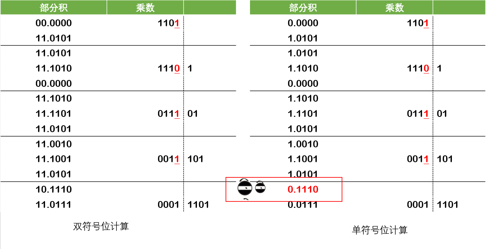

问题出在我画红框的位置，在运算过程中结果超过了1，应该是2点几，但是由于只有一个符号位，符号位直接干成零了，进位被丢弃了，可以说，运算过程中出现了溢出现象，本来好好的负数，一捣鼓成了正数了，所以为了避免这个情况，使用双符号位。

#### Booth算法

##### <u>👉前置知识</u>

$[-x]_补 = -[x]_补$ (mod 2)

证明过程如下，兄弟们可以跳过不看：

1. 若$[x]_补$为正数

   ∴ $x = 0.x_1x_2\cdots x_n$

   ∴ $-x = -0.x_1x_2\cdots x_n$

   <u>**∴ $[-x]_补 = 1.\bar{x_1}\bar{x_2}\cdots \bar{x_n} + 2^{-n} \pmod{2}$ ①**</u>

   > 这里要解释一下，一般我们原码求补码为<u>“数值取反再加一”</u>，这里我们对x的所有小数位取反，然后加上$2^{-n}$即$0.\underbrace{00\cdots1}_n$

   $ \because [x]_补 = 0.x_1x_2\cdots x_n$

   $\therefore -[x]_补=-0.x_1x_2\cdots x_n = 0 -0.x_1x_2\cdots x_n \equiv 2-0.x_1x_2\cdots x_n\pmod{2}$

   ​	<u>**$=1+1-0.x_1x_2\cdots x_n = 1 + 0.\bar{x_1}\bar{x_2}\cdots \bar{x_n} + 2^{-n} = 1.\bar{x_1}\bar{x_2}\cdots \bar{x_n} + 2^{-n}$ ②**</u>

   > $\equiv$是同余符号。$a \equiv b \pmod{2}$代表a和b模2同余
   >
   > 解释一下这个计算：
   >
   > $1+1-0.x_1x_2\cdots x_n = 1 + 0.\bar{x_1}\bar{x_2}\cdots \bar{x_n} + 2^{-n}$
   >
   > 我们可以这么想：
   >
   > $0.x_1x_2\cdots x_n + 0.\bar{x_1}\bar{x_2}\cdots \bar{x_n} = 0.\underbrace{11\cdots 1}_n$
   >
   > $0.x_1x_2\cdots x_n + 0.\bar{x_1}\bar{x_2}\cdots \bar{x_n} + 2^{-n} = 1$
   >
   > 所以
   >
   > $1-0.x_1x_2\cdots x_n = 0.\bar{x_1}\bar{x_2}\cdots \bar{x_n} + 2^{-n}$

   由①和②可知$[-x]_补 = -[x]_补$ (mod 2)

2. 若$[x]_补$为负数

   $\therefore [x]_补 = 1.x_1x_2\cdots x_n$

   $ \therefore x = -(0.\bar{x_1}\bar{x_2}\cdots \bar{x_n} + 2^{-n})$

   $ \therefore -x = 0.\bar{x_1}\bar{x_2}\cdots \bar{x_n} + 2^{-n}$

   <u>**$\therefore [-x]_补 = 0.\bar{x_1}\bar{x_2}\cdots \bar{x_n} + 2^{-n}$①**</u>

   $ \because [x]_补 = 1.x_1x_2\cdots x_n$

   并且$1.x_1x_2\cdots x_n + 0.\bar{x_1}\bar{x_2}\cdots \bar{x_n} + 2^{-n} = 2$

   $\therefore [x]_补= 1.x_1x_2\cdots x_n = 2-(0.\bar{x_1}\bar{x_2}\cdots \bar{x_n} + 2^{-n}) \equiv -(0.\bar{x_1}\bar{x_2}\cdots \bar{x_n} + 2^{-n}) \pmod{2}$

   <u>**$\therefore -[x]_补 = 0.\bar{x_1}\bar{x_2}\cdots \bar{x_n} + 2^{-n}$②**</u>

   $\therefore [-x]_补 = -[x]_补 \pmod{2}$

   

##### 👉Booth算法基本思想

这时候我直接copy前面的校正法中的语句

**当y大于零的时候，$[x\cdot y]_补 = [x]_补 \cdot [y]_补 = [x]_补 \cdot y$**

**当乘数y小于0的时候，$[x\cdot y]_补 = [x(0.y_1y_2\cdots y_n)]_补 + [-x]_补 = [x]_补 (0.y_1y_2\cdots y_n) + [-x]_补$**

综合来看也就是少一个$[-x]_补$和多一个$[-x]_补$的问题

这完全可以使用$y_0$来控制，y大于0的时候$y_0$等于0，y小于0的时候$y_0$等于1，正好对应着$[-x]_补$的有无

即：

**$[x\cdot y]_补 = [x]_补 (0.y_1y_2\cdots y_n) + y_0[-x]_补$**

通过前置知识我们知道了

$[-x]_补 = -[x]_补 \pmod{2}$

所以

**$[x\cdot y]_补 = [x]_补 (0.y_1y_2\cdots y_n) - y_0[x]_补$**

$ = [x]_补(-y_0+y_12^{-1}+y_22^{-2}\cdots y_n2^{-n})$

$ = [x]_补(-y_0+y_1(1 - 2^{-1})+y_2(2^{-1}-2^{-2})\cdots y_n(2^{-n+1}-2^{-n})$

$ = [x]_补((y_1-y_0)+2^{-1}(y_2-y_1)+2^{-2}(y_3-y_2)\cdots + 2^{-n}(0-y_n))$

这时候我们设$y_{n+1} = 0$

则<u>$[x\cdot y]_补=[x]_补((y_1-y_0)+2^{-1}(y_2-y_1)+2^{-2}(y_3-y_2)\cdots + 2^{-n}(y_{n+1}-y_n))$</u>

那么现在我们可以了解一下乘法的递推公式了
$$
[z_0]_补=0\\
[z_1]_补 = 2^{-1}([z_0]_补+(y_{n+1}-y_n)[x]_补)\\
...\\
[z_n]_补 = 2^{-1}([z_{n-1}]_补+(y_2 - y_1)[x]_补)\\
[x\cdot y]_补 = [z_n]_补 + (y_1-y_0)[x]_补
$$
我们需要记住整体公式

<u>$[x\cdot y]_补=[x]_补((y_1-y_0)+2^{-1}(y_2-y_1)+2^{-2}(y_3-y_2)\cdots + 2^{-n}(y_{n+1}-y_n))$</u>

共n+1项，对应着递推公式的n+1步，前n步都需要乘以$2^{-1}$即对部分积进行右移操作，到达第$n+1$步的时候，不需要乘$2^{-1}$即不需要右移操作

如果同志你理解了上面的过程，我觉得$y_iy_{i+1}$对应的状态表就是多余的了，但是打上，更有助于理解

| $y_iy_{i+1}$ | $y_{i+1}-y_i$ | 操作                   |
| ------------ | ------------- | ---------------------- |
| 00           | 0             | 部分积直接右移         |
| 01           | 1             | 部分积加上$[x]_补$     |
| 10           | -1            | **部分积减去$[x]_补$** |
| 11           | 0             | 部分积直接右移         |

减去，计算机怎么直接做减法呢？

还记得我们前置知识里面证明的结论吗？

<u>**$[-x]_补 = -[x]_补 \pmod{2}$**</u>

所以上表我们可以更新成

| $y_iy_{i+1}$ | $y_{i+1}-y_i$ | 操作                     |
| ------------ | ------------- | ------------------------ |
| 00           | 0             | 部分积直接右移           |
| 01           | 1             | 部分积加上$[x]_补$       |
| 10           | -1            | **部分积加上$[－x]_补$** |
| 11           | 0             | 部分积直接右移           |

计算机：“这个我会！”

**那么这就要求我们在计算过程中首先要把$[x]_补和[-x]_补$计算出来**

还有就是，我们要求被乘数和部分积为**双符号位**，这个要求的原因可以从校正法中寻找

乘数需要保留一位符号位，Why？

还记得我们的递推公式吗
$$
[z_0]_补=0\\
[z_1]_补 = 2^{-1}([z_0]_补+(y_{n+1}-y_n)[x]_补)\\
...\\
[z_n]_补 = 2^{-1}([z_{n-1}]_补+(y_2 - y_1)[x]_补)\\
[x\cdot y]_补 = [z_n]_补 + (y_1-y_0)[x]_补
$$
我们最后一步要用到$y_0$也就是符号位，所以保留符号位，强硬一点来说，**你必须要保留符号位**。

叨叨了那么多，做个题缓缓吧

**[王道2021年计算机组成原理考研复习指导，p44 例2.8]**

> 机器字长为5位（含1位符号位，n=4），x=-0.1101，y=0.1011，采用Booth算法求$x\cdot y$

求得$[x]_补$=11.0011，$[-x]_补$=00.1101，$[y]_补$=0.1011

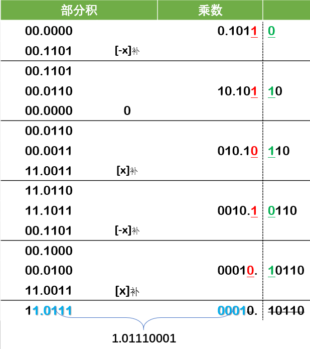

*由于时间比较紧张，所以这次写的博客比较粗糙，望各位海涵，如果哪里写错了，您可以评论或者私聊指出我的错我，我一定马上改正。谢谢。*

### 原码除法

#### 恢复余数法

##### 👉我们面临的问题

如何确定某个位置应该商几？

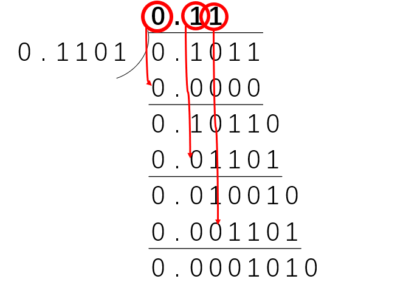

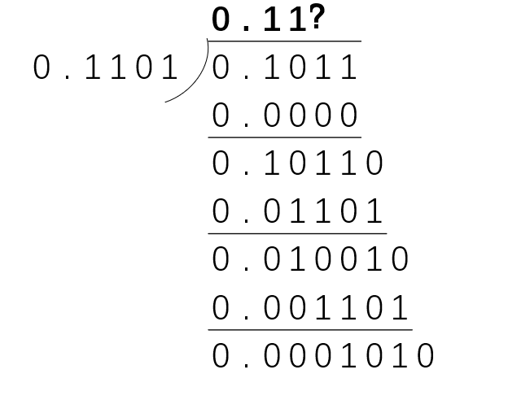

如果这个位置商1的话，则如下

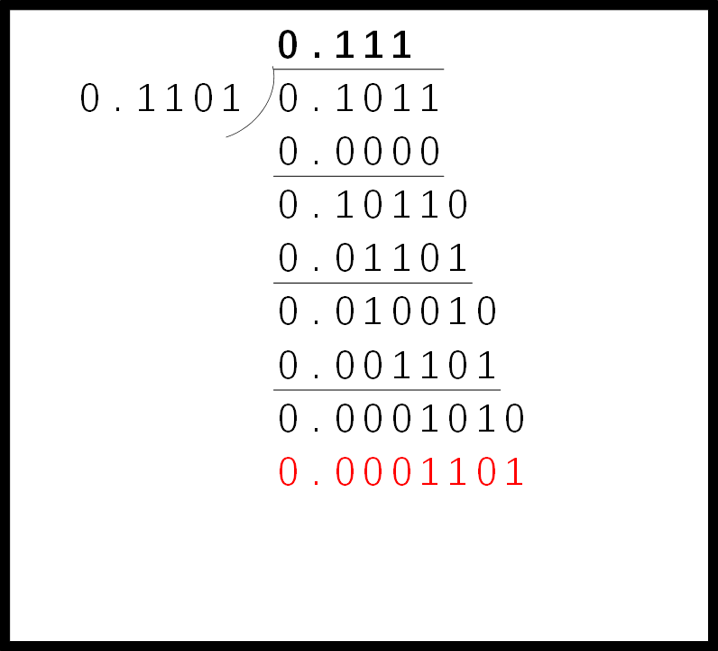

好家伙，根本不够减，赶紧拿出橡皮擦擦掉刚刚的1，换成0，然后继续计算。

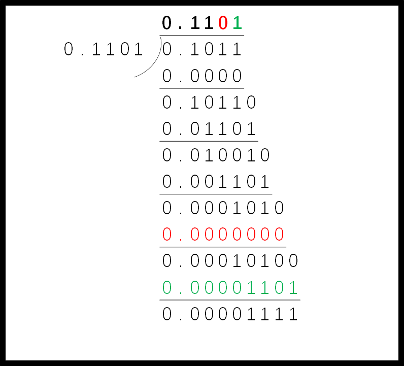

但是计算机还是比人笨的，我们人类能直接擦掉重新改，但是计算机可以吗？

如果您看过我之前的博文，或者了解计算机内部的乘法计算，就应该知道，**计算机在计算乘除法的时候使用寄存器来存储中间结果**，比如乘法的部分积，或者我们目前正在谈的除法中的余数，还是回到刚刚的问题

这个位置应该商什么？

计算机判断谁大谁小本身就是使用减法的结果来判断的（当然在计算机内部是使用的补码，这里我们仅仅用原码来展示一下原理），假设我们商1，那么就像这样：

最后两行很明显被减数小于减数，两者相减的结果无论正负最终都要存入余数的寄存器中，这时候我们检查寄存器里面的结果，发现，噢！原来商1后的余数为负数，不行，这个位置应该商0。

多么像你的人生，当你知道错了的时候，往往事情已经无法挽回了，寄存器里面已经存入一个负数了。

##### 👉计算机是怎么做的

这时候我们要扭转自己作为一个正常人类在做除法时的观念。

作为计算机，你虽然笨，但你足够严谨，而且你在做除法的时候只需要关心商1还是0，所以你先进行验证然后再商。我们还是用这个老图。

面对这个问题，你到底商几？

如果我们默认商1（我只是说如果，我先不商，我先验证），`0.0001010`就需要减去`0.0001101`，先做减法，发现最终结果小于零（重申：计算机内部是使用的补码，这里我们仅仅用原码来展示一下原理），并且这个小于0的结果已经存入了余数寄存器中。

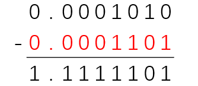

这时候你就要进行判断

1. 余数寄存器中的值**小于0**，表示不能商1，需要**商0**
2. 余数寄存器中的值**大于0**，表示能**商1**

好像我们完成了一个重大任务，我们把这个位置的正确商值求出来了！

**Wait a minute**，寄存器里面此时还存着一个负数呢！如果商0的话，寄存器里面的值不应该发生变化呀，怎么办？终于谈到了我们的正题——恢复余数。

这个时候我们则需要对余数寄存器再进行一步操作，它之前减去了一个除数，再给它加上一个除数，不就把它恢复了吗？

我们每轮上商之前需要进行的操作：

1. 默认让余数减去除数
2. 进行判断
   1. 余数寄存器中的值**小于0**，表示不能商1，需要**商0**，并且要对寄存器中的值进行恢复处理
   2. 余数寄存器中的值**大于0**，表示能**商1**

##### 👉怎么做题？

**关于移位：**

首先，在计算的时候我们采用的是余数左移，形成对比记忆，乘法里面使用的都是右移，

关于左移，我用自己匮乏的语言能力没法说清楚，但是用一张图可以很好地理解，比如对于我们这道题来说，每次得到余数后，我们在下一位上商，假设我们上的商为1，比如你在小数点后第二位上商1，0.01×0.1101=0.001101，而此时上一轮得到的余数为0.01001，我们则需要在这个余数后面补零，这样才能和0.001101对齐，而在计算机中，这个过程其实是左移。

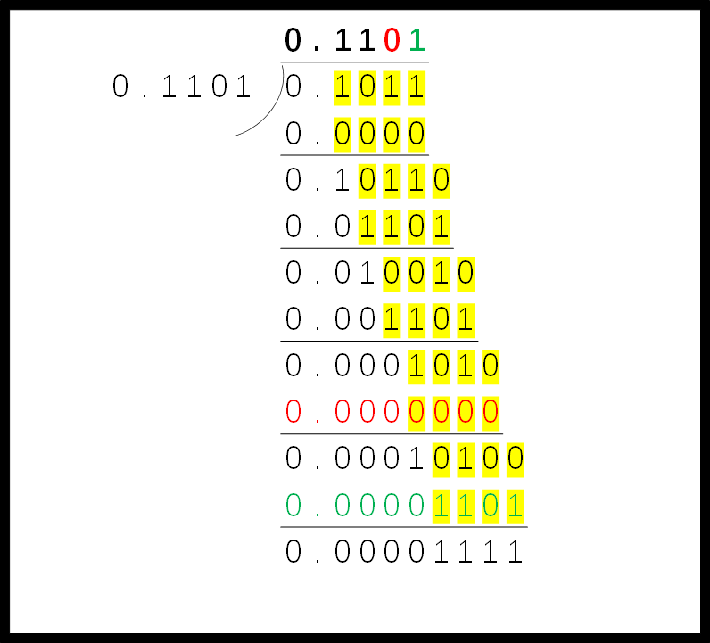

**前期的准备工作：**

原码除法和原码乘法一样，结果的符号提前进行判断，我们需要获得被除数和除数的绝对值原码，或者说补码，反正正数的补码和原码一致。设它们为$被除数_{绝}$和$除数_绝$

每次上商1的时候，原来的余数需要减去$除数_绝$，那必然是不得行，计算机不会做减法，只会做加法，所以我们还需要获得$-除数_{绝}$的补码即$[-除数_绝]_补$

所以我们需要提前准备的是

$被除数_{绝}$，$除数_绝$，$[-除数_绝]_补$

借用实际例题

> 【计算机组成原理 第二版 唐朔飞 p259 例6.24】
>
> 已知x=-0.1011，y=-0.1101，求$[\frac{x}{y}]_原$

按照我们之前总结的，提前准备好三个数

$被除数_{绝}$=$x^*$=0.1011

$除数_绝$=$y^*$=0.1101

$[-除数_绝]_补$=$[-y*]_补$=1.0011

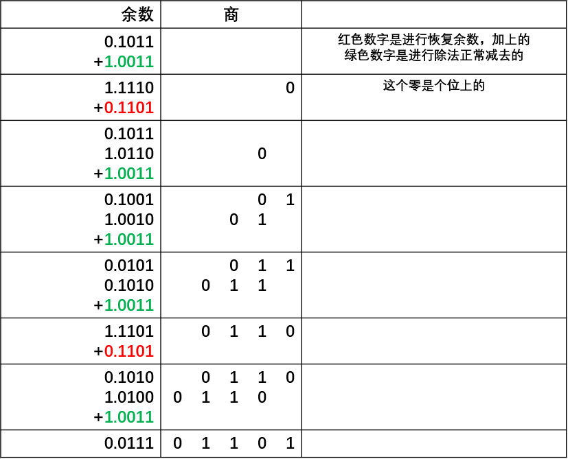

计算出商为`0.1101`后，我们再根据原来的符号判断结果的正负

$1\bigoplus 1 = 0$

最终结果为`0.1101`

**很重要的一个点**

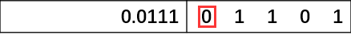

最后结果中的最高位置有判断溢出的功能，如果为1的话，则表示此除法溢出。

一图胜千言，其实光看看这个图就啥都理解了。

#### 加减交替法

##### 👉在恢复的过程中干了什么？

（在恢复余数算法中）当我们发现余数为负数的时候我们需要做什么？

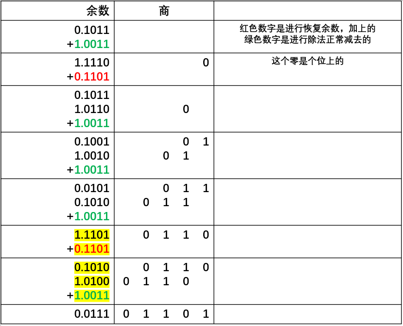

标黄的部分可以表示为

$(余数+[y^*]_补)\times 2 + [-y^*]_补$

其实我们完全可以把这个过程压缩，变成：

$余数\times 2 + [y^*]_补 + [y^*]_补 + [-y^*]_补$

$ [y^*]_补 + [-y^*]_补$其实相当于啥都没干，直接消除，变成

$余数\times 2 + [y^*]_补$

也就是说如果余数为负数，我们只需要将余数乘以2（即左移一位）并且加上$[y^*]_补$即可

##### 👉做题

我们尝试能否把标黄的部分进行化简

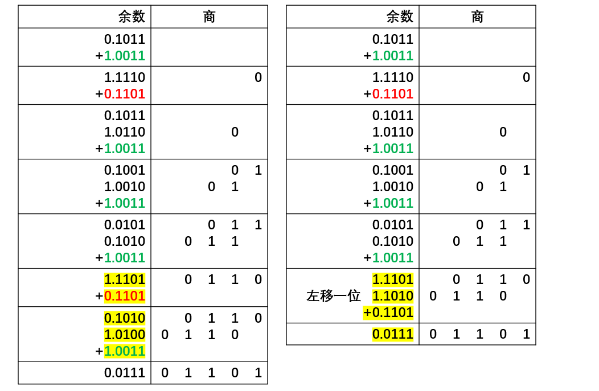

这里我没有完全化简，你可以看到上面还有一处红字，我只是想要表达，加减法交替和恢复余数法本质上是等价的，加减法交替只是为恢复余数法做了个瘦身罢了。下面是完整的化简：

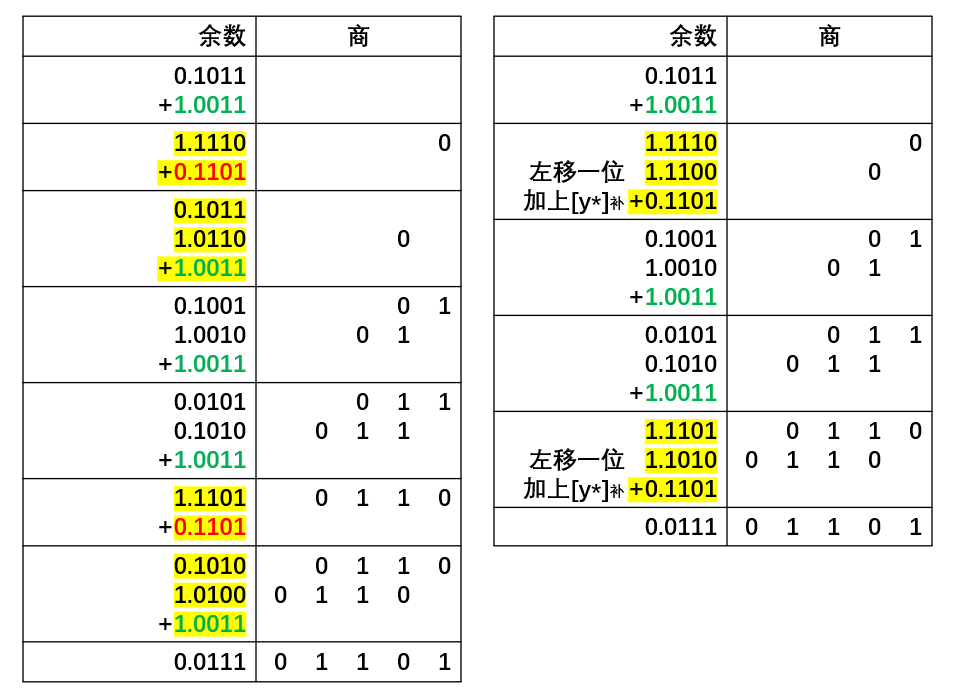

那么右边就是加减法交替的过程了，符号位还是老样子，提前计算好就行。

其前期准备是和恢复余数法一致的。

### 补码除法

#### 够减？还是不够？

大家可以用平常的整数来增强理解。

当被除数和除数**异号**的时候，余数与除数**异号**，说明**够减**

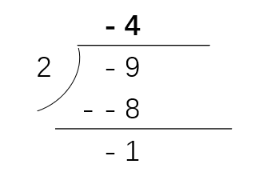

当被除数和除数**同号**的时候，余数与除数**同号**，说明**够减**

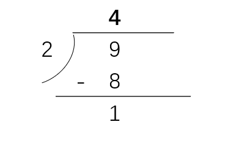

#### 确定商值

课本中指出，我们可以使用**末位恒置1法**。

那么当$被除数_补$与$除数_补$同号的时候，商为正数补码，“够减”上商1，不够减上商0

那么当$被除数_补$与$除数_补$异号的时候，商为负数补码，“够减”上商0，不够减上商1

> 这里我需要解释一下异号的时候为什么会这样：
>
> 这与两个因素有关：<u>①“末位恒置1法”</u>，<u>②商的位数是固定的。</u>
>
> 举个例子吧，比如一个二进制数-10010000，它的补码是？
>
> 我们知道，首位为1，标志着负数，后面为原来的数值部分取反加一，即$[-10010000]_补$=100000000 + (01101111 + 1) = 1 01110000
>
> 在后面的数值位中，哪些位置是仅仅被取反的？
>
> 1 **0111**0000
>
> 到这一步你应该理解，低位的所有0，都是取反之后**加一**的过程中由于进位产生的。
>
> 所有可以这么说：**补码中第从低位起，第一个不为0的位置以及该位置之前的高位，都仅仅是原码对应位的反码**
>
> 那么如果我们使用了**“末位恒置1法”**，即我们将进位扼杀在了最低位置中，那么按照常理来说，异号的时候够减应该商1，但考虑到商又是负数，所以结果直接取反码就行了，因为我们计算过程中得到的所有位都在最低位之前。而由于“末位恒置1”法，这些位直接取反码即可。

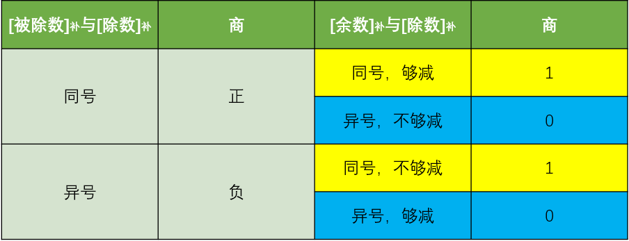

利用统计学、概率论等等高端知识……哦，我考数二，没学概率论，打扰了，

利用我一个正常本科生的常识来看，总共是四种情况，而且不论$[被除数]_补$和$[除数]_补$是同号还是异号，只要$[余数]_补$和$除数]_补$同号，商都是1，相反如果他俩异号，则商0。

那么我们的表格更新为：

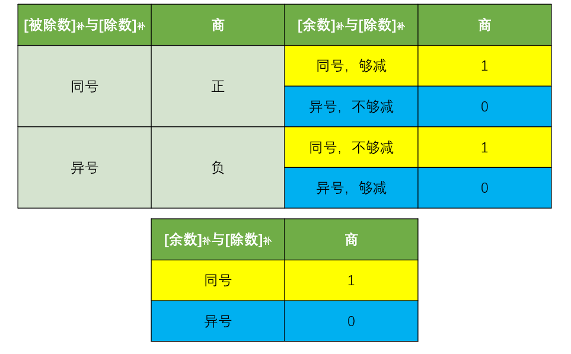

#### 计算过程

首先，补码计算过程的符号是自动生成的，你只管做，符号它会自动确定。

然后是一些表格，比起书上的那些表格，我觉得下面这个表格更重要：

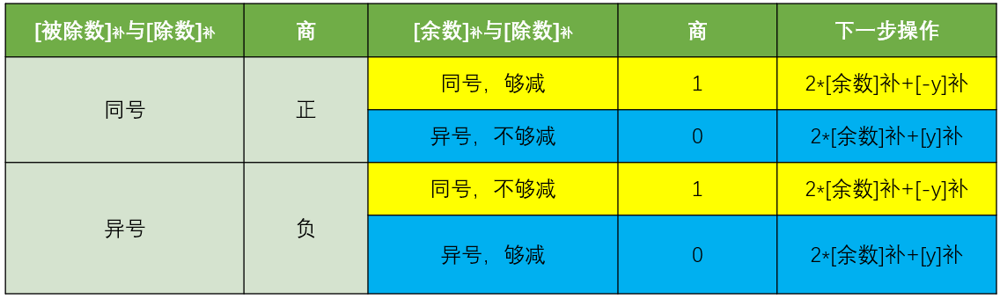

>  $[被除数]_补$和$[除数]_补$异号时，是通过$[被除数]_补 + [除数]_补$来获得余数的，所以对于异号来说，不够减的时候，余数左移之后应该是减去$[除数]_补$即加上$[-除数]_补$

化简一下

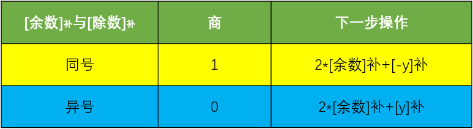

> 【计算机组成原理 第二版 唐朔飞 p266 例6.27】

已知x=-0.1001，y=+0.1101，求$[\frac{x}{y}]_补$

还是准备三样：

$[x]_补, [y]_补, [-y]_补$

$[x]_补 = 1.0111$

$[y]_补 = 0.1101$

$[-y]_补 = 1.0011$

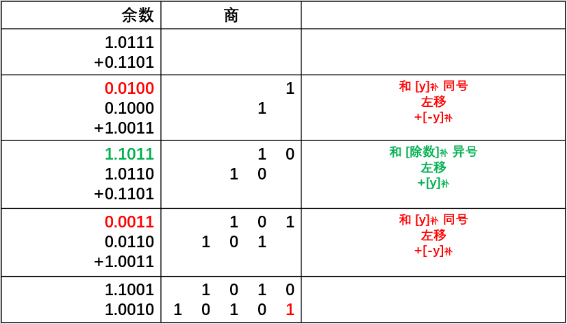

**记得最后一步左移后直接在最后一位补1即可**

### 总结

无论原码除法还是补码除法，你判断他们结束的条件就是商形成了n+1位，即一个符号位和一个小数位。

累了累了，之前写这个纯粹是由于气愤，自己学了多少次原码、补码的乘法除法，总是学了又忘，然后脑子一热，逼着自己写了两篇博客，来加深印象，凡是不能杀死我的必会让我更强大。

复习去了。