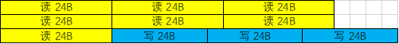
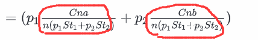

# 计组答案

## 第五章 

### 5.5

1.10


## 第六章 总线

### 6.1 概述


> 2.2 某总线支持耳机Cache块传输方式，若每块6个字，每个字长4字节，时钟频率为100MHz。
>
> (1) 读操作时，第一个时钟周期接收地址，第二、三个为延时周期，另用4个周期传送一个块。读操作的总线传输速率为多少？
>
> 343MB/s
>
> (2)写操作时，第一个时钟周期接收地址，第二个为延时周期，另用4个周期传送一个块。写操作的总线传输速率是多少？
>
> 400MB/s
>
> (3)设在全部的传输中，70%用于读，30%用于写，该总线在本次传输中的平均传输速率是多少？

难道是$343\times 70\% + 400 \times 30\% = 360.1MB/s$？

我们先假设读写了10次，其中七次为读，三次为写，那么总周期数为`7*7+3*6 = 67周期`，总传输数据为`240B`



总时间为$67\times \frac{1}{100M}$

故，平均传输速率为$\frac{240B}{67\times \frac{1}{100M}} = \frac{240B \times 100M}{67} = 358.21MB/s$

事情好像有一点奇怪了。


当然，带入特值来计算结果是不严谨的，我们来推导一下一般性过程

设时钟频率为$CMHz$

设读周期占用$St_1$个周期，写周期占用$St_2$个周期，读周期的数据为aB，写周期的数据为bB

设读写了n次，其中$p_1$（百分比）为读，$p_2$（百分比）为写，

那么

**总周期数**为$p_1\times n \times St_1+p_2 \times n \times St_2 = n(p_1St_1 + p_2St_2)$，

**总传输数据**为$p_1na + p_2nb= n(p_1a + p_2b)B$

**总时间**为$ [n(p_1St_1 + p_2St_2)\times \frac{1}{CM}]s$

故，**平均传输速率**为$\frac{n(p_1a + p_2b)B}{n(p_1St_1 + p_2St_2)\times \frac{1}{CM}} = \frac{C(p_1a+p_2b)}{p_1St_1+p_2St_2}MB/s$

带入数据计算，$\frac{100\times(70\%\times 24 + 30\%\times24)}{70\%\times 7 + 30\%\times 6}=358.21MB/s$

---


那如果我们按照最开始的设想，直接计算出来每种的速率，再分别乘以百分比，然后相加呢？

$\frac{aB}{St_1\times \frac{1}{CM}}\times p_1 + \frac{bB}{St_2\times \frac{1}{CM}}\times p_2 = C(\frac{p_1a}{St_1}+\frac{p_2b}{St_2})MB /s$


把这种直接计算的速率结果再变形一下

```text
 =(p_1\frac{Cna}{nSt_1}+p_2\frac{Cnb}{nSt_2}))
```

$C(\frac{p_1a}{St_1}+\frac{p_2b}{St_2}) =(p_1\frac{Cna}{nSt_1}+p_2\frac{Cnb}{nSt_2}) $

我们把**真正的平均传输速率**再变形一下

$ \frac{C(p_1a+p_2b)}{p_1St_1+p_2St_2} = (p_1\frac{Cna}{n(p_1St_1+p_2St_2)}+p_2\frac{Cnb}{n(p_1St_1+p_2St_2)}) $



我们会发现，**真正的平均传输率里面标红圈的，才是在混合读和写两种方式后，读操作和写操作的真正速率**

跟直接计算的速率一比较，你就发现问题所在了。

