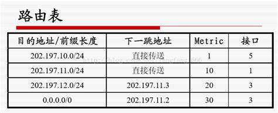
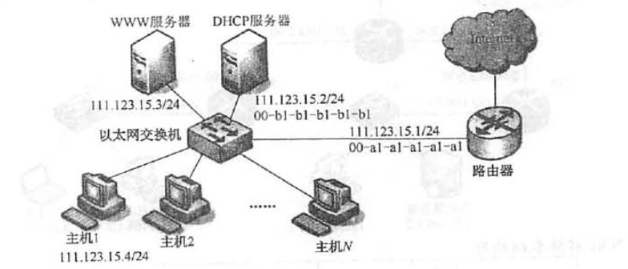

# 计算机网络笔记

## 第一章

> 
>
> 时间分布：
>
> 
>
> 连续地看
>
> 
>
> 2RTT+RTT/2+n×(分组大小/带宽) = 2×100+(100/2) + (1000/1)×(1KB/1.5Mb/s) = 200ms+50ms+1000×$5.4613\times 10^{-3}$​​​​s = 0.2s + 0.05s+5.4613s ≈ 5.71s
>
> 这一题需要注意的是，我一个分组发送出去的时候，接下来的分组也开始发送了，所以他们就像计算机组成原理的流水线一样，经过一个装入时间过后，每隔一个时钟周期就会有一个任务完成，异曲同工之妙。
>
> 
>
> 看这个图可以理解，我们只是在第一问的基础上，添加了来自接收方的确认，你把数据发送到通道上之后，数据在传送到接收方的过程中已经度过了RTT/2的时间，然后接收方发发送的确认再经过RTT/2的时间回到发送方，最后一次发送只有发送到接收方的RTT/2，而不需要计算接收方的确认时间(因为计算的是发送完整个文件的时间)
>
> 我们可以计算：
>
> 2RTT + 1000 ×(1KB/1.5Mb/s) +1000×RTT - RTT/2 = 105.61s
>
> 第三题：
>
> 总共发送1000/1/20=50个分组，同样，最后一个分组只需要计算发送的RTT/2，而不需要考虑返回的RTT/2，而且由于带宽无穷大，不需要计算发送时间，只需要考虑等待的传输时间。
>
> 2RTT + 49×RTT + RTT/2 = 5.15s

【王道2021 p41 3】

> 同步、异步是通信方式
>
> 串行传输适合于远距离传输
>
> 并行传输

【王道2021 p42 8】

> **基带信号：**基带信号（信息源，也称发终端）指发出的没有经过调制（进行频谱搬移和变换）的原始电信号，其特点是频率较低，信号频谱从零频附近开始，具有低通形式。
>
> **基带传输：**基带信号在**数字信道**上传输
>
> **频带传输：**基带信号在**模拟信道**上传输
>
> **宽带传输：**宽带信号将基带信号进行调制后形成频分复用模拟信号，然后传送到**模拟信道**上传输

【王道2021 p42 9】

> A
>
> **波特**：单位时间传送的码元个数。一个数字脉冲就是一个码元。通俗的理解，电路传输信号是靠波形的变化来识别每一位（英文单位bit）信息的，那么这一位信息的波形就叫作码元。

【王道2021 P42 10】

> 以太网采用曼彻斯特编码
>
> 局域网常使用差分曼彻斯特编码
>
> 反向归零编码：USB2.0使用
>
> 
>
> 曼彻斯特编码中，需要两条脉冲来表示一个bit的数据，也就是说，两个波特才传送一个bit，那么数据率应该是40/2=20Mb/s
>
> 编码效率50%
>
> 4B/5B编码
>
> > ​		我们考虑的最后一种编码方法称为4B/5B，它力求不扩大高信号或低信号的持续期而解决曼彻斯特编码的低效问题。4B/5B的思想是在比特流中插入额外的比特以打破一连串的0或1。准确地讲，就是用5个比特来编码4个比特的数据，之后再传给接收方，因此称为4B/5B。5比特代码是由以下方式选定的：每个代码最多有1个前导0，并且末端最多有两个0。因此，当连续传送时，在传输过程中任何一对5比特代码连续的0最多有3个。然后，**再将得到的5比特代码使用NRZI编码传输**，这种方式说明了为什么仅需关心多个连续0的处理，因为NRZI已解决了多个连续1的问题。注意，4B/5B编码的效率为80%。
> >
> > 
> >
> > [编码（NRZ、NRZI、曼彻斯特、4B/5B） - 苍月代表我 - 博客园 (cnblogs.com)](https://www.cnblogs.com/lifan3a/articles/5257728.html)
>
> 发送5bit数据，但是最后得到的有效信息为4bit，而其使用NRZI编码方式，一个波特传送1bit，相当于我传送了5波特，但是有效数据是4bit，故效率为80%

【王道2021 p42 13】

> 每采样一次，采样的是一个波特的数据
>
> 采样多快，和最大传输速率无关

【王道2021 p42 15】

> 二进制信号，强调了码元的离散状态只有两种
>
> 香农定理，计算的是信息传输速率的极限
>
> 奈氏准则，计算的是码元传输速率的上限，只是顺便计算了信息传输速率
>
> 香农：4k*log2(1+127)=28kb/s
>
> 奈氏：2*4klog2V
>
> V=2
>
> `2*4k*1=8kb/s`
>
> 选B

## 第四章

### 到底谁能分割谁？

https://segmentfault.com/a/1190000039784503

[交换机工作原理、MAC地址表、路由器工作原理详解 - 想总结却停留不前？ - 博客园 (cnblogs.com)](https://www.cnblogs.com/hoojjack/p/6747357.html)

https://blog.51cto.com/wushank/1132127

首先下结论：

集线器不分割冲突域，也不分割广播域

交换机分割冲突域，但是VLAN技术可以通过交换机分割冲突域和广播域

路由器可以分割冲突域和广播域

集线器只起到一个互联的作用，只是将不同的计算机通过双绞线等线路连接起来，使得不同的信号电流可以相互流通。每次有电信号发出到网络上的时候，都默认是想要对全体其他计算机设备广播的。`我们得出第一个结论：集线器就是起到一个连接的作用，它无法隔离任何东西`

但是这样会出现一个问题：冲突。

不同计算机设备都想要占用信道来发送自己的信号，有没有一种方法，能尽量减少这种冲突？那就是交换机。

> https://blog.51cto.com/wushank/1132127
>
> 广播信息真是那么频繁出现的吗？
> 答案是：是的！实际上广播帧会非常频繁地出现。利用TCP/IP协议栈通信时，除了前面出现的ARP外，还有可能需要发出DHCP、RIP等很多其他类型的广播信息。
> ARP广播，是在需要与其他主机通信时发出的。当客户机请求DHCP服务器分配IP地址时
> ，就必须发出DHCP的广播。而使用RIP作为路由协议时，每隔30秒路由器都会对邻近的其他路由器广播一次路由信息。RIP以外的其他路由协议使用多播传输路由信息，这也会被交换机转发（Flooding）。除了TCP/IP以外，NetBEUI、IPX和Apple Talk等协议也经常需要用到广播。例如在Windows下双击打开“网络计算机”时就会发出广播（多播）信息。（Windows XP除外……）
> 总之，广播就在我们身边。下面是一些常见的广播通信：
> ●ARP请求：建立IP地址和MAC地址的映射关系。
> ●RIP：选路信息协议(Routing Infromation Protocol)。
> ●DHCP：用于自动设定IP地址的协议。
> ●NetBEUI：Windows下使用的网络协议。
> ●IPX：Novell Netware使用的网络协议。
> ●Apple Talk：苹果公司的Macintosh计算机使用的网络协议。

> **交换机的工作原理**
>
> 交换机在接收到数据帧以后，首先、会记录数据帧中的源MAC地址和对应的接口到MAC表中，接着、会检查自己的MAC表中是否有数据帧中目标MAC地址的信息，如果有则会根据MAC表中记录的对应接口将数据帧发送出去(也就是单播)，如果没有，则会将该数据帧从非接受接口发送出去(也就是广播)。
>
> [交换机工作原理、MAC地址表、路由器工作原理详解 - 想总结却停留不前？ - 博客园 (cnblogs.com)](https://www.cnblogs.com/hoojjack/p/6747357.html)

交换机有一个重要的MAC地址表，当一台电脑想要发送消息给另外一台电脑的时候，`假设其内部的ARP高速缓存有目标计算机的MAC地址`，直接将该MAC地址添加到帧头，那么当我们把一帧一帧的信息发送到线路上之后，会在`同一个交换机下相连的其他计算机（包括交换机）`之间产生广播。

但是信号到达其所隶属的交换机之后，交换机会根据你发送的数据帧内的MAC地址来找到对应的端口，然后发送给对应的交换机，由它再把这个信息往下传。这样就不会造成信号在整个广播域的洪泛，减少了信号冲突。

但是这并不代表着一个交换机把整个广播域分割了，它依然能够支持广播，如果你的MAC帧的目的MAC地址是**FF-FF-FF-FF-FF-FF**，整个广播域（可能包含多个交换机）还是能听到你高亢嘹亮的声音，所以我们说交换机（一般情况下）无法分割广播域。`这里我们得出第二个结论：交换机能隔离冲突域，但是无法隔离广播域`

但是VLAN技术是有硬件支撑的，你可以理解为他改造升级了交换机，`带有不同标志的数据帧`只能在本VLAN中传播，直接隔绝其与外界的联系，想对外界广播？门都没……哦不，还有一扇门，那就是路由器。

路由器根据不同的目的IP地址，查找路由表，然后将IP数据报转发到不同的网络，也是根本没有广播产生的条件，除非你发送的目的IP地址的主机号是全1的，但这也只是让你的信号在所在的广播域内荡漾，根本传不出去。

`我们得出了第三个结论：VLAN技术隔离了广播域，自然就能隔离冲突域，同理路由器也是如此`

> https://blog.51cto.com/wushank/1132127
>
> 
> 
>在基于以太网的通信中，必须在数据帧中指定目标MAC地址才能正常通信，因此计算机A必须先广播“ARP请求（ARP Request）信息”，来尝试获取计算机B的MAC地址。 交换机1收到广播帧（ARP请求）后，会将它转发给除接收端口外的其他所有端口，也就是Flooding了。接着，交换机2收到广播帧后也会Flooding。交换机3、4、5也还会Flooding。最终ARP请求会被转发到同一网络中的所有客户机上。
> 请大家注意一下，这个ARP请求原本是为了获得计算机B的MAC地址而发出的。也就是说：只要计算机B能收到就万事大吉了。可是事实上，数据帧却传遍整个网络，导致所有的计算机都收到了它。如此一来，一方面广播信息消耗了网络整体的带宽，另一方面，收到广播信息的计算机还要消耗一部分CPU时间来对它进行处理。造成了网络带宽和CPU运算能力的大量无谓消耗。
> 
> 

---

### 一些长度

IP规范规定，所有主机和网关至少能支持576B的分组长度

MAC帧至少为64B

### DHCP的源IP地址

> RFC：
>
> 0.0.0.0/8 - Addresses in this block refer to source hosts on "this"
> network. Address 0.0.0.0/32 may be used as a source address for this
> host on this network; other addresses within 0.0.0.0/8 may be used to
> refer to specified hosts on this network ([[RFC1122](http://202.201.112.11/eol/common/faq/rfc1122)], [Section](http://202.201.112.11/eol/common/faq/thread.jsp?threadid=7663#section-) [3.2.1.3](http://202.201.112.11/eol/common/faq/thread.jsp?threadid=7663#section-)).

> 因此，根据RFC文档描述，它不只是代表本机，0.0.0.0/8可以表示本网络中的所有主机，0.0.0.0/32可以用作本机的源地址，0.0.0.0/8也可表示本网络上的某个特定主机,综合起来可以说0.0.0.0表示整个网络
>
> 在路由器配置中可用0.0.0.0/0表示默认路由，作用是帮助路由器发送路由表中无法查询的包。如果设置了全零网络的路由，路由表中无法查询的包都将送到全零网络的路由中去。
>
> 查阅百度知道里一些说法如下：
>
> \1. 严格说来，0.0.0.0已经不是一个真正意义上的IP地址了。它表示的是这样一个集合：所有不清楚的主机和目的网络。这里的“不清楚”是指在本机的路由表里没有特定条目指明如何到达。对本机来说，它就是一个“收容所”，所有不认识的“三无”人员，一 律送进去。如果你在网络设置中设置了缺省网关，那么Windows系统会自动产生一个目的地址为0.0.0.0的缺省路由。
>
> \2. 网络中0.0.0.0的IP地址表示整个网络，即网络中的所有主机。它的作用是帮助路由器发送路由表中无法查询的包。如果设置了全零网络的路由，路由表中无法查询的包都将送到全零网络的路由中去。
>
> [全零网络IP地址0.0.0.0表示意义详谈 - IT心雪的日志 - 网易博客 (163.com)](http://liuzhigong.blog.163.com/blog/static/17827237520114207278610/)

> 3.若IP地址全为0，也就是0.0.0.0，则这个IP地址在IP数据报中只能用作源IP地址，这发生在当设备启动时但又不知道自己的IP地址情况下。在使用DHCP分配IP地址的网络环境中，这样的地址是很常见的。用户[主机](http://baike.baidu.com/view/23880.htm)为了获得一个可用的IP地址，就给DHCP服务器发送IP分组，并用这样的地址作为源地址，目的地址为255.255.255.255（因为主机这时还不知道DHCP服务器的IP地址）。
>
> [全零网络ip地址0.0.0.0表示意义详解_ttwwok的专栏-CSDN博客_ip地址全为0表示](https://blog.csdn.net/ttwwok/article/details/8825337)

### 访问其他网络的MAC帧

从本网络转出之前，MAC帧的目的地址是默认网关的MAC地址

转入其他网络后，MAC帧的源地址为该网络的默认网关的地址

### 网关

> 那么网关究竟是什么呢？网关实质上是一个网络通向其她网络地IP地址。比方有网络A和网络B，网络A地IP地址范围为“192.168.1.1~192. 168.1.254”，子网掩码为255.255.255.0；网络B地IP地址范围为“192.168.2.1~192.168.2.254”，子网掩码为255.255.255.0。在没有路由器地状况下，两个网络之间是不能进行TCP/IP通讯地，即使是两个网络连接在同一台交换机（或集线器）上，TCP/IP协议也会依据子网掩码（255.255.255.0）断定两个网络中地主机处在不同地网络里。而要完成这两个网络之间地通讯，则必需通过网关。假如网络A中地主机发觉数据包地目地主机不在本地网络中，就把数据包转发给它自己地网关，再由网关转发给网络B地网关，网络B地网关再转发给网络B地某个主机。网络B向网络A转发数据包地进程也是如此。
> ————————————————
> 版权声明：本文为CSDN博主「zhiguo2010」的原创文章，遵循CC 4.0 BY-SA版权协议，转载请附上原文出处链接及本声明。
> 原文链接：https://blog.csdn.net/zhiguo2010/article/details/5723592

网关是访问外界网络的一个关口，`如果网络A中的主机发现数据包的目的主机不在本地网络中，就把数据包转发给它自己的网关，再由网关转发给网络B的网关，网络B的网关再转发给网络B的某个主机（如附图所示）。网络B向网络A转发数据包的过程也是如此。`

主机发现自己要发送的IP数据报的目的地址不在本网络内，那么其路由表中会有一个默认路由

> ***\*默认路由\****
>
> **提出：** 路由得查看路由表而决定怎么转发数据包，用静态路由一个一个配置，繁琐容 易 错，但是如果路由器有个邻居知道怎么前往所有的目的地，可以把路由表匹配的任务交给它，省了很多事。
>
> **默认路由的概念**
>
>   (1) 实际上默认路由是一种特殊的静态路由，指的是当 路由表中与包的目的地址之间没有匹配的表项时，路由器能够做出选择。如果没有默认路由，那么目的地址在路由表中没有匹配表项的包将被丢弃。
>
>   (2)默认路由（Default route），如果IP数据包中的目的地址找不到存在的其它路由时，路由器会默认的选择的路由。
>
> **默认路由为0.0.0.0**
>
> 匹配IP地址时，0表示wildcard，任何值都是可以的，所有0.0.0.0.和任何目的地址匹配都会成功，造成默认路由要求的效果。就是说0可以匹配任何的IP地址。 
>
> **默认路由的配置**  
>
>   默认路由既然属于静态路由的一种，那么他的配置就和静态路由是一样的。
>
>  不过要将目的地的IP地址和子网掩码改成0.0.0.0和0.0.0.0.
>
> 

如果这个里面的主机设置默认路由不是111.123.15，那么访问Internet的数据便会被导向一个不知名的路由器，或者其他主机，于是无法访问外部网络

### 路由算法和转发功能

路由是为填充和更细路由表

转发是为了根据路由表的内容来确定每个分组到来时需要采取什么动作

### 第三节

> 
>
> 

> 
>
> 
>
> 

## 补充

### 后退N帧的发送端窗口

我们假设用三个比特来代表发送的帧号，那么发送方的帧序列可以编号为**012345670123456701234567...**

如果发送方的发送窗口大小为8，那么我必须

### 名词

#### 默认网关

默认网关，也叫缺省网关。是一个路由器，在TCP网络上可以转发数据包到其他网络，可以为网络上的TCP主机提供同远程网络上其他主机通信时所使用的默认路由，那么它的作用是什么呢？在一个典型的TCP / IP网络，节点都有一个定义的默认路由设置。可以在没有特定路由的情况下，明确出发送数据包的下一跳IP地址。下面我们一起来看看默认网关作用的详细介绍吧。

　　**默认网关作用的详细介绍**

　　默认网关（Default Gateway）是计算机网络中一个如何将数据包转发到其他网络中的节点。在一个典型的TCP / IP网络，节点（如服务器、工作站和网络设备）都有一个定义的默认路由设置（指向默认网关）。可以在没有特定路由的情况下，明确出发送数据包的下一跳IP地址。

　　默认网关地址的作用是在IP路由表中创建一个默认路径。

　　默认网关是一个用于 TCP/IP 协议的配置项，是一个可直接到达的 IP 路由器的 IP 地址。配置默认网关可以在 IP 路由表中创建一个默认路径。 一台主机可以有多个网关。默认网关的意思是一台主机如果找不到可用的网关，就把数据包发给默认指定的网关，由这个网关来处理数据包。现在主机使用的网关，一般指的是默认网关。 一台电脑的默认网关是不可以随随便便指定的，必须正确地指定，否则一台电脑就会将数据包发给不是网关的电脑，从而无法与其他网络的电脑通信。默认网关的设定有手动设置和自动设置两种方式。

　　举例说明：大家都知道，从一个房间走到另一个房间，必然要经过一扇门。同样，从一个网络向另一个网络发送信网关息，也必须经过一道“关口”，这道关口就是网关。顾名思义，网关（Gateway）就是一个网络连接到另一个网络的“关口”。也就是网络关卡。

　　网关（Gateway）又称网间连接器、协议转换器。默认网关在网络层上以实现网络互连，是最复杂的网络互连设备，仅用于两个高层协议不同的网络互连。网关的结构也和路由器类似，不同的是互连层。网关既可以用于广域网互连，也可以用于局域网互连 。

　　【说明：由于历史的原因，许多有关TCP/IP的文献曾经把网络层使用的路由器称为网关，在今天很多局域网采用都是路由来接入网络，因此通常指的网关就是路由器的IP！】

　　在OSI中，网关有两种：一种是面向连接的网关，一种是无连接的网关。当两个子网之间有一定距离时，往往将一个网关分成两半，中间用一条链路连接起来，我们称之为半网关。

　　按照不同的分类标准，网关也有很多种。TCP/IP协议里的网关是最常用的，在这里我们所讲的“网关”均指TCP/IP协议下的网关。

　　那么网关到底是什么呢？网关实质上是一个网络通向其他网络的IP地址。比如有网络A和网络B，网络A的IP地址范围为“192.168.1.1~192. 168.1.254”，子网掩码为255.255.255.0;网络B的IP地址范围为“192.168.2.1~192.168.2.254”，子网掩码为255.255.255.0。在没有路由器的情况下，两个网络之间是不能进行TCP/IP通信的，即使是两个网络连接在同一台交换机（或集线器）上，TCP/IP协议也会根据子网掩码（255.255.255.0）判定两个网络中的主机处在不同的网络里。而要实现这两个网络之间的通信，则必须通过网关。如果网络A中的主机发现数据包的目的主机不在本地网络中，就把数据包转发给它自己的网关，再由网关转发给网络B的网关，网络B的网关再转发给网络B的某个主机（如附图所示）。网络A向网络B转发数据包的过程。

　　所以说，只有设置好网关的IP地址，TCP/IP协议才能实现不同网络之间的相互通信。那么这个IP地址是哪台机器的IP地址呢？网关的IP地址是具有路由功能的设备的IP地址，具有路由功能的设备有路由器、启用了路由协议的服务器（实质上相当于一台路由器）、代理服务器（也相当于一台路由器）。

　　在和 Novell NetWare 网络交互操作的上下文中，网关在 Windows 网络中使用的服务器信息块 （SMB） 协议以及NetWare网络使用的 NetWare 核心协议 （NCP） 之间起着桥梁的作用。网关也被称为 IP路由器。

#### 网桥

#### 碰撞域

### 复试准备

https://github.com/CS144/sponge

