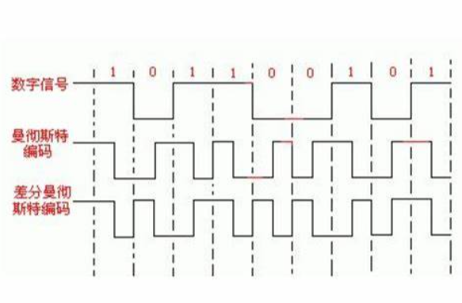

# 计算机网络笔记

> 
>
> 时间分布：
>
> 
>
> 连续地看
>
> 
>
> 2RTT+RTT/2+n×(分组大小/带宽) = 2×100+(100/2) + (1000/1)×(1KB/1.5Mb/s) = 200ms+50ms+1000×$5.4613\times 10^{-3}$​​​​s = 0.2s + 0.05s+5.4613s ≈ 5.71s
>
> 这一题需要注意的是，我一个分组发送出去的时候，接下来的分组也开始发送了，所以他们就像计算机组成原理的流水线一样，经过一个装入时间过后，每隔一个时钟周期就会有一个任务完成，异曲同工之妙。
>
> 
>
> 看这个图可以理解，我们只是在第一问的基础上，添加了来自接收方的确认，你把数据发送到通道上之后，数据在传送到接收方的过程中已经度过了RTT/2的时间，然后接收方发发送的确认再经过RTT/2的时间回到发送方，最后一次发送只有发送到接收方的RTT/2，而不需要计算接收方的确认时间(因为计算的是发送完整个文件的时间)
>
> 我们可以计算：
>
> 2RTT + 1000 ×(1KB/1.5Mb/s) +1000×RTT - RTT/2 = 105.61s
>
> 第三题：
>
> 总共发送1000/1/20=50个分组，同样，最后一个分组只需要计算发送的RTT/2，而不需要考虑返回的RTT/2，而且由于带宽无穷大，不需要计算发送时间，只需要考虑等待的传输时间。
>
> 2RTT + 49×RTT + RTT/2 = 5.15s

## 【王道2021 p41 3】

> 同步、异步是通信方式
>
> 串行传输适合于远距离传输
>
> 并行传输

## 【王道2021 p42 8】

> **基带信号：**基带信号（信息源，也称发终端）指发出的没有经过调制（进行频谱搬移和变换）的原始电信号，其特点是频率较低，信号频谱从零频附近开始，具有低通形式。
>
> **基带传输：**基带信号在**数字信道**上传输
>
> **频带传输：**基带信号在**模拟信道**上传输
>
> **宽带传输：**宽带信号将基带信号进行调制后形成频分复用模拟信号，然后传送到**模拟信道**上传输

## 【王道2021 p42 9】

> A
>
> **波特**：单位时间传送的码元个数。一个数字脉冲就是一个码元。通俗的理解，电路传输信号是靠波形的变化来识别每一位（英文单位bit）信息的，那么这一位信息的波形就叫作码元。

## 【王道2021 P42 10】

> 以太网采用曼彻斯特编码
>
> 局域网常使用差分曼彻斯特编码
>
> 反向归零编码：USB2.0使用
>
> 
>
> 曼彻斯特编码中，需要两条脉冲来表示一个bit的数据，也就是说，两个波特才传送一个bit，那么数据率应该是40/2=20Mb/s
>
> 编码效率50%
>
> 4B/5B编码
>
> > ​		我们考虑的最后一种编码方法称为4B/5B，它力求不扩大高信号或低信号的持续期而解决曼彻斯特编码的低效问题。4B/5B的思想是在比特流中插入额外的比特以打破一连串的0或1。准确地讲，就是用5个比特来编码4个比特的数据，之后再传给接收方，因此称为4B/5B。5比特代码是由以下方式选定的：每个代码最多有1个前导0，并且末端最多有两个0。因此，当连续传送时，在传输过程中任何一对5比特代码连续的0最多有3个。然后，**再将得到的5比特代码使用NRZI编码传输**，这种方式说明了为什么仅需关心多个连续0的处理，因为NRZI已解决了多个连续1的问题。注意，4B/5B编码的效率为80%。
> >
> > 
> >
> > [编码（NRZ、NRZI、曼彻斯特、4B/5B） - 苍月代表我 - 博客园 (cnblogs.com)](https://www.cnblogs.com/lifan3a/articles/5257728.html)
>
> 发送5bit数据，但是最后得到的有效信息为4bit，而其使用NRZI编码方式，一个波特传送1bit，相当于我传送了5波特，但是有效数据是4bit，故效率为80%

## 【王道2021 p42 13】

> 每采样一次，采样的是一个波特的数据
>
> 采样多快，和最大传输速率无关

## 【王道2021 p42 15】

> 二进制信号，强调了码元的离散状态只有两种
>
> 香农定理，计算的是信息传输速率的极限
>
> 奈氏准则，计算的是码元传输速率的上限，只是顺便计算了信息传输速率
>
> 香农：4k*log2(1+127)=28kb/s
>
> 奈氏：2*4klog2V
>
> V=2
>
> `2*4k*1=8kb/s`
>
> 选B

