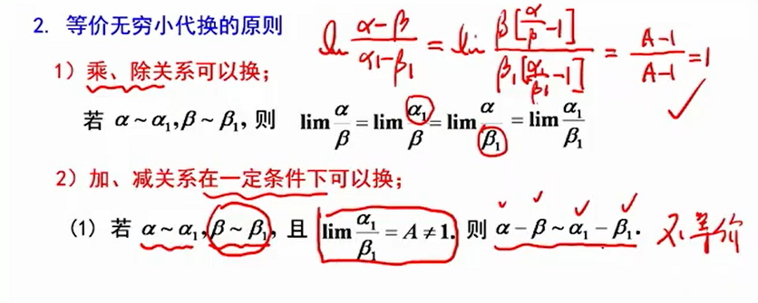
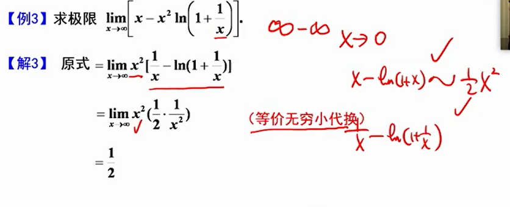
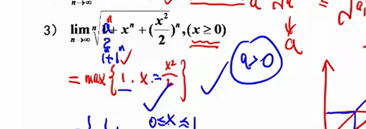

# 高数

## 660记录

难题

【660 数二 p16 41】

【660 数二 p18 47】

【660 数二 p23 61】

存疑

【660 数二 p80 236】

## 一些笔记

### 极限求法

#### 1.利用有理运算

#### 2.利用基本极限

#### 3.等价无穷小代换

#### 4.洛必达

#### 5.泰勒

偶函数在零点的泰勒展开式只有偶次项

#### 6.夹逼准则

#### 7.定积分定义

#### 8.单调有界准则

1. 证存在
2. 求极限

#### 9.中值定理

**同一函数两点的差**

#### 常见题型

##### *$\frac{0}{0}$​

根式：

1. 有理化
2. $(1+x)^\alpha-1\sim\alpha x$
3. 拉格朗日中值定理

变上限积分，可以使用等价代换

$$
\begin{aligned}
&当x\to0时，(1+x)^\alpha-1\sim \alpha x\\
&推广：\\
&若\alpha(x)\to0,\alpha(x)\beta(x)\to 0\\
&则 (1+\alpha(x))^{\beta{(x)}}-1\sim \alpha(x)\beta(x)
\end{aligned}
$$

##### $\frac{\infty}{\infty}$

##### $\infty - \infty$

##### $0\times \infty$

**如果不方便，就处理前面的0**

##### *$1^{\infty}$​

##### $\infty^{0},0^0$

##### 数列极限

###### 1 不定式的数列极限

###### 2 n项和

###### 3 n项连乘

###### 4 难 递推关系

找极限找不到可以先算出来极限（草稿纸），然后通过归纳法证明

先斩后奏

##### 确定极限的参数

##### 无穷小量阶的比较

偶函数在零点的泰勒展开式只有偶次项

#### 连续

#### 经验总结

1. $cot^2x$​​看作$\frac{1}{tan^2x}$​​会更简单

2. 

3. 

4. 

5. 

   **趋向于常数是0阶**

6. 
   $$
   (1+\alpha(x))^{\beta{(x)}}-1\sim e^{\beta(x)\ln{(1+\alpha(x))}}-1\sim \beta(x)\ln{(1+\alpha(x)}\sim\beta(x)\alpha(x)
   $$
   

7. 

### 周期性

[考研高数函数奇偶性周期性等总结 - 知乎 (zhihu.com)](https://zhuanlan.zhihu.com/p/62392945)

**1.关于导函数：**

①可导的奇函数，其导函数必为偶函数

②可导的偶函数，其导函数必为奇函数

③可导的周期函数，其导函数仍为周期函数，且周期相同

其中第①条性质可以用导数的增量形式来证明（导数的增量形式往往是用来证明的，对称形式则用来判断计算。）其他证明也类似。

**2.关于原函数：**

①若 $f(x)$​ 为连续的偶函数，则$\int_{0}^{x}f(t)dt$​为可导奇函数

①'若$f(x)$为连续的偶函数，则其所有原函数有唯一一个原函数为奇函数（一猜就知道是哪个)

②若$f(x)$为连续的奇函数，则$\int_{0}^{x}f(t)dt$为可导偶函数

②'若$f(x)$为连续的奇函数，则$\forall a \in R$使得$\int_{a}^{x}f(t)dt$为可导偶函数（即所有原函数均为偶函数)

**3.关于函数与原函数之间的性质**

①若$f(x)$有有限个第一类间断点，则$\int_{a}^{x}f(t)dt$连续

②若$f(x)$连续，则$\int_{a}^{x}f(t)dt$一阶可导

③若$f(x)$一阶可导，则$\int_{a}^{x}f(t)dt$ 二阶可导

可以看到，从 $f(x)$ 到 $\int_{a}^{x}f(t)dt$ ，函数的性质上了一个台阶，你可以叫它为“**升阶理论”**。

**4.关于周期函数的原函数**

①设$f(x)$​是以T为周期的连续函数，则$\int_{a}^{a+T}f(x)dx = \int_{0}^{T}f(x)dx$​

② $\int_{a}^{x}f(t)dt$​以 T 为周期 $\iff\int_{0}^{T}f(x)dx=0$​ 

证②：

###  微分

#### 弧微分

直角坐标

$ds = \sqrt{1+(y')^2}dx$​

参数方程
$$
\left\{
\begin{aligned}
x=x(t)\\
y=y(t)
\end{aligned}
\right.
$$
$ds=\sqrt{[x'(t)]^2 + [y'(t)]^2}$

极坐标方程
$$
\left\{
\begin{array}{**lr**}
x=r(\theta)cos\theta\\
y = r(\theta)sin\theta
\end{array}
\right.
$$
$dx = (r'cos\theta-rsin\theta)d\theta$​

$dy=(r'sin\theta +rcos\theta)d\theta$

$ds = \sqrt{(dx)^2+(dy)^2}d\theta$​

$=\sqrt{r^2+r'^2}d\theta$

#### 曲率

$$
P=\frac{|y''|}{(1+y'^2)^{\frac{3}{2}}}\\
r=\frac{1}{P}
$$

参数方程形式

[曲率_百度百科 (baidu.com)](https://baike.baidu.com/item/曲率/9985286)
$$
\begin{align*}\label{2}
&\left\{
\begin{array}{**lr**}
x=\varphi(t)\\
y=\psi(t)
\end{array}
\right.\\

&y'=\frac{\psi'(t)}{\varphi'(t)}\\
&y''=\frac{dy'}{dt}\div \frac{dx}{dt}\\
&=\frac{\psi''(t)\varphi(t)-\psi'(t)\varphi''(t)}{\varphi'^2(t)}\div \varphi'(t)\\
&=\frac{\psi''(t)\varphi(t)-\psi'(t)\varphi''(t)}{\varphi'^3(t)}\\
&P=\frac{|y''|}{(1+y'^2)^{\frac{3}{2}}}\\
&=\frac{|\frac{\psi''(t)\varphi(t)-\psi'(t)\varphi''(t)}{\varphi'^3(t)}|}{(1+\frac{\psi'^2(t)}{\varphi'^2(t)})^\frac{3}{2}}\\
&=\frac{|\frac{\psi''(t)\varphi(t)-\psi'(t)\varphi''(t)}{\varphi'^3(t)}|}{(\frac{\varphi'^2(t)+\psi'^2(t)}{\varphi'^2(t)})^\frac{3}{2}}\\
&=\frac{|\frac{\psi''(t)\varphi(t)-\psi'(t)\varphi''(t)}{\varphi'^3(t)}|}{\frac{(\varphi'^2(t)+\psi'^2(t))^\frac{3}{2}}{\varphi'^3(t)}}\\
&=\frac{|\psi''(t)\varphi(t)-\psi'(t)\varphi''(t)|}{\varphi'^2(t)+\psi'^2(t))^\frac{3}{2}}
\end{align*}
$$

### 分段函数求导

1. 求分段点外的其他点的导数的时候，如果函数在该点连续，则可以使用求导法则
2. 在分段点处
   1. 若直接求导，使用定义法
   2. 若证明了连续性后，可以直接使用求导法则求分段点的左右导数

函数可导，导函数连续吗
$$
f(x)=\left\{
\begin{array}{**lr**}
x^2\sin{\frac{1}{x}}&x\neq0,\\
0 & x=0
\end{array}
\right.\\
f'(x)=\left\{
\begin{array}{**lr**}
2x\sin{(\frac{1}{x})}-\cos{(\frac{1}{x})}&x\neq0,\\
0 & x=0
\end{array}
\right.
$$
导函数在(0,0)不连续

另一个可导但导函数不连续的例子

【660 数二 p199 578】
$$
f(x)=
\left\{
\begin{array}{**lr**}
\frac{1}{x}\ln{(1+x^2)}\sin{\frac{1}{x}},&x>0\\
0,&x=0\\
\frac{1}{x}\int_0^{x^2}\sin{t}dt&x<0
\end{array}
\right.
$$

### 间断点

第一类间断点
$$
\left\{
\begin{array}{**lr**}
\lim\limits_{x\to x_0^-}f(x) = \lim\limits_{x\to x_0^+}f(x)\ne f(x_0)&可去间断点\\
\lim\limits_{x\to x_0^-}f(x) \ne \lim\limits_{x\to x_0^+}f(x)&跳跃间断点\\
\end{array}
\right.
$$
第二类间断点
$$
\left\{
\begin{array}{**lr**}
\lim\limits_{x\to x_0^-}f(x), \lim\limits_{x\to x_0^+}f(x)至少有一个不存在& 无穷间断点\\
来回震荡 &震荡间断点\\
\end{array}
\right.
$$

>**注1**. 有人问到震荡间断点，解释一下。第二类间断点是左、右极限至少有一个不存在。而极限不存在只有两种情况：
>
>(1) 极限“存在”，但为 $\infty$​ , 对应无穷间断点；
>
>(2) 至少有两个趋于 $x_0$​ 的子列，使得函数值极限不相等，这种往往是以带$\sin\frac{1}{x}$  和 $\cos\frac{1}{x}$项为代表，体现为震荡间断点。
>
>**注2**. 可见，判断间断点分类只是基于左、右极限，所以，遇见间断点的题二话不说先求左右极限。

### 微分方程

#### 二阶常系数线性非齐次

两种情况

设$f(x)=y''+py'+qy$​

特征方程为$r^2+pr+q = 0$

(1)$f(x) = e^{\lambda x} P_n(x)$​

特解设为$x^k e^{\lambda x}Q_n(x)$​​

其中，k为$\lambda$​作为特征方程的根的重数，Q(x)为P(x)的同阶的多项式

(2)$f(x) = e^{\lambda x}[P_l(x)\cos{\omega x}+Q_n(x)\sin{\omega x}]$​

特解设为
$$
y^* = x^ke^{\lambda x}[R^{(1)}_m\cos{\omega x} + R^{(2)}_m\sin{\omega x}]
$$

+ $R^{(1)}_m和R^{(2)}_m$​是同型m次多项式，$m=max(l,n)$​
+ k按照$\lambda + \omega i$​不是特征方程的根、单根依次取0、1

### 反函数问题

[反函数常见问题解决思路 - 知乎 (zhihu.com)](https://zhuanlan.zhihu.com/p/366375070)

：**反函数的导数等于直接函数导数的倒数**。

$$
\frac{d^2y}{dy^2} = \frac{d(\frac{dx}{dy})}{dy} =\frac{d(\frac{dx}{dy})}{dx}\frac{dx}{dy}
$$

令
$$
\frac{dy}{dx}=y'
$$

$$
\frac{d^2y}{dy^2} = \frac{d(\frac{dx}{dy})}{dy} =\frac{d(\frac{dx}{dy})}{dx}\frac{dx}{dy} = \frac{1}{y'}\frac{d(\frac{1}{y'})}{dx} = -\frac{y''}{y'^3}
$$

### 积分

#### 特殊积分

#### 定积分

##### 旋转体侧面积

$$
ds = \sqrt{(dx)^2 + (dy)^2}\\
dS=\left\{
\begin{array}{**lr**}
\sqrt{1+f'^2(x)}dx&直角坐标系\\
\sqrt{\alpha'^2(t)+\beta'^2(t)}dt&参数方程\\
\sqrt{r^2(\theta)+r'^2(\theta)}d\theta&极坐标\\
\end{array}
\right.\\
S=\left\{
\begin{array}{**lr**}
\int_{a}^{b}2\pi f(x)\sqrt{1+f'^2(x)}dx&直角坐标系\\
\int_{t_1}^{t^2}2\pi \beta(t)\sqrt{\alpha'^2(t)+\beta'^2(t)}dt&参数方程\\
\int_{\theta_1}^{\theta_2}2\pi r(\theta)\sin{\theta}\sqrt{r^2(\theta)+r'^2(\theta)}d\theta&极坐标\\
\end{array}
\right.
$$

##### 找不到原函数的积分

$$
\int\frac{\sin{x}}{x}dx, \int\frac{\cos{x}}{x}dx,\int\frac{\tan{x}}{x}dx\\
\int{\frac{e^x}{x}dx},\int{e^{ax^2+bx+c}dx}\\
\int{\sin{x^2}dx},\int{\cos{x^2}dx},\int{\tan{x^2}dx}\\
\int{\frac{dx}{\ln{x}}}\\
\int{\sin{\frac{1}{x}}dx},\int{\cos{\frac{1}{x}}dx}
$$

求$\int_0^{+\infty}e^{-x^2}dx$​

$I^2 = \int_0^{+\infty}e^{-x^2}dx\times \int_0^{+\infty}e^{-x^2}dx$​

$=\int_0^{+\infty}e^{-x^2}dx\int_0^{+\infty}e^{-y^2}dy$​

$=\int_0^{+\infty}\int_0^{+\infty}e^{-(x^2+y^2)}dxdy$​

$=\int_0^{\frac{\pi}{2}}d\theta\int_0^{+\infty}e^{-r^2}rdr$​

$=\frac{1}{2}\int_0^{\frac{\pi}{2}}d\theta\int_0^{+\infty}e^{-r^2}dr^2$​​

$=\frac{1}{2}\int_0^{\frac{\pi}{2}}\lim\limits_{b\to{+\infty}}(-e^{-r^2}\big|_0^b)d\theta$​

$=\frac{1}{4} \pi$

$I=\frac{\sqrt{\pi}}{2}$​（泊松定理）

##### 绕轴旋转

#### 心！

质心：

(多质点形式)
$$
\overline{x}=\frac{M_y}{M}=\frac{\sum_{i=1}^nm_ix_i}{\sum_{i=1}^nm_i}\\
\overline{y}=\frac{M_x}{M}=\frac{\sum_{i=1}^n m_iy_i}{\sum_{i=1}^nm_i}
$$

(平面形式)

设平面薄片的密度为$\mu(x,y)$​​​​​​，每个点的面积$d\sigma$​​

每个质点对x轴的静矩为$dM_y=x\mu(x,y)d\sigma$​​​​

每个质点对y轴的静矩为$dM_x=y\mu(x,y)d\sigma$​

在整个区域上积分
$$
M_y=\iint\limits_{D} x\mu(x,y)d\sigma \\
M_x=\iint\limits_{D} y\mu(x,y)d\sigma
$$
薄片质量为
$$
M=\iint\limits_{D} \mu(x,y)d\sigma
$$
所以
$$
\overline{x}=\frac{\iint\limits_{D} x\mu(x,y)d\sigma}{\iint\limits_{D} \mu(x,y)d\sigma}\\
\overline{y}=\frac{\iint\limits_{D}y\mu(x,y)d\sigma}{\iint\limits_{D} \mu(x,y)d\sigma}
$$
若密度均匀为$\rho$​，面积为A
$$
\overline{x}=\frac{\iint\limits_{D} x\mu(x,y)d\sigma}{\iint\limits_{D} \mu(x,y)d\sigma}\\
=\frac{\rho\iint\limits_{D} xd\sigma}{A\rho}\\
=\frac{1}{A}\iint\limits_{D} xd\sigma\\
\overline{y}=\frac{1}{A}\iint\limits_{D} yd\sigma\\
$$

#### 二重积分的分部积分法

660 275题

## 强化

可以对F(x)求导，

但是不能继续再求导，因为题目只是说f(x)连续，但是没说是否可导

$\int_{0}^{x}f(t)dt-xf(x)$​​不好比较大小，是因为一个是积分，一个是正常函数，要统一比较，可以使用**积分中值定理**

第二种证法——定积分的估值性

$\int_{a}^{b}f(x)dx\ge (b-a)m$​​​​​，m为[a.b]上的最小值​，因为f(x)单调不增，所以f(x)是[0,x]上的最小值，所以$\int_{0}^{x}f(t)dt$​ 大于等于(x-0)f(x)，所以相减大于等于0

第三种证法——都化成积分形式

$\int_{0}^{x}f(t)dt-xf(x)=\int_{0}^{t}f(t)dt - \int_{0}^{x}f(x)dt=\int_{0}^{x}(f(t)-f(x))dt$​

### 第一章 函数

#### 第二节 极限

题型一

选择题、大题

---

考保序性

保序性，从n>N之后，即n足够大之后

## 函数图像

> $\sin{\frac{1}{x}}$
>
> 

> $\frac{\tan{x}}{x}$
>
> 

> $\frac{\sin{x}}{x}$
>
> 

### 双纽线

当r等于0的时候，$\cos{2\theta}=0,2\theta=\frac{\pi}{2}, \theta=\frac{\pi}{4}$​

### 三角函数

#### sin(sin(x))、cos(cos(x))

### $\sqrt{x}+\sqrt{y}=\sqrt{2}$

### 双曲正/余弦函数

[双曲函数（一）——双曲余弦函数 - 简书 (jianshu.com)](https://www.jianshu.com/p/77effb9cdf64)

双曲余弦函数
$$
\cosh{x}=\frac{e^x+e^{-x}}{2}
$$

> 从原点发出的射线与单位双曲线（方程：
>
> 
>
> ）相交于点（cosh a,sinh a)。这里的a为射线、双曲线和x轴围成的面积的两倍。对于双曲线上位于x轴下方的点，这个面积被认为是负值。其中，cosh a就是a的双曲余弦函数。
>
> 经过复杂的计算可以推出： 
>
> 
>
> 应用上常遇到以e为底的[指数函数](https://baike.baidu.com/item/指数函数)
>
> 和
>
> 所产生的[双曲函数](https://baike.baidu.com/item/双曲函数)以及它们的反函数——[反双曲函数](https://baike.baidu.com/item/反双曲函数)，而双曲正弦函数是双曲函数的一种，它的定义式 [1] 为
>
> 。
>
> 当x的[绝对值](https://baike.baidu.com/item/绝对值)很大时，双曲正弦函数的图形在第一象限内接近于曲线，在第三象限内接近于曲线。当x=0时，sinhx=sinh0=0。
>
> [双曲正弦函数_百度百科 (baidu.com)](https://baike.baidu.com/item/双曲正弦函数)

### 穿针法

`(x-1)*(x-2)*(x+3)`

`(x-1)^2*(x-2)`

`(x-1)*(x-2)*(3-x)`

`(x-1)*(x-2)*(3-x)^2`

